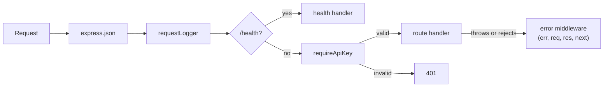

# Node.js + Express

The patterns below come from a **reference API** (Express/TypeScript, outside this repo): `server.ts` for routing, `middleware.ts` for auth, logging and idempotency, `webhook.ts` for outbound calls.

## TL;DR

- **Express is an ordered pipeline of middleware.** Each function either ends the response or calls `next()`. Forget both and the request hangs forever.
- **Order is the access-control policy.** Routes mounted before `requireApiKey` are public; routes after it are protected.
- **Async errors depend on the version.** Express 5 forwards rejected promises from handlers to `next(err)`. Express 4 doesn't, so you need `try/catch` or an `asyncHandler` wrapper.
- **Node runs your JS on one thread.** I/O waits are cheap; CPU-heavy work in a handler blocks every other request.
- **Every outbound call gets a timeout.** Retry it only if it's idempotent.

---

## The problem

A voice agent calls your wrapper API mid-call: ~50k requests/day, peaks around 20 req/s. Every request needs parsing, logging, an API-key check, validation and a call to a legacy TMS. Inline in each handler, that's 30 lines copied across ten routes, and the copy you forget has no auth.

**Bridge:** middleware is to a request what a chain of CTEs is to a query: each step transforms the previous output, except any step can short-circuit, like a `WHERE` dropping the row. Node itself is one thread juggling waiting requests. Awaiting the TMS is cheap; parsing a 200 MB CSV synchronously stalls every caller, like one huge query starving an X-Small warehouse.

---

## 1. Middleware: the core mental model



```ts
app.use(cors({ origin: ["http://localhost:5173"] })); // first, so OPTIONS preflights aren't rejected by auth
app.use(express.json());   // parses JSON bodies before any route sees them
app.use(requestLogger);    // every request

app.get("/health", (_req, res) => res.json({ ok: true })); // public: mounted before auth

const api = express.Router();
api.use(requireApiKey);    // only routes on this router
api.get("/shipments/:loadNumber", handler);
app.use("/", api);

app.use(errorHandler);     // 4-argument error middleware goes LAST
```

- **Order matters.** `/health` is reachable without a key; everything on `api` needs one, without repeating the check in each handler.
- **Error middleware has four parameters** `(err, req, res, next)`. Express recognizes it by arity, and it only catches errors from middleware registered before it.
- **Hung request** = a middleware that neither calls `next()` nor sends a response. No error, no log line, just a client timeout.

## 2. Async error handling

**Express 5** (5.0.0 released October 2024): "Route handlers and middleware that return a Promise call `next(value)` automatically when they reject or throw an error" ([Express docs](https://expressjs.com/en/guide/error-handling.html), checked Sept 2026). An `async` handler that throws reaches your error middleware with no extra code.

**Express 4** doesn't do this. A rejected promise in an `async` handler never reaches `next`, so the request hangs. Since Node 15, an unhandled rejection also crashes the process by default. On Express 4, use one of these:

```ts
// Pattern 1: try/catch inside the handler (what the reference API does)
api.post("/shipments/:loadNumber/check-in", async (req, res, next) => {
  try {
    // ...
  } catch (err) {
    next(err); // or respond directly: res.status(500).json({ error: "internal_error" })
  }
});

// Pattern 2: a wrapper that forwards rejections to next()
const asyncHandler = (fn) => (req, res, next) => Promise.resolve(fn(req, res, next)).catch(next);
api.get("/shipments/:id", asyncHandler(async (req, res) => { /* ... */ }));
```

**Still not caught, even in Express 5:** errors thrown inside callbacks that aren't part of the returned promise, like a `setTimeout`, an event-emitter listener, or a promise you started but didn't `await`.

## 3. Request validation and status codes

Validate first and fail fast with a specific code (full table in [rest-apis-webhooks.md §1](rest-apis-webhooks.md#1-status-codes-that-matter)):

```ts
if (!status || !VALID_SHIPMENT_STATUSES.includes(status)) {
  res.status(422).json({ error: "invalid_status" });
  return; // without this, execution continues
}
```

Forgetting `return` after sending means the handler keeps running and may send again, which throws `ERR_HTTP_HEADERS_SENT`.

## 4. Structured logging

```ts
res.setHeader("x-request-id", requestId);
res.on("finish", () => {
  console.log(JSON.stringify({ requestId, method, path, status: res.statusCode, durationMs }));
});
```

JSON logs let you query "all 5xx for request id X". Echoing `x-request-id` lets a caller report the exact failing call. Never log API keys, auth headers or PII-bearing bodies.

## 5. Calling third-party APIs from a server

```ts
const res = await fetch(url, {
  method: "POST", headers, body,
  signal: AbortSignal.timeout(5_000), // never unbounded
});
if (!res.ok) throw new UpstreamError(res.status);
```

Name these unprompted:
- **Timeouts.** Without one, a stuck upstream holds your request (and the voice agent's caller) open until something else gives up. Your timeout must be shorter than your caller's.
- **Retries with exponential backoff and jitter, only for idempotent operations** or ones carrying an idempotency key. Blind POST retries create duplicates. See [rest-apis-webhooks.md §2](rest-apis-webhooks.md#2-idempotency) and the sender loop in [§3](rest-apis-webhooks.md#3-webhooks).
- **Don't forward upstream error bodies verbatim.** Map them to your own error codes so internal details don't leak.

## 6. Environment and config

```ts
const API_KEY = process.env.API_KEY ?? "dev-secret-key"; // fine locally, dangerous if shipped
```

Secrets belong in environment variables or a secrets manager, never in code or git. In production, a missing required variable should **throw at startup**, not silently fall back to a dev default.

## 7. TypeScript and ESM gotchas

- With `"type": "module"` and `NodeNext` resolution (the reference API's setup), relative imports need an explicit `.js` extension: `import { app } from "./server.js"` even though the file is `server.ts`. The extension refers to the compiled output.
- `tsx` runs TypeScript directly for dev. `tsc --noEmit` still matters for type-checking in CI, and `tsc` builds `dist/` for deployment.

---

## Decide

- **Express** for a small HTTP API or wrapper. **Next.js route handlers** when the API only serves one Next.js front end ([frontend-concepts.md §7](../frontend/frontend-concepts.md#7-api-route--route-handler)).
- **Handle errors in the handler** when you can respond meaningfully (422, 404). **Let them propagate** to the error middleware when unexpected, so every 500 is logged the same way.
- **Work in the request** when it finishes well under the caller's timeout. **Return 202 and queue it** when it's slow (LLM calls, PDFs) or CPU-bound.

## Failure modes

| Failure | How it shows up | Mitigation |
|---|---|---|
| Middleware never calls `next()` | Client timeouts, no error or `finish` log | Every branch calls `next()` or responds; alert on p99 |
| Unhandled rejection | Hung requests (Express 4) or crash loop | Express 5 or `asyncHandler`; `await` every promise |
| No upstream timeout | Requests and memory pile up | `AbortSignal.timeout`, circuit breaker |
| CPU work on the main thread | All endpoints slow down together | Worker threads or a job queue |

## Common wrong answers

- **"Async errors are always caught by Express."** Only since Express 5, and only for promises the handler returns.
- **"Node is single-threaded, so it can't handle concurrency."** It handles thousands of concurrent *I/O-bound* requests. It struggles with CPU-bound work.
- **"`res.json()` ends the function."** It sends the response. Your code keeps running until you `return`.

---

## Self-check

<details><summary><b>Q1.</b> An `async` route handler awaits a DB call that rejects. What happens in Express 4 vs Express 5?</summary>

In Express 4 the rejection isn't forwarded to `next`. The request hangs until the client times out, and on Node 15+ the unhandled rejection can crash the process. In Express 5 the returned promise's rejection is passed to `next(err)` automatically, so the error middleware responds. On Express 4, wrap handlers in `try/catch` or an `asyncHandler` that does `.catch(next)`.

</details>

<details><summary><b>Q2.</b> You want `/health` public and everything else behind an API key, with no auth check copied into handlers. How?</summary>

Mount `/health` on `app` before the protected router, and `router.use(requireApiKey)` on a router that holds every other route. Middleware only applies to routes registered after it on the same app or router. Mount `cors()` before both so browser preflights aren't rejected.

</details>

<details><summary><b>Q3.</b> Your wrapper calls a legacy TMS that sometimes never responds. What breaks, and what do you add?</summary>

Each stuck call holds a request open, the voice agent waits in silence, and sockets and memory pile up. Add `AbortSignal.timeout(...)` shorter than the caller's timeout, retry with backoff and jitter only for GETs or idempotency-keyed requests, add a circuit breaker for long outages, and return a clear 502/504.

</details>

<details><summary><b>Q4.</b> How do you rate-limit this endpoint, and what does the caller see?</summary>

Middleware before the route handler, token bucket or sliding window keyed by API key (or IP for public routes). Use a Redis sorted set or counter so the limit holds across instances. The caller gets `429` with `Retry-After`, never a silent drop, because a silent drop looks like a network failure and causes more retries.

</details>

<details><summary><b>Q5.</b> How do you test an Express route without a fixed network port?</summary>

Either `app.listen(0)` for an ephemeral port and `fetch` against it (what the reference API's smoke test does), or `supertest(app)`, which drives the app directly without a real socket. Both run in CI without port clashes.

</details>

<details><summary><b>Q6.</b> What breaks about an in-memory idempotency store at scale?</summary>

It's lost on restart, so a retry after a deploy duplicates the operation. It isn't shared across instances behind a load balancer, so a retry routed to another instance runs again. Use Postgres with a unique constraint or Redis `SET NX`, claimed atomically ([rest-apis-webhooks.md §2](rest-apis-webhooks.md#2-idempotency)).

</details>

---

## Related

- [rest-apis-webhooks.md](rest-apis-webhooks.md): status codes, idempotency keys, webhook signing and retries, CORS
- [performance-and-security.md](performance-and-security.md): secrets, input validation, rate limiting as a security control
- [frontend-concepts.md](../frontend/frontend-concepts.md): "middleware" in Express vs Next.js vs Redux
