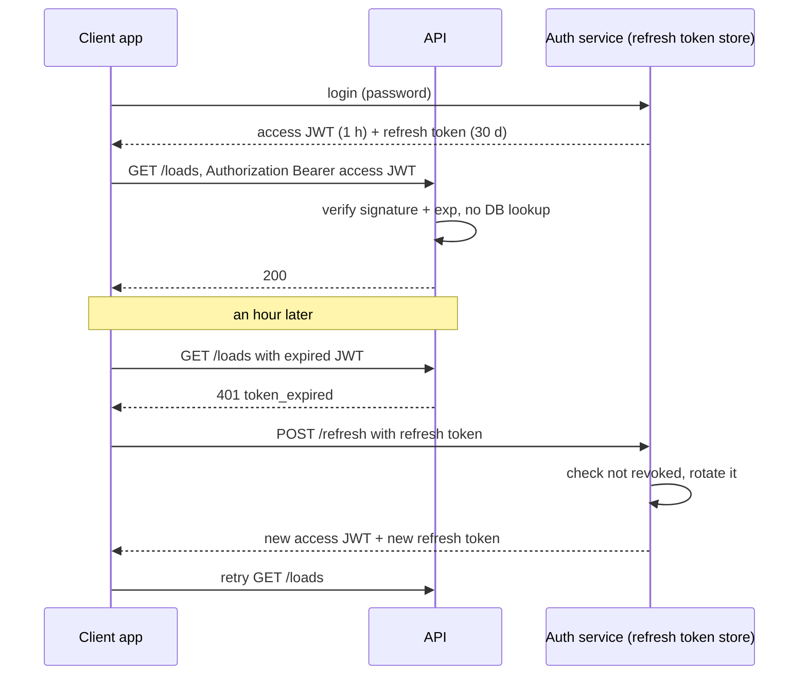

# Performance & Security

Organized around what gets asked, with examples from two running projects kept outside this repo: a **reference API** (Express/TypeScript) and a production-shaped Next.js/Expo/FastAPI app.

## TL;DR

- **Measure before you optimize.** Profile, find the slow layer, fix that. Usually it's the database, not React.
- **N+1 is the most common backend performance bug.** One query per row instead of one join or batch. It's the same mistake as a Python loop firing one Snowflake query per ID.
- **React escapes by default.** XSS comes back through `dangerouslySetInnerHTML`, `href="javascript:..."` and unsanitized HTML.
- **CSRF is a cookie problem.** Header-based tokens avoid it by construction. Cookie sessions need an explicit `SameSite` plus a CSRF token, because only Chromium defaults to `Lax`.
- **JWTs are signed, not encrypted.** Use short-lived access tokens and rotated refresh tokens, and choose storage by threat: `httpOnly` cookie vs XSS, header token vs CSRF.

---

## Part 1: Performance

### 1.1 The problem: "the load board is slow"

Dispatchers say the load board takes 4 s. Memoizing components, adding Redis or adding indexes are all guesses. Open the Network tab: if the API takes 3.6 s of the 4, the frontend isn't the problem. Say "profile first", then name the tool per layer: Lighthouse for the page, React Profiler for renders, `durationMs` request logs for the API, `EXPLAIN ANALYZE` for SQL.

### 1.2 Backend and data: usually the bigger levers

- **N+1 queries.** Fetch 50 loads, then query the carrier for each: 51 round trips. At ~5 ms each that's ~255 ms before any real work. One `JOIN`, or `WHERE carrier_id = ANY($1)`, makes it 1–2 queries. ORMs hide this: look for the same query repeated in the logs with different IDs. Details in [sql-advanced.md](../data-engineering/sql-advanced.md).
- **Indexing.** A filter or join on an unindexed column is a full scan. It's the OLTP cousin of a Snowflake query that can't prune micro-partitions.
- **Caching.** Redis for hot, expensive reads, plus HTTP caching headers (`Cache-Control`, `ETag`) so the browser or CDN doesn't ask again. Express sends a weak `ETag` by default, so the reference API's responses already had one. Patterns and invalidation live in [in-memory-databases.md](../system_design/99-reference/in-memory-databases.md).
- **Pagination.** Never return an unbounded list. Cursor vs offset is covered in [rest-apis-webhooks.md §6](rest-apis-webhooks.md#6-pagination-and-rate-limiting).
- **Connection pooling.** Reuse DB connections instead of opening one per request; a new Postgres connection costs a TLS handshake plus a backend process. A FastAPI service's `asyncpg` pool is a real example.

### 1.3 Frontend levers

- **Unnecessary re-renders.** `React.memo`, `useMemo` and `useCallback` are explained once in [react.md §4](../frontend/react.md#4-hooks). Use them after the Profiler shows a cost, not by default.
- **Code splitting.** Load a route's code only when the user navigates there (`React.lazy` + `Suspense`, automatic per route in Next.js).
- **List virtualization.** For 5,000 rows, render the ~30 visible ones.
- **Images.** Serve sized and compressed images (Next.js `<Image>`). Often a bigger win than any JS tweak.
- **Debounce** search-as-you-type so it fires after a typing pause, not per keystroke.
- **Core Web Vitals**, assessed at the 75th percentile of page loads ([web.dev](https://web.dev/articles/vitals), checked Sept 2026):

| Metric | Measures | "Good" |
|---|---|---|
| **LCP**, Largest Contentful Paint | How fast the main content appears | ≤ 2.5 s |
| **INP**, Interaction to Next Paint | How responsive clicks and taps feel (replaced FID in 2024) | ≤ 200 ms |
| **CLS**, Cumulative Layout Shift | Whether content jumps while loading | ≤ 0.1 |

---

## Part 2: Security

Each item: what it is, how it's exploited, how you prevent it.

### 2.1 XSS (Cross-Site Scripting)

**What:** attacker JavaScript runs in another user's session, injected through content later rendered as HTML (a load note, a carrier name, a URL parameter). It can read anything JS can read, including tokens in `localStorage`.

**React's default:** `
{userInput}
` renders as text, even if it contains `<script>`. The ways around that protection:
- `dangerouslySetInnerHTML` with unsanitized input. The name is a warning label.
- `<a href={userUrl}>` where `userUrl` is `javascript:...`. Allow only `http(s):`.
- Direct DOM writes through a ref (`el.innerHTML = ...`).

**Prevention:** let React escape. When you must render HTML (CMS rich text), sanitize with DOMPurify first. A Content-Security-Policy header is the defense-in-depth layer.

### 2.2 CSRF (Cross-Site Request Forgery)

**What:** a malicious page makes the victim's browser send a request to your app, and the browser **attaches your app's cookies automatically**. The attacker never reads the response; they just need the side effect, like "change payout bank account".

**Why header tokens are immune:** the attacker's page can make the browser send a request, but it can't add an `Authorization: Bearer ...` or `x-api-key` header whose value it doesn't know. An `x-api-key` header and a JWT-in-header pattern both avoid CSRF by construction.

**`SameSite` precisely** (checked Sept 2026):
- **Chromium** (Chrome, Edge) treats a cookie with no `SameSite` attribute as `Lax`, fully rolled out to Chrome 80+ in August 2020 ([chromium.org](https://www.chromium.org/updates/same-site/)). A "Lax+POST" exception still sends such cookies on top-level cross-site POSTs for 2 minutes after they're set.
- **Firefox and Safari don't default to `Lax`.** Firefox backed out over site breakage; Safari relies on third-party-cookie blocking.
- `Lax` still sends cookies on top-level cross-site **GET** navigations, so a state-changing GET stays exploitable.

**Prevention for cookie auth:** set `SameSite=Lax` (or `Strict`) explicitly, never mutate on GET, and add a CSRF token (synchronizer or double-submit) for state-changing requests.

### 2.3 SQL injection

Never concatenate user input into SQL. Use parameterized queries (`$1` in asyncpg, bound parameters in SQLAlchemy) so input is always data, never query structure. You know this from warehouse work. The API version is a voice agent passing `"42; DROP TABLE loads"` as a load number.

### 2.4 Auth and token security

- **Passwords:** a slow, salted, purpose-built hash (argon2, bcrypt). Never plaintext, never a bare fast hash like SHA-256.
- **JWTs are signed, not encrypted.** Anyone can base64-decode the payload. The signature proves integrity, not secrecy, so no secrets or sensitive fields in claims. Verify the algorithm server-side; never accept `alg: none`.
- **Access + refresh tokens.** A JWT can't be revoked before it expires, so keep access tokens short-lived and use a longer-lived refresh token that the server *can* revoke. A common split is 1 h access / 30 d refresh.

**Refresh token rotation:** each use issues a new refresh token and invalidates the old one. If an old one is presented again, it was stolen, so revoke the whole family.

**Where to store tokens:**

| Storage | XSS risk | CSRF risk | Use when |
|---|---|---|---|
| `localStorage` | Readable by any injected script | None, sent via header | Low-risk internal tools, strict CSP |
| `httpOnly; Secure; SameSite` cookie | JS can't read it | Needs `SameSite` + CSRF token | Browser apps with sensitive data (default choice) |
| Memory + refresh in `httpOnly` cookie | Short exposure window | Refresh endpoint needs CSRF care | SPAs wanting both |
| OS secure storage (`expo-secure-store`) | Not JS-readable | N/A | Mobile. Expo apps do this |

### 2.5 CORS is not a security boundary

CORS only controls which browser origins may **read** responses. `curl`, servers and scripts ignore it, so real access control (auth, keys) must run on every request regardless. Full mechanism and preflight in [rest-apis-webhooks.md §5](rest-apis-webhooks.md#5-cors-why-cant-my-dashboard-reach-my-api).

### 2.6 Validate input at the server boundary

A React form or an LLM tool call can send anything, whatever the UI or prompt tries to constrain. Two real examples:
- The reference API's check-in endpoint returns 422 for any `status` outside the four valid values.
- An LLM extraction pipeline re-validates the model's JSON (regex-extract, type-check, whitelist-filter) before it touches the database. That's the same rule applied to AI output: an LLM's structured output is untrusted input.

### 2.7 Secrets, dependencies, rate limiting

- Secrets live in env vars or a secrets manager, and production fails at startup if one is missing ([nodejs-express.md §6](nodejs-express.md#6-environment-and-config)).
- Keep dependencies patched and run `npm audit` or equivalent. Known CVEs in old packages cause more breaches than novel exploits.
- Rate limiting is a security control: it stops login brute force and scrapers. FastAPI has `slowapi` for per-endpoint limits. Leaving it out of a small demo is defensible only if the README lists it as a known gap — naming your own gaps is a good "what's missing" answer.

---

## Decide

- **Session cookie** (`httpOnly; Secure; SameSite=Lax` + CSRF token) for a browser app on one domain. **Bearer tokens** for mobile and third-party clients. **API keys** for machine callers like a voice agent's tool node.
- **Optimize the query** when the API is slow; **optimize rendering** only when the Profiler shows long commits over a fast API; **cache** repeated expensive reads that tolerate staleness.

## Common wrong answers

- **"We use React, so we're safe from XSS."** Not with `dangerouslySetInnerHTML`, `javascript:` URLs or direct DOM writes.
- **"SameSite=Lax is the default, so CSRF is solved."** Only in Chromium. It still allows top-level GETs, and the Lax+POST window exists. Set it explicitly and add a CSRF token.
- **"JWTs hide the user data."** They're base64, not encrypted.
- **"Add `useMemo` everywhere to make it fast."** It adds overhead and bugs. Profile first; the slow part is usually the API.

---

## Self-check

<b>Q1.</b> The load board takes 4 s to load. Walk through how you'd find the cause before changing anything.

Open the Network tab and split the 4 s into API time vs render time. If the API dominates, check its request logs for the slow endpoint, then run `EXPLAIN ANALYZE` on its queries and look for N+1 (the same query repeated per row) or a sequential scan on a filtered column. If the API is fast, use the React Profiler to find long commits, then consider virtualization or memoization. Fix the biggest measured slice first.

<b>Q2.</b> Why is an API authenticated with `Authorization: Bearer` largely immune to CSRF, while a cookie session isn't?

CSRF works because the browser attaches cookies automatically to a cross-site request. An attacker's page can trigger the request but can't read your token or set a custom header with its value. A cookie session is attached without the attacker knowing anything, so it needs `SameSite` and a CSRF token.

<b>Q3.</b> "Chrome defaults cookies to SameSite=Lax, so we don't need CSRF tokens." What's wrong with that?

Firefox and Safari don't default to Lax, so their users are unprotected. Lax still sends cookies on top-level cross-site GET navigations, so any state-changing GET is exploitable. Chrome's Lax+POST exception sends cookies without an explicit attribute on cross-site top-level POSTs for 2 minutes after they're set. Set `SameSite` explicitly, never mutate on GET, and use CSRF tokens for cookie-authenticated writes.

<b>Q4.</b> Why pair a short-lived access JWT with a refresh token instead of issuing one 30-day JWT?

A JWT is verified statelessly, so it can't be revoked before expiry. A leaked 30-day JWT works for 30 days. A 1-hour access token caps the damage at an hour, and the refresh token is checked against a server-side store on each use, so it can be revoked and rotated. Reuse of a rotated refresh token signals theft.

<b>Q5.</b> An LLM agent extracts a load's pickup date and rate from an email and your code inserts them into Postgres. What security and correctness checks go between the model and the DB?

Treat it as untrusted input: strict JSON parse against a typed schema, whitelist enums, range-check values (rate > 0 and below a sane max, date in a plausible window), and write only with parameterized queries. On failure, reject or route to human review instead of coercing. The LLM extraction pipeline above does exactly this.

---

## Related

- [rest-apis-webhooks.md](rest-apis-webhooks.md): canonical home for CORS, idempotency and webhook signing
- [react.md](../frontend/react.md): memoization, rendering and effects
- [in-memory-databases.md](../system_design/99-reference/in-memory-databases.md): caching patterns, invalidation, stampedes
- [sql-advanced.md](../data-engineering/sql-advanced.md): indexes, `EXPLAIN`, isolation
