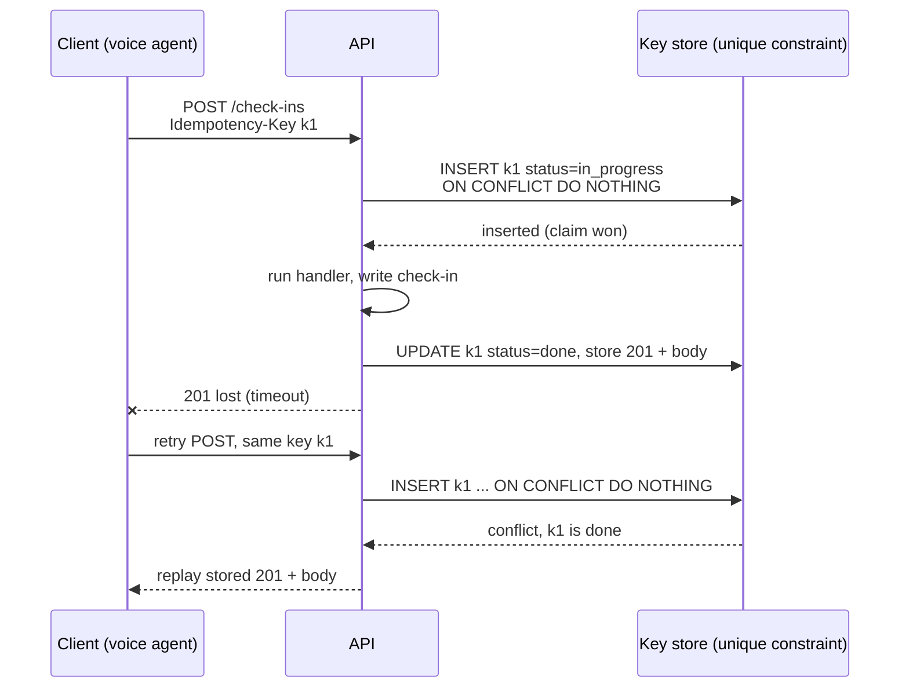
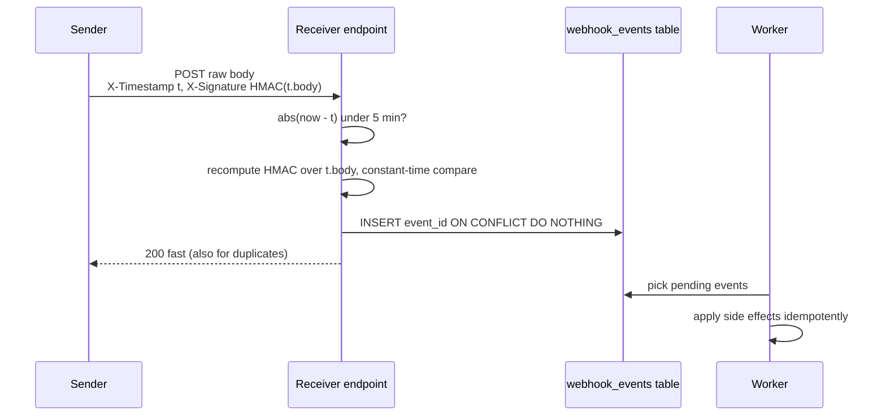
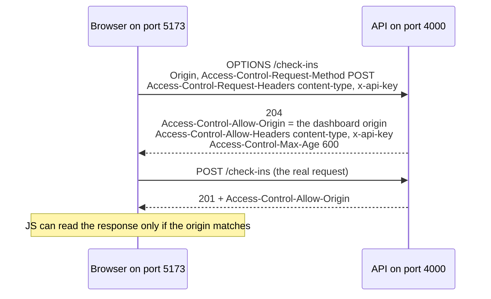

# REST APIs & Webhooks

This doc covers the handful of HTTP API ideas that come up again and again in backend and take-home interviews: status codes, idempotency, webhooks, auth, CORS, pagination and rate limiting. The running example is a logistics API. Trucks check in at warehouses, and some of those check-ins are logged by a **voice agent**, an AI that talks to drivers on the phone and calls the API as a tool while the call is live.

The patterns were built for real in a **reference API** (Express/TypeScript, outside this repo): `middleware.ts` for auth and idempotency, `webhook.ts` for signing and retries. The code below is a cleaned-up, production-hardened version of it.

## TL;DR

- **The status code is the instruction to the caller.** A `4xx` says "your request is wrong, sending it again won't help". A `5xx` or `429` says "try again later". A program can decide what to do without reading the error message.
- **An idempotency key makes a retried POST safe.** The client picks one key per operation and sends it on every retry. The server stores the key under a unique constraint, so the second attempt finds the first one's result and returns it instead of doing the work again. It's the same idea as a dbt incremental model with a `unique_key`.
- **Checking the key and claiming it must be one step.** If two copies of a request arrive at once, "look it up, then insert it" lets both through. An atomic insert (`INSERT ... ON CONFLICT DO NOTHING`, or Redis `SET NX`) lets exactly one win.
- **A webhook receiver checks four things, in order.** Is it really from the sender (signature)? Is it recent (timestamp)? Have I seen it before (event id)? Then it answers `200` straight away and does the real work in the background.
- **A webhook sender retries with growing, randomized waits, and eventually gives up into a dead-letter store.** In production those retries run from a database table or a queue, not inside the request that triggered them.

---

## 1. Status codes that matter

### Why they matter more than they look

When a human calls an API, they read the error message. When a program calls it (a retry loop, a monitoring dashboard, a voice agent deciding what to tell the driver), it mostly looks at the **status code**. The code answers three questions at a glance:

- **`2xx`: it worked.** Move on.
- **`4xx`: the caller got something wrong.** The request is malformed, unauthorized or pointing at something that doesn't exist. Sending the exact same request again will fail the exact same way, so don't retry it. Fix it or give up.
- **`5xx`: the server got something wrong.** It crashed, a database was down, or it timed out. The request itself may be fine, so retrying later is reasonable.

`429 Too Many Requests` is the one `4xx` that means "retry later": you're not wrong, you're just too fast.

So a wrong status code isn't a cosmetic bug. If your API returns `200 {"error": "not found"}`, every client's retry logic and every dashboard counting errors will think the call succeeded.

### The codes you'll actually use

| Code | Use it when | Common mistake |
|---|---|---|
| 200 OK | A successful GET, or a POST that doesn't create anything | Using 200 for a create |
| 201 Created | A POST created a new resource | — |
| 204 No Content | It worked and there's nothing to return (typically DELETE) | Returning 200 with a `null` body |
| 400 Bad Request | The request is malformed: invalid JSON, a missing required header | Using 400 for "not found" |
| 401 Unauthorized | Credentials are missing or invalid: "I don't know who you are" | Confusing it with 403 |
| 403 Forbidden | Credentials are fine but not allowed to do this: "I know who you are, and no" | Confusing it with 401 |
| 404 Not Found | The resource doesn't exist | 200 with `{error: "not found"}` |
| 409 Conflict | The request clashes with the current state: a concurrent update, a duplicate create, or an idempotency key still being processed | — |
| 422 Unprocessable | The JSON is valid but the values make no sense (an unknown enum value, an end date before the start date) | Using 400 |
| 429 Too Many Requests | The caller is rate-limited | Forgetting the `Retry-After` header that says how long to wait |
| 500 Internal Server Error | An unhandled error on the server | Leaking a stack trace in the response body |

The 400 vs 422 distinction is simply this: 400 means "I couldn't even parse what you sent", and 422 means "I parsed it, and it's wrong".

---

## 2. Idempotency

### The problem

The voice agent is on a live call and sends `POST /check-ins` to log that truck 812 has arrived. The server writes the row. Then the response gets lost, because the network hiccups or the agent's 3-second timeout fires just before the reply arrives. From the agent's side, the request might have worked or might not have. It can't tell.

Its only sensible move is to send the request again. Without protection, that retry logs a **second** check-in for the same arrival.

Put numbers on it. 10k trucks × 5 check-ins a day = 50k POSTs a day. If 0.5% of them time out and get retried, that's about **250 duplicate check-ins a day** in the load timeline. None of them raise an error, because each one looks like a perfectly valid request.

### The mental model

An operation is **idempotent** if doing it twice leaves the system in the same state as doing it once. Pressing an elevator's call button is idempotent: pressing it five times still brings one elevator.

Some operations are naturally idempotent, and some aren't:

- **Setting a value is naturally idempotent.** `PUT /loads/42/status {"status": "delivered"}` sets the status to "delivered". Run it twice and the status is still "delivered". You don't need anything extra.
- **Creating a new fact is not.** "Log a check-in", "charge the card" and "send an SMS" each add something new every time they run. Run them twice and you get two check-ins, two charges and two texts.

For the second kind you add an **idempotency key**. You already know this pattern from dbt. An incremental model with `unique_key` and the `merge` strategy is safe to rerun: rows that already exist get matched on the key instead of inserted again. An idempotency key turns a POST into the same kind of `MERGE`. The "natural key" is a value the client generates for *this one logical request*, and a unique constraint on the server is what turns the second attempt into "already done, here's the result".

### How it works

The client generates the key (usually a random UUID) **once, before the first attempt**, and sends the same key in an `Idempotency-Key` header on every retry. A new key means a new operation. The same key means "this is the same thing I asked for before".

On the server, the first request with a key claims it by inserting it into a key store with status `in_progress`, runs the handler, then saves the response next to the key and marks it `done`. When the retry arrives with the same key, the insert hits the unique constraint. The server looks up what it saved and sends back the **original** response. The client can't tell the difference between "it worked the first time" and "it worked just now", and that's the point.



### The race most answers miss

The obvious implementation is: look up the key, and if it's missing, run the handler and save the result. That works when retries arrive one after another. It breaks when two copies of the same request arrive **at the same time**, say 50 ms apart because the client's timeout was aggressive and it retried while the first attempt was still running. Both requests look up the key, both see "not there yet", and both run the handler. You get the duplicate anyway.

This bug has a name, **check-then-act**: the gap between checking a condition and acting on it lets someone else slip in. The fix is to make the check and the claim a single atomic operation, one the database performs as an indivisible step. A unique constraint does exactly that, because only one insert of a given key can ever succeed:

```sql
-- Postgres: the unique constraint is the lock
INSERT INTO idempotency_keys (key, request_hash, status, created_at)
VALUES ($1, $2, 'in_progress', now())
ON CONFLICT (key) DO NOTHING
RETURNING key;   -- a row back = you own it; no row = someone else does
```

Redis has the same guarantee through `SET` with `NX` ("only set it if it doesn't already exist"), plus an expiry so old keys clean themselves up:

```ts
// Redis equivalent: SET only if Not eXists, with a TTL
const claimed = await redis.set(`idem:${key}`, "in_progress", { NX: true, EX: 86_400 });
```

If you lose the claim, someone else already owns the key, so you read the stored record and respond based on its state. The `request_hash` is a hash of the request body. It catches a client bug where the same key is reused for a *different* request:

| Stored state | What to return |
|---|---|
| `done`, same request hash | Replay the stored status code and body |
| `done`, different request hash | `422` (or `409`): the key was reused for a different payload, which is a client bug |
| `in_progress` | `409` with `Retry-After`, or wait briefly and check again |
| `in_progress`, but older than a lock timeout | The first handler probably crashed. Let this retry take over |

One more detail matters. If you can, write the business row (the check-in) and mark the key `done` **in the same database transaction**. Otherwise a crash between the two leaves the check-in written but the key stuck at `in_progress`, and the next retry can't tell whether the work happened.

### Decide

- **Pick a Postgres table** when the handler already writes to Postgres. One transaction then covers both the business row and the key, which is the strongest guarantee you can get.
- **Pick Redis `SET NX`** when handlers write to several different stores, so no single transaction could cover them anyway. It's cheap to size: about 50k keys a day × ~1 KB each × a 24-hour expiry ≈ 50 MB.
- **An in-memory `Map`** (what the reference API uses) is only good for a single-instance demo. It's wiped on every restart, and with two server instances, each has its own map, so a retry that lands on the other instance isn't caught.

---

## 3. Webhooks

### What a webhook is

Normally, if you want to know when something changes on another system, you **poll**: you ask "anything new?" every few seconds. A **webhook** flips that around. You register a URL with the other system, and it sends an HTTP POST to that URL when something happens. The other system calls you instead of you calling it.

The difference in load is large. Polling 10k trucks every 30 seconds is about 330 requests per second, and almost all of them get the answer "nothing changed". A webhook sends a request only when something actually happens.

Webhooks show up on both sides of most platforms. A visual workflow builder, for example, typically gives each workflow its own webhook URL so external systems can trigger it, and the workflows send webhooks out to other systems in turn.

### Why webhooks are harder than they look

A webhook is a POST from a system you don't control to a URL anyone on the internet can reach. That creates two problems:

1. **Anyone can send a request to your URL.** You need to prove each request really came from the sender and wasn't modified on the way.
2. **Delivery is at-least-once.** If the sender doesn't get a `2xx` back quickly (because you timed out, crashed or the network dropped the reply), it sends the event again. So you *will* receive some events more than once.

Each side has a job. **The sender retries until it gets a success. The receiver makes the retry harmless.** Neither side alone gives you correctness. If you know Airflow, this is task retries plus an idempotent task: retries alone produce duplicates, and idempotency alone doesn't recover from failures.

### Receiving: verify, check freshness, dedupe, acknowledge

**Step 1: prove the sender sent it (the signature).** The sender and receiver share a secret, a random string you exchange once when you register the webhook. For each request, the sender computes an **HMAC** (hash-based message authentication code) over the request body using that secret, and puts the result in a header. An HMAC is a fingerprint of the message that only someone holding the secret can produce. The receiver recomputes the HMAC from the body it received and compares. If an attacker changed even one byte of the body, or never had the secret, the fingerprints won't match. The secret itself never travels over the network.

**Step 2: reject old requests (the timestamp).** A valid signature isn't enough on its own. An attacker who captures one real request could send it again tomorrow, and the signature would still be valid. That's called a **replay attack**. To block it, the sender includes a timestamp and signs `timestamp.body` rather than just the body. The receiver rejects anything older than a tolerance window (5 minutes is typical), and because the timestamp is part of the signed message, the attacker can't change it without breaking the signature.

**Step 3: ignore duplicates (the event id).** Every event carries a unique id, and the sender reuses it on every retry. The receiver inserts the id into a table with a unique constraint. If the insert conflicts, it has seen this event before and skips it. This is the same trick as the idempotency key in section 2.

**Step 4: answer fast, work later.** Return `200` as soon as the event is safely stored, and let a background worker do the actual processing. If you do slow work (calling an LLM, updating five tables) before responding, the sender times out and retries. One event then becomes several deliveries, all being processed at once. Return `200` for duplicates too. They've already been handled, so there's nothing for the sender to retry.



Here it is in Express. Two details in the code are easy to get wrong, and the comments point them out:

- **Use the raw body, not parsed JSON.** The signature was computed over the exact bytes the sender sent. If you parse the JSON and serialize it again, key order or whitespace can change, and the HMAC won't match even for a genuine request.
- **Compare signatures in constant time.** A normal `===` string comparison stops at the first byte that differs, so it takes slightly longer the more leading bytes are right. By measuring those tiny differences over many attempts, an attacker can guess a valid signature byte by byte. `crypto.timingSafeEqual` always takes the same time.

```ts
import crypto from "node:crypto";

const TOLERANCE_S = 300;

function hmacHex(message: string, secret: string) {
  return crypto.createHmac("sha256", secret).update(message).digest("hex");
}

function verifySignature(message: string, signatureHex: string, secret: string): boolean {
  const expected = Buffer.from(hmacHex(message, secret), "hex");
  const received = Buffer.from(signatureHex, "hex");
  // timingSafeEqual throws RangeError on different lengths, so check first
  if (received.length !== expected.length) return false;
  return crypto.timingSafeEqual(expected, received);
}

// express.raw, NOT express.json: re-serialized JSON won't match the signed bytes
app.post("/webhooks/loads", express.raw({ type: "application/json" }), async (req, res) => {
  const ts = Number(req.header("x-timestamp"));
  const sig = req.header("x-signature") ?? "";
  if (!Number.isFinite(ts) || Math.abs(Date.now() / 1000 - ts) > TOLERANCE_S) {
    return res.status(400).json({ error: "stale_or_missing_timestamp" });
  }
  if (!verifySignature(`${ts}.${req.body.toString("utf8")}`, sig, WEBHOOK_SECRET)) {
    return res.status(401).json({ error: "bad_signature" });
  }
  const event = JSON.parse(req.body.toString("utf8"));
  await db.query(
    "INSERT INTO webhook_events (event_id, payload) VALUES ($1, $2) ON CONFLICT (event_id) DO NOTHING",
    [event.id, event],
  );
  res.sendStatus(200); // a worker processes the row later
});
```

The header names here are illustrative. Every provider documents its own. Stripe's libraries, for example, default to a 5-minute timestamp tolerance (checked Sept 2026).

### Sending: retry with exponential backoff and jitter

The sender's job is to keep trying until the receiver says `2xx`, without making things worse for a receiver that's already struggling.

The reference API retries twice with a fixed 250 ms pause between attempts. That has two problems. First, it gives up within a second, so a receiver that's down for a 30-second deploy loses the event. Second, fixed delays cause a **thundering herd**. When the receiver comes back up, every sender that was failing retries at the same moment, and the burst can knock it straight over again.

The hardened version fixes both:

- **Exponential backoff:** each wait doubles (0.5 s, 1 s, 2 s, 4 s, ...), up to a cap. Short outages recover fast, and long outages don't get hammered.
- **Jitter:** each wait is a *random* value between zero and the backoff limit, so retries from many senders spread out instead of arriving together. "Full jitter", the variant used below, is the common default.
- **Retry only what a retry could fix.** `429`, `5xx` and network errors are retryable. A `400` or `404` will fail the same way every time, so stop.
- **Dead-letter when you give up.** After the last attempt, write the event to a **dead-letter** store: a table or queue of events that couldn't be delivered, which someone can inspect and replay later. An event should never just disappear.
- **Re-sign every attempt.** The signature includes a timestamp, so a retry 20 minutes later carrying the original timestamp would be rejected as stale.

```ts
const MAX_ATTEMPTS = 6, BASE_MS = 500, CAP_MS = 60_000;

async function deliver(url: string, event: { id: string }, secret: string) {
  const body = JSON.stringify(event);
  for (let attempt = 0; attempt < MAX_ATTEMPTS; attempt++) {
    const ts = Math.floor(Date.now() / 1000); // re-sign every attempt, or late retries fall outside tolerance
    const headers = {
      "content-type": "application/json",
      "x-timestamp": String(ts),
      "x-signature": hmacHex(`${ts}.${body}`, secret),
      "x-event-id": event.id, // same id on every attempt so the receiver can dedupe
    };
    try {
      const res = await fetch(url, { method: "POST", headers, body, signal: AbortSignal.timeout(5_000) });
      if (res.ok) return;
      const retryable = res.status === 429 || res.status >= 500;
      if (!retryable) return deadLetter(event, `status ${res.status}`);
    } catch {
      // network error or timeout: retryable
    }
    // full jitter: random wait in [0, min(cap, base * 2^attempt)]
    await sleep(Math.random() * Math.min(CAP_MS, BASE_MS * 2 ** attempt));
  }
  deadLetter(event, "max attempts");
}
```

Real providers keep trying for much longer than six attempts. Stripe retries live-mode events for up to three days with exponential backoff (checked Sept 2026).

### Decide

This loop still has a weakness: the retries live in the memory of the process that's running it. If the server restarts halfway through the backoff, the event is gone. How much that matters decides where the retries should live:

- **Pick an inline retry loop** (the code above) for a demo, or for a few events a minute where losing one on a crash is acceptable.
- **Switch to an outbox table and a worker** once an event must never be lost. In the same database transaction that changes the business data, you also insert a row into an `outbox` table. Because it's one transaction, you can't end up with the change saved but the event forgotten. A separate worker reads the outbox and delivers each event with backoff. The full pattern is in [sql-vs-nosql.md](../system_design/99-reference/sql-vs-nosql.md).
- **Switch to a queue (SQS) with a DLQ** (dead-letter queue) when volume is high or several consumers need the same event. Delivery semantics are covered in [streaming-tools.md](../system_design/99-reference/streaming-tools.md).

---

## 4. Auth: API key vs OAuth

There are two common ways for a caller to prove who it is:

- **An API key** is a long random string the caller sends with every request, usually in a header. It's like a building badge: whoever holds it gets in. It's simple, and it fits one server talking to another.
- **OAuth 2.0** is a protocol for **delegated access**. A user lets a third-party app act on their behalf, with limited permissions (called **scopes**), without handing over their password. The app gets short-lived access tokens and refreshes them as they expire. It's more moving parts, and it's the right tool when users, third parties or fine-grained permissions are involved.

| | API key | OAuth 2.0 |
|---|---|---|
| Good for | Server-to-server calls from one known client | Delegated user access, third-party apps, scoped permissions |
| Revocation | Rotate or delete the key | Revoke one token or one client without touching the others |
| Complexity | Trivial | A token endpoint, a refresh flow, scopes |
| Platform context | Account-level "Generate API Key" for triggering workflows | OAuth-based SSO + MFA for the builder UI |

The reference API uses a single shared API key, which is fine for one trusted integration. Once there are several customers, each needs their own key, so you can revoke one without breaking the others. Store the keys **hashed**, like passwords: if your database leaks, the attacker gets hashes they can't use, not working keys.

---

## 5. CORS: "why can't my dashboard reach my API?"

### The problem

Your `dashboard` runs on `http://localhost:5173` and calls `legacy-wrapper` on `http://localhost:4000`. Your Node smoke test against the API passed. But in the browser, the dashboard shows "could not reach the server", and the network tab shows no HTTP status at all.

### The mechanism

An **origin** is the combination of scheme, host and port: `http://localhost:5173` and `http://localhost:4000` are different origins because the ports differ. Browsers enforce the **same-origin policy**: JavaScript running on one origin isn't allowed to *read* a response from another origin unless that server explicitly opts in with `Access-Control-Allow-*` response headers. That opt-in mechanism is **CORS** (Cross-Origin Resource Sharing).

The key thing to understand is that **the browser does the blocking, not the server**. `curl`, Node scripts and server-to-server calls don't enforce the same-origin policy at all, which is why the smoke test passed.

For most real API calls, the browser also asks permission *before* sending the request. This is the **preflight**: an automatic `OPTIONS` request saying "I'm about to send a POST from this origin with these headers. Is that allowed?" Only if the server's answer says yes does the browser send the real request.



The browser skips the preflight only for "simple" requests: GET, HEAD or POST, with only a short list of standard headers, and a `Content-Type` of `text/plain`, `multipart/form-data` or `application/x-www-form-urlencoded` ([MDN](https://developer.mozilla.org/en-US/docs/Web/HTTP/Guides/CORS)). In practice that means **almost every JSON API call triggers a preflight**: `Content-Type: application/json` alone is enough, and so is any custom header like `x-api-key` or `idempotency-key`.

The fix is to tell the server which origins and headers to allow:

```ts
app.use(cors({
  origin: ["http://localhost:5173"],
  allowedHeaders: ["content-type", "x-api-key", "idempotency-key"],
}));
```

### Failure modes

- **A custom header is missing from `allowedHeaders`.** The preflight fails, so the network tab shows a blocked `OPTIONS` request rather than a 401 or 500. Your JavaScript sees only `TypeError: Failed to fetch`.
- **`Access-Control-Allow-Origin: *` with cookies.** Browsers reject the wildcard on requests that send credentials. List the exact origins instead.
- **Auth middleware runs before CORS.** The browser never attaches your API key to the `OPTIONS` preflight, so auth rejects it with a 401 and the real request is never sent. Mount `cors()` first.

**Interview framing:** when "the frontend can't reach the API", first confirm the server is running and the URL is right, then check CORS. The tell is a failed fetch with **no status code**. Remember too that CORS is not access control: it only limits what browser JavaScript can read ([performance-and-security.md §2.5](performance-and-security.md#25-cors-is-not-a-security-boundary)).

---

## 6. Pagination and rate limiting

### Pagination: offset vs cursor

When a list is too long to return in one response, you return it in pages, and there are two ways to say "the next page".

**Offset pagination** (`?page=2&limit=50`, which becomes `OFFSET 50 LIMIT 50` in SQL) is simple and lets the client jump to any page. It has two problems. If rows are inserted while someone is paging, everything shifts, so they see some rows twice and miss others. It also gets slow on deep pages, because `OFFSET 100000` makes the database read and throw away 100k rows before returning anything.

**Cursor pagination** (`?after=<opaque id>`) says "give me the 50 rows after this one". The server turns that into `WHERE id > $cursor ORDER BY id LIMIT 50`, which an index can answer directly no matter how deep you are, and new inserts don't shift what you've already seen. The cost is that you can only go forward, one page at a time, so you can't jump to page 5.

**Decide:** default to cursor pagination for anything that's written to constantly, like a load board. Use offset for small, mostly static lists where "jump to page N" is a real feature.

### Rate limiting

A rate limiter caps how many requests one caller can make, keyed by API key (or by IP for anonymous traffic), and usually runs as middleware in front of every route. The two common algorithms are:

- **Token bucket:** each caller has a bucket that refills at a steady rate (say 10 tokens a second, up to 100). Each request spends a token, and an empty bucket means the request is rejected. It allows short bursts while enforcing the average.
- **Sliding window:** count the caller's requests in the last N seconds, and reject once the count passes the limit. A Redis sorted set is the usual store for this ([in-memory-databases.md](../system_design/99-reference/in-memory-databases.md)).

Whichever you pick, **always reject with `429` and a `Retry-After` header**. Silently dropping the request looks like a network failure to the client, which then retries, making the overload worse.

---

## 7. Talking through a take-home

When you explain your code, don't walk through it line by line. Use *constraint → decision → trade-off*: name what forced your hand, what you chose, and what you gave up. For example:

> "A voice agent can retry check-ins mid-call, and a check-in is a new fact rather than a value being set, so I required an `Idempotency-Key`. For the demo the key store is in memory. In production it's a Postgres table with a unique constraint, claimed with an atomic insert."

---

## Common wrong answers

- **"Check if the key exists, then process it."** That's check-then-act, and it's a race: two concurrent retries both see "missing" and both run. The claim has to be an atomic insert against a unique constraint.
- **"We use HTTPS, so webhooks don't need signatures."** HTTPS proves to the *sender* that it reached the right server. It proves nothing to *you* about who sent the request. Your webhook URL is public, and anyone can POST to it.
- **"Return 500 if processing fails, so the sender retries."** Only do that for failures a retry could fix, like your database being briefly down. For a permanent error (a bug, bad data), a 500 just triggers days of pointless retries. Acknowledge the event, store it, and deal with the failure on your side.
- **"CORS protects my API."** CORS only controls what JavaScript in a browser can read. curl, scripts and other servers ignore it completely, so auth still has to happen on every request.

---

## Self-check

<details><summary><b>Q1.</b> A client retries a POST with the same Idempotency-Key 50 ms after the first attempt, while the first is still running. What happens with a naive cache lookup, and what's the fix?</summary>

Both requests look up the key, both find nothing, and both run the handler, so you get a duplicate. The fix is an atomic claim: `INSERT ... ON CONFLICT (key) DO NOTHING RETURNING key` in Postgres, or `SET key in_progress NX EX ttl` in Redis. Only one request can win the claim, and it runs the handler. The loser reads the stored record. It returns `409` with `Retry-After` while the record is `in_progress`, or replays the stored response once it's `done`.

</details>

<details><summary><b>Q2.</b> Why is the timestamp inside the signed string, and why does the sender re-sign on every retry?</summary>

Because the timestamp is part of what's signed, nobody can change it without invalidating the HMAC. The receiver can therefore trust it and reject anything older than its tolerance (say 5 minutes), which stops an attacker from replaying a captured request later. The sender re-signs each attempt for the same reason: a retry 30 minutes later carrying the original timestamp would itself be rejected as stale.

</details>

<details><summary><b>Q3.</b> What breaks if you verify a webhook with `crypto.timingSafeEqual(Buffer.from(expected), Buffer.from(header))` and no length check?</summary>

`timingSafeEqual` throws a `RangeError` when the two buffers have different lengths. An attacker who sends a short or garbage signature turns what should be a clean 401 into an unhandled exception, which could mean a 500 or a crashed handler. Compare the lengths first and return `false` if they differ.

</details>

<details><summary><b>Q4.</b> Your webhook handler takes 20 s because it calls an LLM. What goes wrong and how do you restructure it?</summary>

The sender times out waiting for your response and retries, so one event turns into several LLM runs happening at once. Restructure it: verify the signature, insert the event keyed on `event_id` with `ON CONFLICT DO NOTHING`, return 200 immediately, and let a worker process the pending rows. It's like an Airflow sensor that only records that something arrived, with a downstream task doing the actual work.

</details>

<details><summary><b>Q5.</b> The dashboard works with curl but the browser says "Failed to fetch" on POST with `x-api-key`. Walk through the cause.</summary>

The custom `x-api-key` header, and the `application/json` content type, make this a non-simple request, so the browser first sends an `OPTIONS` preflight. One of three things is failing: the server has no CORS config at all, `x-api-key` is missing from `Access-Control-Allow-Headers`, or the auth middleware rejects the preflight with a 401 because preflights never carry the API key. curl never sends preflights, which is why it works. Fix: mount `cors()` before auth, listing the exact origin and headers.

</details>

<details><summary><b>Q6.</b> Mini design: carriers' TMS systems must be notified within a minute when a load's status changes, about 200k changes/day, and some carrier endpoints are down for hours. Sketch the sender.</summary>

Size it first. 200k a day is about 2.3 events a second on average, maybe 20 a second at peak, which is small. Write each status change and an `outbox` row in the same transaction, so no change can be saved without its event. Workers read the outbox, sign each attempt with a fresh timestamp, POST with a 5 s timeout, and retry `429`/`5xx` with exponential backoff and full jitter (waits capped at about an hour, for about 24 hours in total), then dead-letter and alert. Cap concurrency per carrier so one dead endpoint can't tie up all the workers. Every attempt carries the same `event_id` so carriers can dedupe. Move to SQS with a DLQ if volume or the number of consumers grows.

</details>

---

## Related

- [nodejs-express.md](nodejs-express.md): middleware order, async errors, timeouts on outbound calls
- [performance-and-security.md](performance-and-security.md): CSRF, JWT, token storage
- [sql-vs-nosql.md](../system_design/99-reference/sql-vs-nosql.md): the main write-up of the outbox and dual-write patterns
- [streaming-tools.md](../system_design/99-reference/streaming-tools.md): at-least-once delivery and idempotent consumers
- [in-memory-databases.md](../system_design/99-reference/in-memory-databases.md): `SET NX` guards, sliding-window rate limits
