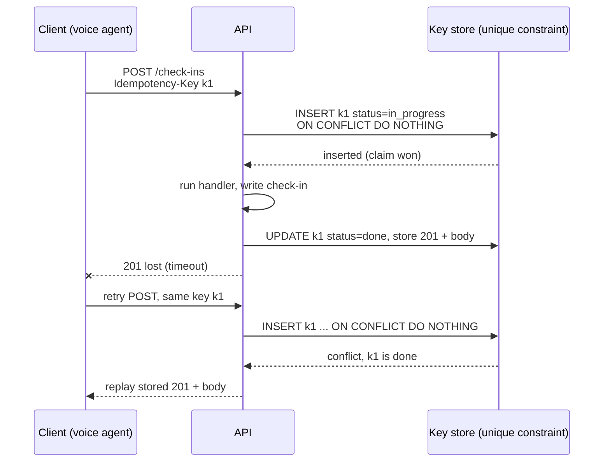
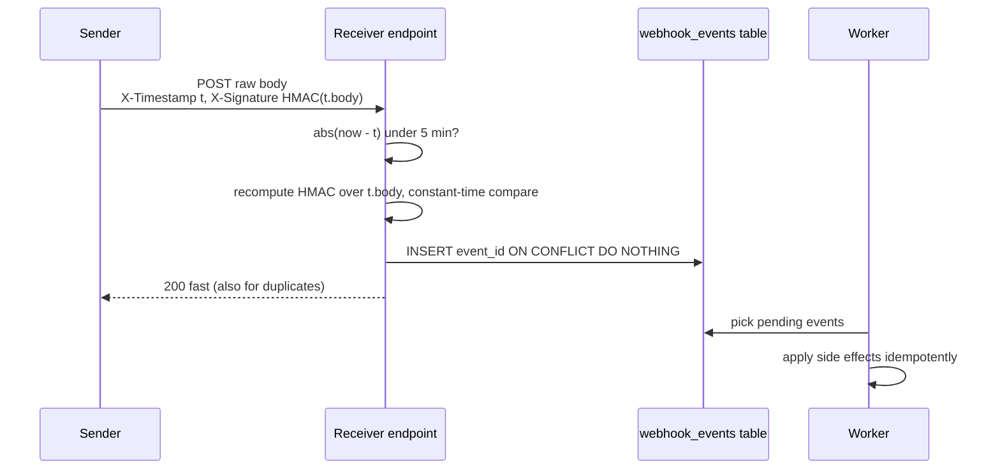
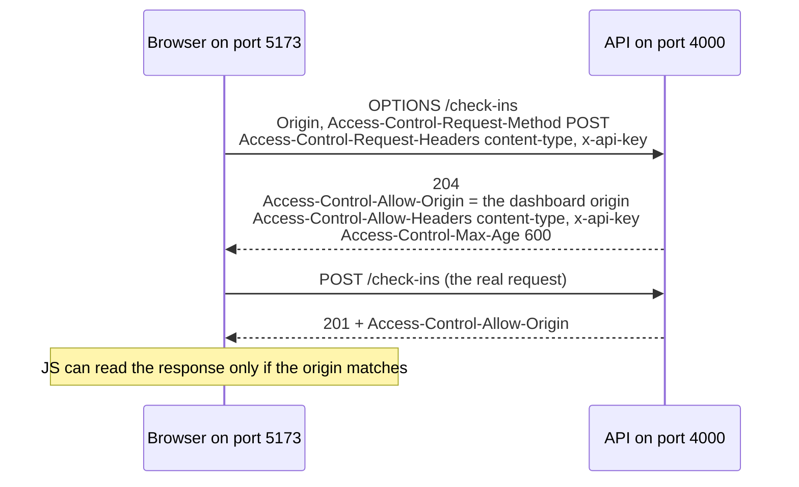

# REST APIs & Webhooks

The patterns below were built for real in a **reference API** (Express/TypeScript, outside this repo): `middleware.ts` for auth and idempotency, `webhook.ts` for signing and retries. Code here is a cleaned-up, production-hardened version of it.

## TL;DR

- **Status codes are the retry contract.** `4xx` means "don't retry as-is", `5xx`/`429` mean "retry later". A caller decides without reading the body.
- **Idempotency key = MERGE on a natural key.** The client picks the key once per logical operation; a unique constraint turns the retry into a no-op that replays the first response.
- **Claim the key atomically.** Two concurrent retries with the same key must not both run: `INSERT ... ON CONFLICT DO NOTHING` or Redis `SET NX`, and return `409` while the first is in progress.
- **Webhook receiver: verify, dedupe, 2xx, then process.** HMAC over `timestamp.body`, reject stale timestamps, dedupe on event id, acknowledge fast, do the work async.
- **Webhook sender: exponential backoff with jitter, then a dead-letter.** Past a demo, the retries live in an outbox table or queue, not in the request thread.

---

## 1. Status codes that matter

| Code | Use it when | Common mistake |
|---|---|---|
| 200 | Successful GET, or a POST that doesn't create anything | Using 200 for a create |
| 201 | POST created a resource | — |
| 204 | Success, nothing to return (DELETE) | 200 with a `null` body |
| 400 | Malformed request (bad JSON, missing required header) | Using 400 for "not found" |
| 401 | Missing or invalid credentials | Confusing it with 403 |
| 403 | Authenticated but not allowed | Confusing it with 401 |
| 404 | Resource doesn't exist | 200 with `{error: "not found"}` |
| 409 | Conflict: concurrent update, duplicate create, idempotency key still in progress | — |
| 422 | Well-formed but semantically invalid (bad enum value) | Using 400 |
| 429 | Rate limited | Forgetting `Retry-After` |
| 500 | Unhandled server error | Leaking a stack trace |

Dashboards and retry logic key off the status class. Getting codes right is what lets a voice agent's tool node decide "retry or give up" without parsing prose.

---

## 2. Idempotency

### The problem

A voice agent on a live call POSTs a truck check-in. The server writes the row, but the response is lost to a timeout. The agent's only sane move is to retry. Without idempotency, the retry logs a second check-in.

Size it: 10k trucks × 5 check-ins/day = 50k POSTs/day. At a 0.5% timeout rate that's ~250 retries/day, so **~250 duplicate facts a day** in the load timeline, all of them silent.

### The mental model

**An idempotency key makes a POST behave like a `MERGE` on a natural key.** You already do this in dbt: `unique_key` + `merge` makes rerunning an incremental model safe. Here the "natural key" is the client-generated key for *this logical request*, and the unique constraint is what turns the second INSERT into "already done, here's the result".

Two ways to be idempotent:
- **Naturally idempotent** operations set a value: `PUT /loads/42/status {"status":"delivered"}`. Running it twice gives the same state. No key needed.
- **Creates of new facts** (log a check-in, charge a card, send an SMS) are not. They need a key.

### The mechanism



The client generates the key (a UUID) **once per logical operation, before the first attempt**, and reuses it on every retry.

### The race most answers miss

Two copies of the same request arrive 50 ms apart: the client timed out aggressively and retried while the first is still running. A naive "look up key, if missing run handler, then cache" lets **both** see "missing" and both run. The check and the claim must be one atomic step:

```sql
-- Postgres: the unique constraint is the lock
INSERT INTO idempotency_keys (key, request_hash, status, created_at)
VALUES ($1, $2, 'in_progress', now())
ON CONFLICT (key) DO NOTHING
RETURNING key;   -- a row back = you own it; no row = someone else does
```

```ts
// Redis equivalent: SET only if Not eXists, with a TTL
const claimed = await redis.set(`idem:${key}`, "in_progress", { NX: true, EX: 86_400 });
```

When the claim fails, read the stored record:

| Stored state | Response |
|---|---|
| `done`, same request hash | Replay the stored status and body |
| `done`, different request hash | `422` (or `409`): key reused for a different payload |
| `in_progress` | `409` with `Retry-After`, or wait briefly and poll |
| `in_progress` but older than a lock timeout | Handler probably crashed. Let the retry take over |

Best case, write the business row and mark the key `done` **in the same DB transaction**, so a crash can't leave "check-in written, key still in progress".

### Decide

- **Postgres table** when the handler already writes to Postgres, so one transaction covers both. **Redis `SET NX`** when handlers span several stores. Approx. 50k keys/day × ~1 KB × 24 h TTL ≈ 50 MB.
- **In-memory `Map`** (the reference API) only for a single-instance demo: lost on restart, not shared across instances.

---

## 3. Webhooks

A webhook is a server pushing an event to a URL someone registered, instead of them polling. A visual workflow builder typically exposes a webhook URL per workflow so external systems can trigger it, and the workflows call out to other systems the same way.

**Bridge:** a webhook with a DB outbox is **Airflow retries plus an idempotent task**. The sender retries until it gets a success; the receiver makes the retry harmless. Neither side alone gives you correctness.

Polling vs webhook, sized: 10k trucks polled every 30 s is ~330 requests/s, almost all answering "nothing changed". A webhook sends only when something happens.

### Receiving: verify, dedupe, acknowledge, process



```ts
import crypto from "node:crypto";

const TOLERANCE_S = 300;

function hmacHex(message: string, secret: string) {
  return crypto.createHmac("sha256", secret).update(message).digest("hex");
}

function verifySignature(message: string, signatureHex: string, secret: string): boolean {
  const expected = Buffer.from(hmacHex(message, secret), "hex");
  const received = Buffer.from(signatureHex, "hex");
  // timingSafeEqual throws RangeError on different lengths, so check first
  if (received.length !== expected.length) return false;
  return crypto.timingSafeEqual(expected, received);
}

// express.raw, NOT express.json: re-serialized JSON won't match the signed bytes
app.post("/webhooks/loads", express.raw({ type: "application/json" }), async (req, res) => {
  const ts = Number(req.header("x-timestamp"));
  const sig = req.header("x-signature") ?? "";
  if (!Number.isFinite(ts) || Math.abs(Date.now() / 1000 - ts) > TOLERANCE_S) {
    return res.status(400).json({ error: "stale_or_missing_timestamp" });
  }
  if (!verifySignature(`${ts}.${req.body.toString("utf8")}`, sig, WEBHOOK_SECRET)) {
    return res.status(401).json({ error: "bad_signature" });
  }
  const event = JSON.parse(req.body.toString("utf8"));
  await db.query(
    "INSERT INTO webhook_events (event_id, payload) VALUES ($1, $2) ON CONFLICT (event_id) DO NOTHING",
    [event.id, event],
  );
  res.sendStatus(200); // a worker processes the row later
});
```

Header names are illustrative; each provider documents its own. Why each step:
- **HMAC over the body**: a tampered body fails, and the secret never travels on the wire.
- **Signed timestamp**: a captured request can't be replayed later or re-dated. Stripe's libraries default to a 5-minute tolerance (checked Sept 2026).
- **`timingSafeEqual`, not `===`**: `===` exits at the first differing byte and leaks timing.
- **Dedupe on event id**: delivery is at-least-once.
- **2xx fast**: a slow handler times out the sender, and one event becomes several deliveries.

### Sending: retry with exponential backoff and jitter

The reference API's sender retries twice with a 250 ms linear delay: it gives up within a second, and fixed delays make failed senders retry in lockstep (thundering herd). Hardened:

```ts
const MAX_ATTEMPTS = 6, BASE_MS = 500, CAP_MS = 60_000;

async function deliver(url: string, event: { id: string }, secret: string) {
  const body = JSON.stringify(event);
  for (let attempt = 0; attempt < MAX_ATTEMPTS; attempt++) {
    const ts = Math.floor(Date.now() / 1000); // re-sign every attempt, or late retries fall outside tolerance
    const headers = {
      "content-type": "application/json",
      "x-timestamp": String(ts),
      "x-signature": hmacHex(`${ts}.${body}`, secret),
      "x-event-id": event.id, // same id on every attempt so the receiver can dedupe
    };
    try {
      const res = await fetch(url, { method: "POST", headers, body, signal: AbortSignal.timeout(5_000) });
      if (res.ok) return;
      const retryable = res.status === 429 || res.status >= 500;
      if (!retryable) return deadLetter(event, `status ${res.status}`);
    } catch {
      // network error or timeout: retryable
    }
    // full jitter: random wait in [0, min(cap, base * 2^attempt)]
    await sleep(Math.random() * Math.min(CAP_MS, BASE_MS * 2 ** attempt));
  }
  deadLetter(event, "max attempts");
}
```

Real providers retry much longer: Stripe retries live-mode events for up to three days with exponential backoff (checked Sept 2026).

### Decide

- **Inline retry loop** for a demo or a few events/min where losing one on a crash is acceptable.
- **Outbox table + worker** once the event must not be lost: write the business row and the outbox row in one transaction, and a worker delivers with backoff. Full pattern in [sql-vs-nosql.md](../system_design/99-reference/sql-vs-nosql.md).
- **Queue (SQS) with a DLQ** when volume is high or many consumers need the event. Delivery semantics live in [streaming-tools.md](../system_design/99-reference/streaming-tools.md).

---

## 4. Auth: API key vs OAuth

| | API key | OAuth 2.0 |
|---|---|---|
| Good for | Server-to-server, one known client | Delegated user access, third-party apps, scopes |
| Revocation | Rotate or delete the key | Revoke one token or client without touching others |
| Complexity | Trivial | Token endpoint, refresh flow, scopes |
| Platform context | Account-level "Generate API Key" for triggering workflows | OAuth-based SSO + MFA for the builder UI |

The reference API's single shared API key is fine for one trusted integration. With multiple customers, each needs their own key, issued and revoked independently and **hashed at rest** like a password.

---

## 5. CORS: "why can't my dashboard reach my API"

### The problem

Your `dashboard` on `http://localhost:5173` calls `legacy-wrapper` on `http://localhost:4000`. The Node smoke test passed, but the browser shows "could not reach the server" with no HTTP status at all.

### The mechanism

Different port = different origin. The browser enforces the same-origin policy: JS on one origin can't **read** a response from another unless the server opts in with `Access-Control-Allow-*` headers. `curl` and server-to-server calls never hit this, which is why the smoke test passed.

If a request isn't "simple", the browser first sends a **preflight**:



A request is "simple" only if it's GET/HEAD/POST, uses only safelisted headers, and has `Content-Type` of `text/plain`, `multipart/form-data` or `application/x-www-form-urlencoded` ([MDN](https://developer.mozilla.org/en-US/docs/Web/HTTP/Guides/CORS)). So **`application/json` alone triggers a preflight**, and so does any custom header like `x-api-key` or `idempotency-key`.

```ts
app.use(cors({
  origin: ["http://localhost:5173"],
  allowedHeaders: ["content-type", "x-api-key", "idempotency-key"],
}));
```

### Failure modes

- **Custom header missing from `allowedHeaders`**: the preflight fails, and the network tab shows a blocked `OPTIONS`, not a 401 or 500. Your JS sees a `TypeError: Failed to fetch`.
- **`Access-Control-Allow-Origin: *` with cookies**: browsers reject a wildcard on credentialed requests. List exact origins.
- **Auth middleware runs before CORS**: the `OPTIONS` preflight carries no API key, gets a 401, and the real request never happens. Mount `cors()` first.

**Interview framing:** "front end can't reach the API" → confirm the server runs and the URL is right, then check CORS. A fetch failing with **no status code** is the tell. CORS is not access control ([performance-and-security.md §2.5](performance-and-security.md#25-cors-is-not-a-security-boundary)).

---

## 6. Pagination and rate limiting

- **Offset** (`?page=2&limit=50`) is simple but rows shift between pages under concurrent writes, and `OFFSET 100000` scans and discards 100k rows. **Cursor** (`?after=<opaque id>`) is stable under writes and uses an index seek, but can't jump to page 5. Default to cursor for anything with steady writes, like a load board.
- **Rate limiting** is token bucket or sliding window, keyed by API key or IP, implemented as middleware. Always return `429` + `Retry-After`. A silent drop looks like a network failure and triggers extra retries. A Redis sorted set is the usual sliding-window store ([in-memory-databases.md](../system_design/99-reference/in-memory-databases.md)).

---

## 7. Talking through a take-home

Use *constraint → decision → trade-off*: "A voice agent can retry check-ins mid-call, and a check-in is a new fact, so I required an `Idempotency-Key`. The store was in-memory for the demo; in production it's a unique-constrained Postgres table claimed atomically." That beats a line-by-line code tour.

---

## Common wrong answers

- **"Check if the key exists, then process."** Check-then-act is a race. The claim must be an atomic insert against a unique constraint.
- **"Use HTTPS, so webhooks don't need signatures."** TLS proves you reached the right server, not that the caller is who they claim to be. Anyone can POST to a public URL.
- **"Return 500 if processing fails, so the sender retries."** Do that only for failures a retry could fix. A permanent error just triggers days of retries. Acknowledge, store the event, and handle the failure on your side.
- **"CORS protects my API."** It only governs what browser JS can read. Auth still has to happen on every request.

---

## Self-check

<details><summary><b>Q1.</b> A client retries a POST with the same Idempotency-Key 50 ms after the first attempt, while the first is still running. What happens with a naive cache lookup, and what's the fix?</summary>

Both requests look up the key, both see nothing, both run the handler: a duplicate. The fix is an atomic claim: `INSERT ... ON CONFLICT (key) DO NOTHING RETURNING key` in Postgres, or `SET key in_progress NX EX ttl` in Redis. Whoever wins runs the handler. The loser reads the record and returns `409` + `Retry-After` while it's `in_progress`, or replays the stored response once it's `done`.

</details>

<details><summary><b>Q2.</b> Why is the timestamp inside the signed string, and why does the sender re-sign on every retry?</summary>

Inside the signature, the timestamp can't be altered without invalidating the HMAC, so the receiver can reject anything older than its tolerance (for example 5 minutes). That blocks replaying a captured request. The sender re-signs each attempt because a retry 30 minutes later with the original timestamp would itself be rejected as stale.

</details>

<details><summary><b>Q3.</b> What breaks if you verify a webhook with `crypto.timingSafeEqual(Buffer.from(expected), Buffer.from(header))` and no length check?</summary>

`timingSafeEqual` throws a `RangeError` when the buffers differ in length. An attacker sending a short or garbage signature turns a clean 401 into an unhandled exception, possibly a 500 or a crashed handler. Compare lengths first and return `false`.

</details>

<details><summary><b>Q4.</b> Your webhook handler takes 20 s because it calls an LLM. What goes wrong and how do you restructure it?</summary>

The sender times out, retries, and one event becomes several concurrent LLM runs. Restructure: verify, insert keyed on `event_id` with `ON CONFLICT DO NOTHING`, return 200 immediately, and let a worker process pending rows, like a sensor that records arrival and a downstream task that does the work.

</details>

<details><summary><b>Q5.</b> The dashboard works with curl but the browser says "Failed to fetch" on POST with `x-api-key`. Walk through the cause.</summary>

The custom header and `application/json` make the request non-simple, so the browser sends an `OPTIONS` preflight first. Either the server has no CORS config, `x-api-key` is missing from `Access-Control-Allow-Headers`, or auth middleware rejects the key-less `OPTIONS` with a 401. curl skips preflights entirely. Fix: mount `cors()` before auth, with the exact origin and headers listed.

</details>

<details><summary><b>Q6.</b> Mini design: carriers' TMS systems must be notified within a minute when a load's status changes, about 200k changes/day, and some carrier endpoints are down for hours. Sketch the sender.</summary>

200k/day is ~2.3/s average, maybe 20/s peak: small. Write the status change and an `outbox` row in one transaction. Workers sign with a fresh timestamp, POST with a 5 s timeout, and retry 429/5xx with exponential backoff and full jitter (capped at ~1 h, for ~24 h), then dead-letter and alert. Cap concurrency per carrier so one dead endpoint doesn't hog workers. Every attempt carries the same `event_id`. Switch to SQS + DLQ if volume or fan-out grows.

</details>

---

## Related

- [nodejs-express.md](nodejs-express.md): middleware order, async errors, timeouts on outbound calls
- [performance-and-security.md](performance-and-security.md): CSRF, JWT, token storage
- [sql-vs-nosql.md](../system_design/99-reference/sql-vs-nosql.md): canonical home for the outbox and dual-write patterns
- [streaming-tools.md](../system_design/99-reference/streaming-tools.md): at-least-once delivery + idempotent consumers
- [in-memory-databases.md](../system_design/99-reference/in-memory-databases.md): `SET NX` guards, sliding-window rate limits
