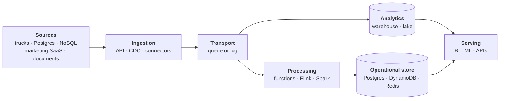
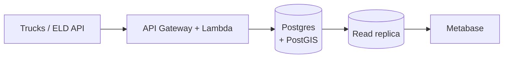
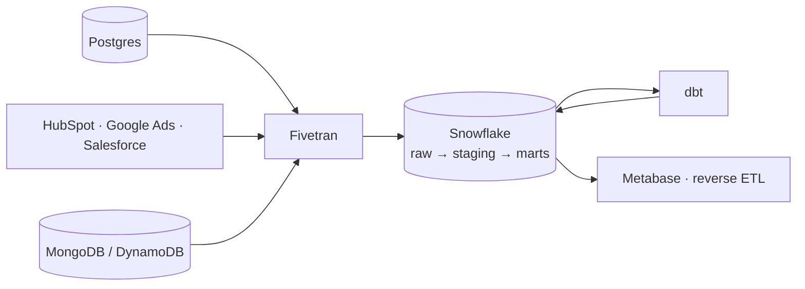
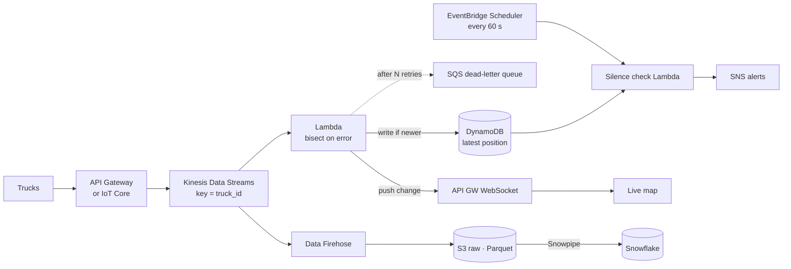
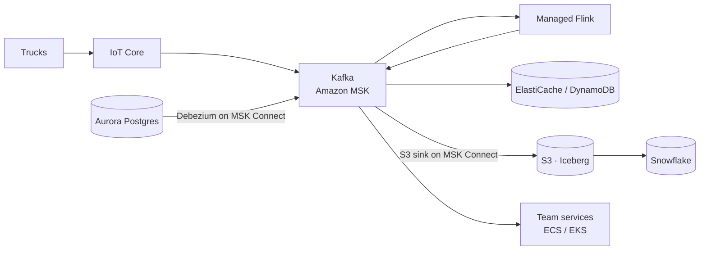

# Cloud Data Architecture on AWS

The interview question is almost never *"what is Kafka?"*. It's **"this business has X trucks, Y data sources and Z people — what do you build?"** This page gives you one default per job, the AWS service that does it, the arithmetic that sizes it, and the trigger that would make you switch. §12 walks through the AWS services in each of the six system design cases.

<p><button class="adv-open mx-go">🧭 Open the architecture advisor</button> &nbsp;<span style="font-size:12px;opacity:.7">choose the business needs, get the recommended stack · key <kbd>r</kbd></span></p>

## TL;DR

- "Size it before naming tools. 10k trucks pinging every 30 s is 333 events/s, which fits in one Kinesis shard."
- "Kafka isn't the alternative to AWS. It's one option for one layer, transport, and AWS even sells it as MSK."
- "I pick one default per job and name the trigger that moves me off it: volume, number of consuming teams, freshness, or compliance."
- "One store is the source of truth. Every other store is a derived view fed by CDC or an outbox, never by dual writes."
- "I accept lock-in on compute where it buys speed, and keep the data in open formats on S3 so the data is never what's trapped."

---

## 0. If you only memorize this: the core toolkit

The tables further down list many tools **for reference only**. To study, learn **one default per job** and **one alternative with its trigger**:

| Job | Default (on AWS) | Switch to… | …when |
|---|---|---|---|
| Copy data from apps & databases | **Fivetran** | **CDC** with **DMS** | you need changes within minutes, including deletes |
| Receive pings / webhooks | **API Gateway + Lambda** | **IoT Core** (MQTT) | you own the devices and they need per-device certificates |
| Hand off work (no replay) | **SQS** (+ dead-letter queue) | | |
| Event pipe many systems read | **Kinesis Data Streams** | **Kafka on MSK** | many teams, compacted topics, retention past 365 days |
| Land a stream in S3 / Snowflake | **Amazon Data Firehose** | | |
| React to events | **Lambda** | **Managed Service for Apache Flink** | needs memory per truck / timers |
| Run a multi-step workflow | **Step Functions** | | |
| App database | **Aurora PostgreSQL** | **DynamoDB** | simple key lookups at massive scale |
| Fast cache / latest values | **ElastiCache** (Valkey / Redis) | | |
| Cheap raw storage | **S3** | | |
| Analytics | **Snowflake** (inside your AWS region) | **Redshift** | the company wants everything AWS-native on one bill |
| Clean & model data | **dbt** | | |
| Run jobs in order | **Airflow on MWAA** | | |
| Alarms & metrics | **CloudWatch** | | |
| Dashboards | **Metabase** | | |

**The scale ladder** (the whole page in four lines):
- **10 trucks** → Lambda writes to Postgres. No streaming.
- **500 trucks + marketing/SQL/NoSQL** → Fivetran → Snowflake → dbt.
- **10k trucks, live map & alerts** → Kinesis → Lambda (Flink once you need per-truck timers) → DynamoDB/ElastiCache, plus Firehose → S3 → Snowflake.
- **100k trucks, many teams** → Kafka on MSK as the backbone.

Learn the job first, then the AWS service that does it. Want to be quizzed on this? Run **`/teacher`** in Claude Code.

---

## 1. Every data platform has the same layers



**Bridge from a batch stack:** you already run three of these boxes. Spark is *processing*, Snowflake is *analytics*, and Airflow schedules the batch half. Streaming adds a *transport* box in the middle (a log instead of files landing in S3) and an *operational store* on the side for what the app reads in milliseconds.

"AWS vs Kafka" is a false choice. **Kafka is one option for a single layer (transport)**, while AWS offers a service for every layer, including a managed Kafka (MSK). The real comparisons are:

1. **Transport:** queue (SQS) vs log (Kinesis or Kafka), in §3
2. **Platform style:** plain Lambda + Aurora, a SaaS "modern data stack", serverless streaming, or Kafka on MSK, in §4
3. **Analytics:** warehouse (Snowflake) vs lakehouse (Databricks + Delta/Iceberg), in §6

---

## 2. Size it: the scale ladder in numbers

```
events/s  = trucks ÷ ping_interval_s
MB/s      = events/s × event_KB ÷ 1024
GB/day    = MB/s × 86,400 ÷ 1024
Kinesis shards = max(write MB/s ÷ 1, events/s ÷ 1000, shared read MB/s ÷ 2), then ×1.5–2 headroom
```

Assume a ~1 KB JSON ping every 30 s, the same numbers as the [truck-stream-processor](../system_design/truck-stream-processor/README.md) case.

| Rung | Load | events/s | Throughput | Per day | Transport it needs |
| --- | --- | --- | --- | --- | --- |
| **10 trucks** | 10 @ 30 s | 0.33 | ~0.3 KB/s | ~29k events, ~28 MB | None. Lambda upserts into Postgres |
| **10k trucks** | 10k @ 30 s | 333 | ~0.33 MB/s | ~28 GB | 1 Kinesis shard (2 for headroom) |
| **100k trucks** | 100k @ 30 s | 3,333 | ~3.3 MB/s | ~275 GB | 4 shards (6–8 with headroom) |
| **100k trucks, 5 s pings** | 100k @ 5 s | 20,000 | ~19.5 MB/s | ~1.6 TB | 20 shards (30–40 with headroom) |

Two things to say out loud:
- **Volume alone never forces Kafka on this ladder.** Even 20,000 events/s is about 20 shards. The move to Kafka at 100k trucks is about *many teams* reading the same events, compaction and Kafka Connect. It isn't about throughput.
- **Reads count too.** A shard gives 2 MB/s and 5 `GetRecords` calls/s, *shared* by every standard consumer. Three consumers each reading 19.5 MB/s need ~58 MB/s of read capacity, which is ~30 shards. Past two or three consumers, switch to enhanced fan-out (a dedicated 2 MB/s per consumer per shard) or Kafka consumer groups. The mechanism is in [streaming-tools.md §4](../system_design/99-reference/streaming-tools.md).

---

## 3. Transport: the decision, not the catalog

The queue-vs-log mechanism, Kinesis vs Kafka limits and delivery semantics live in **[streaming-tools.md](../system_design/99-reference/streaming-tools.md)**. Here is only the choice:

- **Hand off work and nobody re-reads it** → **SQS**. Most "we need streaming" requirements are really work queues.
- **On AWS, one team, a handful of consumers** → **Kinesis** in on-demand mode. There are no brokers, and it integrates natively with Lambda, Firehose and Flink. An on-demand stream starts at 4 MB/s of write capacity and absorbs up to double its peak of the last 30 days. In the largest regions it scales to 10 GB/s *(checked 2026-09)*.
- **Many teams share the stream, or you need compaction, replay beyond 365 days, or Kafka Connect** → **Kafka on Amazon MSK**. MSK Serverless when you don't want to size brokers, provisioned MSK when you need full control of the configuration, and **MSK Connect** to run Kafka Connect connectors (Debezium, S3 sink) without your own workers.
- **Just deliver a stream into storage** → **Amazon Data Firehose** reading from Kinesis. It buffers (0–900 s), converts JSON to Parquet, and writes to S3, Snowflake or Redshift. It's a delivery pipe, not a log: nothing can re-read it.

**What would make me change it:** more consumers than enhanced fan-out allows (20 registered per stream, 50 in On-demand Advantage mode, checked 2026-09), or a need for compacted "latest value per key" topics.

---

## 4. Four archetypes: pick one, then adjust

### A. "Keep it boring": serverless + Postgres

**When:** tens to a few hundred trucks, one or two engineers, a tight budget, minute-level freshness.
**Why it wins:** a single database, close to zero ops, and a bill of a few hundred dollars a month. Postgres handles far more than people expect.
**Outgrow it when:** a second data source shows up, analysts slow down production, or you need several real-time consumers.

### B. Modern data stack (ELT + warehouse + dbt)

**When:** many **heterogeneous** sources (SQL + NoSQL + marketing SaaS), BI and attribution are the goal, and freshness of an hour or so is fine. This is the right answer for "the business has marketing data, some NoSQL and some SQL".
**Why it wins:** connectors are a solved problem (rate limits, pagination, schema drift), and the whole team works in SQL.
**Watch:** connector cost grows with monthly active rows. Airbyte is the cheaper alternative, with more rough edges.

### C. Serverless streaming on AWS

**When:** thousands of trucks, a live map or real-time alerts. Swap the Lambda for Managed Flink once alerts need per-truck timers or the scan gets slow ([truck-stream-processor](../system_design/truck-stream-processor/README.md)).
**Why it wins:** every box is managed and billed per use, with IAM, VPC and CloudWatch already integrated. The S3 copy means any bug downstream is a replay, not data loss.
**Trade-off:** Kinesis limits start to hurt when many teams consume: per-shard read caps, no compaction, a 365-day retention ceiling, and the cost of fan-out.

### D. Kafka-centric platform

**When:** 100k+ trucks *and* many teams producing and consuming the same events, CDC from several databases, or an existing platform team.
**Why it wins:** a single durable event backbone. Replay, compaction and the Connect ecosystem make every downstream store a **derived view**.
**Trade-off:** the most operational and conceptual weight (schemas, partitions, rebalancing). It's only worth it once the organization is large enough.

---

## 5. Mixing SQL, NoSQL and marketing data

| Source | How it gets in | Freshness | Gotcha |
| --- | --- | --- | --- |
| **Postgres / MySQL** (orders, billing) | Log-based CDC (Debezium, DMS) or a Fivetran incremental sync | seconds (CDC) · minutes (connector) | Watermark syncs on `updated_at` **miss hard deletes** |
| **DynamoDB / MongoDB** | DynamoDB Streams (24 h retention) / Mongo change streams → stream, or connector | seconds–minutes | Nested JSON lands as `VARIANT`. Flatten it in dbt staging, not at ingestion |
| **Marketing & CRM** (HubSpot, Google Ads, Meta, Salesforce) | Fivetran, scheduled | hourly–daily | APIs are rate-limited and restate history (conversions get attributed late), so re-sync with lookback windows |
| **Truck telemetry** | ELD vendor API/webhooks (Samsara, Motive) or direct MQTT | seconds | Out-of-order and duplicate pings. Dedupe on `(truck_id, event_ts)` and use event time |
| **Documents** (BOL, POD, invoices) | S3 → event → workflow → OCR + LLM → Postgres | minutes | Keep the original file. Store model output with confidence scores and a review queue |

Outbox vs CDC as *patterns* (and why never dual writes) live in [sql-vs-nosql.md](../system_design/99-reference/sql-vs-nosql.md).

**Where they meet:** in the warehouse, using conformed dimensions.
- `dim_customer` joins CRM account ↔ billing customer ↔ app user (identity resolution on domain / email / tax id).
- `fct_shipments` joins orders (SQL) + trip telemetry aggregates (stream) + documents (POD received).
- `fct_marketing_touch` → attribution → which campaign produced revenue-generating shippers.

That last join (marketing spend → shipments → margin) is usually the business question behind the whole project. Say it.

---

## 6. Warehouse vs lakehouse

**Rule:** SQL/dbt team → **Snowflake**, deployed in the same AWS region as your S3 buckets. **Redshift** when the company wants everything AWS-native on one bill. Spark/ML-heavy team or a hard open-format requirement → **Databricks + Delta/Iceberg** on S3. Occasional SQL over the raw lake → **Athena**, pay per TB scanned, no cluster.

What each is weak at, which is what interviewers probe:
- **Snowflake:** heavy ML and long-running streaming compute. Streaming ingest exists (Snowpipe Streaming, Dynamic Tables).
- **Redshift:** more tuning (distribution and sort keys, workload management), and a smaller dbt/community ecosystem. Redshift Serverless removes the sizing but not the modelling.
- **Athena:** cost surprises on unpartitioned scans, since you pay per TB read. Partition by date and store Parquet.
- **Databricks:** SQL-only teams and governance setup. Its home turf is the Spark you already know ([pyspark.md](../data-engineering/pyspark.md)).

Cost and pruning details: [snowflake-performance.md](../data-engineering/snowflake-performance.md).

---

## 7. Processing and orchestration, briefly

| Need | Pick |
| --- | --- |
| Stateless per-event transform, dedupe, upsert | **Lambda** |
| Windows, joins, "truck went silent for 30 min", sub-second alerts | **Flink** (managed) |
| Seconds of latency and the team already writes PySpark | Spark Structured Streaming on Databricks |
| Minute-level incremental models inside the warehouse | Snowflake Dynamic Tables / **dbt** incremental |
| Scheduled batch pipeline with dependencies and backfills | **Airflow on MWAA** |
| Per-event workflow with retries and human review (documents) | **Step Functions** (Standard) |
| Three sources, one dbt project | Connector schedules + dbt Cloud jobs. No Airflow yet |

Lambda vs Flink in depth: [streaming-tools.md §5](../system_design/99-reference/streaming-tools.md).

---

## 8. Cost and lock-in trade-offs to name

- **Serverless is cheap when idle and expensive at steady high load.** Lambda + Kinesis on-demand beats a cluster at low utilization. Where it flips is a *rule of thumb, not a law*. Published break-even analyses land anywhere from ~40% to ~70% steady utilization, depending on duration, memory and the API Gateway/NAT/logging costs around the function (approx., checked 2026-09). Do the arithmetic for your workload.
- **Managed services (Fivetran, Snowflake, MSK Serverless, Managed Flink) cost more on the invoice and less in engineer time.** For a team of two, it's almost always worth it.
- **AWS-specific APIs vs open protocols:** SQS, Kinesis and DynamoDB have AWS-only APIs; MSK (Kafka) and Aurora (Postgres) speak standard protocols. Use the AWS-native one when it saves operations, and keep **raw data as Parquet/Iceberg on S3** so any engine can read it later.
- **Hidden AWS costs:** NAT Gateway data processing (use VPC endpoints for S3, DynamoDB and Kinesis), CloudWatch Logs ingestion from chatty Lambdas, and cross-AZ traffic between brokers and clients.

---

## 9. Failure modes to name at the architecture level

| Failure | How it shows up | Canonical home |
| --- | --- | --- |
| **Hot partition** | Keyed by `region`, one shard throttles while the others idle. On-demand Kinesis doesn't save you: a single key still caps at 1 MB/s | [streaming-tools.md](../system_design/99-reference/streaming-tools.md) |
| **Poison message** | One malformed ping fails forever and stalls its whole shard, because a log is ordered | [streaming-tools.md](../system_design/99-reference/streaming-tools.md) |
| **Backpressure / iterator age** | Consumer lag climbs for hours before anything visibly breaks, then retention deletes unread data | [streaming-tools.md](../system_design/99-reference/streaming-tools.md) |
| **Cache stampede** | A hot key expires and thousands of requests hit Postgres at once | [in-memory-databases.md](../system_design/99-reference/in-memory-databases.md) |
| **Dual-write drift** | The app writes Postgres, then publishes, and crashes in between. The stores disagree silently | [sql-vs-nosql.md](../system_design/99-reference/sql-vs-nosql.md) |
| **Over-engineering** | Kafka + Flink for 10 trucks: 0.33 events/s and a platform team's worth of ops | §2 above |

## 10. Common wrong answers

- **"AWS or Kafka?"** Wrong axis. Kafka is a transport. The AWS answer for that one layer is Kinesis or MSK.
- **"Kafka, because we need real-time."** Kinesis and SQS both deliver in milliseconds to seconds. Kafka earns its ops cost through many consumers, compaction and its ecosystem, not through latency.
- **"Serverless is always cheaper."** It's cheaper when idle. At steady high utilization, provisioned capacity or containers win. Show the arithmetic instead of asserting it.
- **"Firehose is our stream."** Firehose delivers and forgets. If a second reader or a replay is needed, Kinesis Data Streams (or MSK) goes in front.
- **"Lambda writes straight to Aurora."** Hundreds of concurrent Lambdas each open a connection. Put RDS Proxy in between.

---

## 11. Interview one-liners

- "Kafka and Kinesis are the same idea, a partitioned replayable log. Kinesis trades ecosystem and flexibility for zero ops on AWS. I'd go to Kafka on MSK when many teams share the stream or we need compaction."
- "For 10 trucks I wouldn't build a streaming platform. That's a third of an event per second, and a Postgres table with an upsert handles it."
- "With SQL, NoSQL and marketing sources, the hard part isn't transport, it's **conformed dimensions and identity resolution** in the warehouse. So: managed connectors, then dbt."
- "Only one store is the source of truth. Everything else is a derived view fed by CDC, never by dual writes."
- "I'd pick managed services first and name the trigger that would make me change it: volume, consumer count, or a compliance requirement."

---

## 12. AWS, case by case

Each of the six system design cases uses a small set of AWS services. This section lists them per case, with what each service does *in that case* and the setting that makes it work. Read the case first, then use this to check that you can name every AWS box and say why it's there.

### Truck stream processor (silence detection, 10k trucks)

[Case](../system_design/truck-stream-processor/README.md). The flow: `API Gateway → Kinesis → Lambda → DynamoDB`, a scheduled Lambda that finds silent trucks, and `Firehose → S3 → Snowflake` for history.

| AWS service | Its job in this case | The setting that matters |
| --- | --- | --- |
| API Gateway | Authenticated HTTPS entry for 10k devices, with throttling | Without it every device needs AWS credentials, and one bad device can flood the stream |
| Kinesis Data Streams | Durable, ordered buffer with two readers (Lambda and Firehose) | Partition key `truck_id` keeps each truck's pings in order; 1 shard needed, 2 provisioned |
| Lambda (Kinesis consumer) | Turns pings into each truck's `last_seen` | Bisect on error, bounded retries, on-failure destination to SQS |
| DynamoDB | Current state per truck | Conditional write: only if `event_time > last_seen`, so duplicates and replays do nothing |
| EventBridge Scheduler + Lambda | The clock: every 60 s, find trucks silent for more than X minutes | A missing ping triggers nothing, so something has to check on a schedule |
| SNS / EventBridge | Sends the alert | Alert key `(truck_id, silence_started_at)` so a retry doesn't page twice |
| Firehose → S3 → Snowpipe | History for analytics and replay | Parquet partitioned by date |
| CloudWatch | Health | Alarm on `IteratorAge` (reader falling behind) and DLQ depth |
| *Growth:* Managed Flink, IoT Core | Per-truck timers at 100k trucks; MQTT devices with certificates | |

### CDC from Postgres to the warehouse

[Case](../system_design/cdc-postgres-to-warehouse/README.md). The flow: `Aurora → DMS → Kinesis → Firehose → S3 → Snowpipe → Snowflake MERGE`, with DynamoDB Streams feeding the same Kinesis stream through a Lambda.

| AWS service | Its job in this case | The setting that matters |
| --- | --- | --- |
| RDS / Aurora PostgreSQL | Source of truth | `rds.logical_replication = 1`; alarm on `OldestReplicationSlotLag` and `TransactionLogsDiskUsage`, because an unread slot fills the disk |
| DMS | Reads every committed change, including deletes | Full load first (from a read replica), then CDC; mask PII in the task's table mapping; alarm on `CDCLatencySource` / `CDCLatencyTarget` |
| Kinesis Data Streams | Buffer between DMS and loaders; lets a second consumer read the same changes | Key = table + primary key; 2 shards at peak, 4 provisioned |
| DynamoDB Streams + Lambda | CDC for the NoSQL data | Streams keep only 24 h: alarm long before that |
| Firehose | Batches change events into S3 files | Buffer 60 s, not the 300 s default, or the 5-minute SLO is gone |
| S3 (append-only raw) | Replay and audit | A transform bug is a re-run over S3, not a 320 GB re-extract |
| MWAA | Runs the `MERGE` and dbt every few minutes | |

### Live load board

[Case](../system_design/live-load-board/README.md). The flow: `Aurora (truth + outbox) → projector → ElastiCache indexes + pub/sub → WebSocket tier`.

| AWS service | Its job in this case | The setting that matters |
| --- | --- | --- |
| Aurora PostgreSQL | Decides who books a load | Conditional `UPDATE ... WHERE status = 'open'`: the first wins, the second gets 0 rows and a 409 |
| ElastiCache (Valkey / Redis) | GEO, sorted-set and set indexes for filters at 2,000 reads/s; pub/sub for deltas | `noeviction`; it's a derived view, rebuilt from Postgres in seconds |
| Containers (ECS on Fargate) | Load API and projector | Steady 2,000 QPS is cheaper on containers than per-request Lambda |
| API Gateway WebSocket | Pushes deltas to 5,000 carriers | 2 h max connection, 10 min idle timeout, 500 new connections/s per account per Region by default |
| S3 → Snowflake | Pricing and market analytics | |
| *Growth:* Kinesis (via CDC), OpenSearch | More consumers of load events; free-text lane search | |

### Document ingestion pipeline

[Case](../system_design/document-ingestion-pipeline/README.md). The flow: `S3 → SQS → starter Lambda → Step Functions (Textract → Bedrock → validate) → Aurora`, with a human review queue.

| AWS service | Its job in this case | The setting that matters |
| --- | --- | --- |
| SES, S3 presigned URLs | Every channel lands the raw file in one bucket | Never proxy file bytes through your API |
| S3 | Landing zone, raw retention, eval set | KMS encryption; `ObjectCreated` events go to SQS |
| SQS | Absorbs the 40k-document month-start burst | Dead-letter queue; visibility timeout longer than the starter's run |
| Lambda (starter) | Starts one workflow per document | Reserved concurrency caps how many run at once, keeping you inside Textract and Bedrock quotas |
| Step Functions (Standard) | Per-document workflow with retries and waits | Standard, because `.waitForTaskToken` for human review isn't available in Express; execution name = content hash, so re-sends are rejected |
| Textract | OCR plus geometry for the reviewer | `AnalyzeExpense` for invoices (~$3k/month here) instead of Tables + Forms on everything (~$19.5k) |
| Bedrock | Extracts fields into typed JSON via a tool schema | Retry 429s with backoff; batch inference for backlogs at ~50% of the price |
| SNS | Textract async completion callback | |

### Freight billing warehouse

[Case](../system_design/freight-billing-warehouse/README.md). Mostly Snowflake and dbt; AWS provides the landing zone and the scheduler.

| AWS service | Its job in this case | The setting that matters |
| --- | --- | --- |
| S3 | Landing for carrier files (EDI, CSV) | Keys are content hashes, so a re-sent file lands on the same key and loads once |
| MWAA | Orchestrates Fivetran syncs, Python extractors and dbt | Tasks tell Snowflake or S3 to do the work; don't pull data through the worker's memory |
| Secrets Manager | SFTP and API credentials for the extractors | |

### Warehouse refactor and consolidation

[Case](../system_design/warehouse-refactor-consolidation/README.md). A Snowflake cost and trust problem; the AWS part is the Airflow that runs it.

| AWS service | Its job in this case | The setting that matters |
| --- | --- | --- |
| MWAA | Replace the one 6-hour DAG with model-level tasks | Cosmos renders each dbt model as a task, so a failure retries one model; `max_active_runs=1` and pools so backfills don't flood Snowflake |
| MWAA workers | Orchestrate only | Push the work down to Snowflake; a `PythonOperator` pulling GBs through the worker runs out of memory |
| CloudWatch | Airflow metrics from MWAA | Pair them with failure and SLA-miss callbacks to Slack, so nobody finds out at 10am |

---

## Self-check

<details><summary><b>Q1.</b> 10k trucks send a 1 KB ping every 30 s. Give events/s, MB/s, GB/day and the Kinesis shard count.</summary>

10,000 ÷ 30 = **333 events/s**. × 1 KB ≈ **0.33 MB/s**. × 86,400 s ≈ **28 GB/day**. Shards = max(0.33 MB/s ÷ 1, 333 ÷ 1000) = 0.33, so **1 shard**, and 2 with headroom. Say the arithmetic before naming a tool.

</details>

<details><summary><b>Q2.</b> At 100k trucks with 5 s pings you still only need ~20 shards. So why does the scale ladder move to Kafka?</summary>

Because the trigger is organizational, not volume. Many teams produce and consume the same events, and each wants its own consumer group, replay, compacted "latest state" topics and Kafka Connect sinks. Kinesis caps enhanced fan-out consumers per stream and has no compaction. Kafka makes adding the tenth consumer cheap.

</details>

<details><summary><b>Q3.</b> Three standard consumers read a Kinesis stream taking 19.5 MB/s of writes. What breaks, and what do you do?</summary>

The shared read limit breaks: 2 MB/s and 5 `GetRecords` calls/s per shard, shared by all standard consumers. Three consumers need ~58 MB/s of reads, about 30 shards, and they compete for the 5 calls/s, so iterator age climbs. Fix it with enhanced fan-out (2 MB/s dedicated per consumer per shard) or, if consumers keep multiplying, Kafka consumer groups.

</details>

<details><summary><b>Q4.</b> A 500-truck company has Postgres, MongoDB and HubSpot, and wants weekly margin by marketing campaign. What do you build, and what do you deliberately not build?</summary>

Fivetran for all three sources → Snowflake (raw → staging → marts) → dbt with a conformed `dim_customer` (identity resolution) and `fct_shipments` → Metabase. Airflow isn't needed yet; connector schedules and dbt jobs are enough. **Don't** build Kinesis, Kafka or Flink: weekly freshness makes a streaming layer pure cost. Switch Postgres to CDC only if someone needs minutes-fresh data.

</details>

<details><summary><b>Q5.</b> Someone says "serverless is cheaper below 40–50% utilization". How do you respond?</summary>

It's a rule of thumb. The break-even moves with function duration, memory, and the costs around the function (API Gateway per request, NAT, logs). Published analyses put it anywhere between ~40% and ~70%. I'd estimate it: requests/s × duration × memory for Lambda against always-on container hours, and weigh the ops time too.

</details>

<details><summary><b>Q6.</b> A Lambda reading from Kinesis hits one malformed record. What happens with default settings, and which three settings fix it?</summary>

By default Lambda retries the whole batch until the record expires from the stream, so that shard stops moving and `IteratorAge` climbs while the other shards are fine. Fix: **bisect batch on error** (split the batch to isolate the bad record), a **maximum retry count**, and an **on-failure destination** (an SQS dead-letter queue) with an alarm on its size.

</details>

<details><summary><b>Q7.</b> Firehose vs Kinesis Data Streams: when is Firehose alone enough, and when do you need both?</summary>

Firehose alone is enough when the only goal is to land events in S3, Snowflake or Redshift and nobody needs to re-read them. Put Kinesis Data Streams in front when there's more than one reader (a Lambda updating the live map *and* the archive) or you need replay, because Firehose delivers and forgets.

</details>

<details><summary><b>Q8.</b> Why does the document pipeline use Step Functions Standard and not Express?</summary>

Each document can wait hours for Textract's async job or a human reviewer. Standard runs up to a year and supports `.waitForTaskToken`; Express runs at most 5 minutes and doesn't support those callbacks. Standard also gives a per-document execution history, so "where is doc 4471?" has an answer.

</details>

<details><summary><b>Q9.</b> Hundreds of Lambdas write truck positions to Aurora and the database starts refusing connections. What do you add, and what else would you check?</summary>

**RDS Proxy**, which pools connections so concurrent Lambdas share a few. Also batch the writes (one upsert per Kinesis batch, not per ping), and check that the upsert only overwrites when the incoming ping is newer.

</details>

<details><summary><b>Q10.</b> In the CDC case, which AWS metric do you alarm on so the CDC pipeline can't take production down, and why?</summary>

`OldestReplicationSlotLag` (and `TransactionLogsDiskUsage`) on the RDS/Aurora instance. If DMS stops reading, the replication slot makes Postgres keep all WAL, the disk fills, and writes stop.

</details>

---

## Reference: AWS service per layer

Look this up when needed. **Bold** = in the core toolkit (§0). The last column is the number or setting interviewers ask about.

| Layer | AWS service | The detail that matters |
| --- | --- | --- |
| Queue | **SQS** | Visibility timeout ≥ 6× the consumer Lambda's timeout; `maxReceiveCount` → dead-letter queue; retention up to 14 days |
| Fan-out | SNS / EventBridge | SNS → several SQS queues for fan-out; EventBridge routes by event content and can archive and replay |
| Partitioned log | **Kinesis Data Streams** | Per shard: 1 MB/s or 1,000 records/s in, 2 MB/s out shared by standard readers; retention 24 h default, up to 365 days |
| Managed Kafka | MSK (+ MSK Connect) | Serverless or provisioned brokers; Connect runs Debezium and S3 sink connectors |
| Stream delivery to storage | **Amazon Data Firehose** | Buffer 0–900 s; JSON → Parquet conversion; destinations S3, Snowflake, Redshift, OpenSearch, HTTP |
| Device ingestion | IoT Core | MQTT with a certificate per device; rules route messages to Kinesis, Lambda or DynamoDB |
| HTTP entry point | **API Gateway** | HTTP APIs are cheaper; REST APIs add API keys, usage plans and request validation; WebSocket APIs: 2 h max connection, 10 min idle |
| Stateful stream processing | **Managed Service for Apache Flink** | Keyed state and timers per truck, checkpoints to S3 |
| Functions | **Lambda** | 15 min max, up to 10 GB memory; Kinesis source: bisect on error, max retries, on-failure destination, parallelization factor up to 10 per shard |
| Workflows | **Step Functions** | Standard runs up to 1 year and supports `.waitForTaskToken`; Express runs up to 5 min |
| Object storage | **S3** | Event notifications to SQS/EventBridge; 3,500 writes and 5,500 reads per second per prefix |
| Relational | **Aurora PostgreSQL** / RDS | Up to 15 read replicas; RDS Proxy for Lambda; logical replication slot for CDC |
| Key-value | **DynamoDB** | Items up to 400 KB; conditional writes; Streams keep 24 h; TTL deletes within days, not minutes |
| Cache | **ElastiCache** (Valkey / Redis) | GEO, sorted sets, pub/sub; a derived view you can rebuild |
| CDC | **DMS** | Full load, then CDC from the Postgres WAL; alarm on replication slot lag |
| Warehouse | Redshift (or **Snowflake** in-region) | Snowpipe auto-ingest from S3 |
| Lake query | Athena + Glue Data Catalog | Pay per TB scanned; partition and use Parquet |
| Spark | EMR, Glue, or Databricks on AWS | |
| Orchestration | **MWAA** (Airflow) | Scheduled pipelines with dependencies and backfills |
| Document AI | Textract | Pick the API per document class; `AnalyzeExpense` for invoices |
| LLMs | Bedrock | Quotas are tokens per minute per model; batch inference for backlogs |
| Monitoring | **CloudWatch** | Kinesis `IteratorAge`, DLQ depth, DMS `CDCLatencySource` |
| Secrets & keys | Secrets Manager, KMS | Rotation; envelope encryption |
| Private networking | VPC endpoints / PrivateLink | Keeps S3, DynamoDB and Kinesis traffic off the internet and off the NAT bill |

---

## Related
- [Streaming tools](../system_design/99-reference/streaming-tools.md) (queue vs log, Kinesis vs Kafka, delivery semantics) · [SQL vs NoSQL](../system_design/99-reference/sql-vs-nosql.md) (outbox, CDC, consistency) · [In-memory databases](../system_design/99-reference/in-memory-databases.md) (caching) · [AWS services map](../system_design/99-reference/aws-services-map.md)
- Applied in: [truck-stream-processor](../system_design/truck-stream-processor/README.md) · [cdc-postgres-to-warehouse](../system_design/cdc-postgres-to-warehouse/README.md) · [live-load-board](../system_design/live-load-board/README.md)
