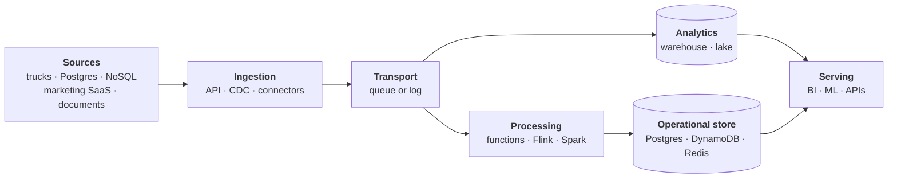
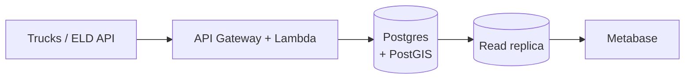
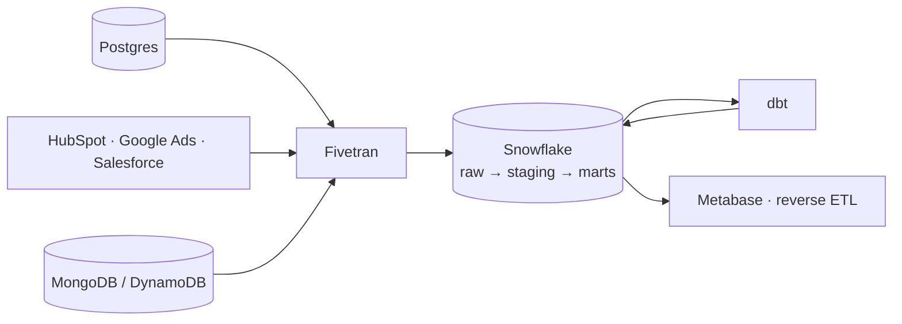
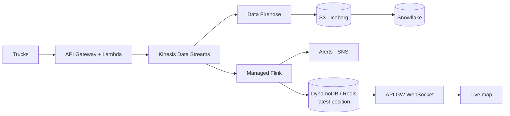
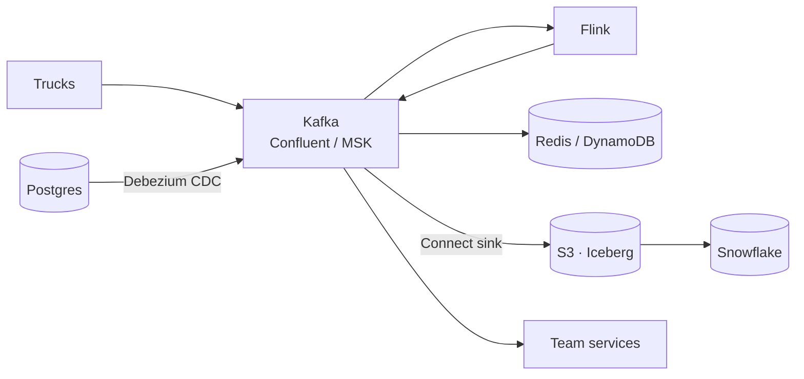

# Cloud Data Architecture — AWS vs Kafka vs the Rest

The interview question is almost never *"what is Kafka?"*. It's **"this business has X trucks, Y data sources and Z people — what do you build?"** This page gives you one default per job, the arithmetic that sizes it, and the trigger that would make you switch.

<p><button class="adv-open mx-go">🧭 Open the architecture advisor</button> &nbsp;<span style="font-size:12px;opacity:.7">choose the business needs, get the recommended stack · key <kbd>r</kbd></span></p>

## TL;DR

- "Size it before naming tools. 10k trucks pinging every 30 s is 333 events/s, which fits in one Kinesis shard."
- "Kafka isn't the alternative to AWS. It's one option for one layer, transport, and AWS even sells it as MSK."
- "I pick one default per job and name the trigger that moves me off it: volume, number of consuming teams, freshness, or compliance."
- "One store is the source of truth. Every other store is a derived view fed by CDC or an outbox, never by dual writes."
- "I accept lock-in on compute where it buys speed, and keep the data in open formats on S3 so the data is never what's trapped."

---

## 0. If you only memorize this: the core toolkit

The tables further down list many tools **for reference only**. To study, learn **one default per job** and **one alternative with its trigger**:

| Job | Default | Switch to… | …when |
|---|---|---|---|
| Copy data from apps & databases | **Fivetran** | **CDC** (Debezium / DMS) | you need changes within seconds |
| Receive pings / webhooks | **API Gateway + Lambda** | | |
| Hand off work (no replay) | **SQS** | | |
| Event pipe many systems read | **Kinesis** | **Kafka** | huge volume, many teams, multi-cloud |
| React to events | **Lambda** | **Flink** | needs memory per truck / timers |
| App database | **Postgres** | **DynamoDB** | simple key lookups at massive scale |
| Fast cache / latest values | **Redis** | | |
| Cheap raw storage | **S3** | | |
| Analytics | **Snowflake** | | |
| Clean & model data | **dbt** | | |
| Run jobs in order | **Airflow** | | |
| Dashboards | **Metabase** | | |

**The scale ladder** (the whole page in four lines):
- **10 trucks** → Lambda writes to Postgres. No streaming.
- **500 trucks + marketing/SQL/NoSQL** → Fivetran → Snowflake → dbt.
- **10k trucks, live map & alerts** → Kinesis → Flink → DynamoDB/Redis, plus S3 → Snowflake.
- **100k trucks, many teams** → Kafka as the backbone.

GCP and Azure have the same jobs under different names (Pub/Sub ≈ Kinesis, BigQuery ≈ Snowflake…). Learn the job, not the brand. Want to be quizzed on this? Run **`/teacher`** in Claude Code.

---

## 1. Every data platform has the same layers



**Bridge from a batch stack:** you already run three of these boxes. Spark is *processing*, Snowflake is *analytics*, and Airflow schedules the batch half. Streaming adds a *transport* box in the middle (a log instead of files landing in S3) and an *operational store* on the side for what the app reads in milliseconds.

"AWS vs Kafka" is a false choice. **Kafka is one option for a single layer (transport)**, while AWS offers a service for every layer, including a managed Kafka (MSK). The real comparisons are:

1. **Transport:** queue (SQS) vs log (Kinesis or Kafka), in §3
2. **Platform style:** cloud-native serverless vs vendor-neutral open source vs SaaS "modern data stack", in §4
3. **Analytics:** warehouse (Snowflake) vs lakehouse (Databricks + Delta/Iceberg), in §6

---

## 2. Size it: the scale ladder in numbers

```
events/s  = trucks ÷ ping_interval_s
MB/s      = events/s × event_KB ÷ 1024
GB/day    = MB/s × 86,400 ÷ 1024
Kinesis shards = max(write MB/s ÷ 1, events/s ÷ 1000, shared read MB/s ÷ 2), then ×1.5–2 headroom
```

Assume a ~1 KB JSON ping every 30 s, the same numbers as the [truck-stream-processor](../system_design/truck-stream-processor/README.md) case.

| Rung | Load | events/s | Throughput | Per day | Transport it needs |
| --- | --- | --- | --- | --- | --- |
| **10 trucks** | 10 @ 30 s | 0.33 | ~0.3 KB/s | ~29k events, ~28 MB | None. Lambda upserts into Postgres |
| **10k trucks** | 10k @ 30 s | 333 | ~0.33 MB/s | ~28 GB | 1 Kinesis shard (2 for headroom) |
| **100k trucks** | 100k @ 30 s | 3,333 | ~3.3 MB/s | ~275 GB | 4 shards (6–8 with headroom) |
| **100k trucks, 5 s pings** | 100k @ 5 s | 20,000 | ~19.5 MB/s | ~1.6 TB | 20 shards (30–40 with headroom) |

Two things to say out loud:
- **Volume alone never forces Kafka on this ladder.** Even 20,000 events/s is about 20 shards. The move to Kafka at 100k trucks is about *many teams* reading the same events, compaction, Kafka Connect and portability. It isn't about throughput.
- **Reads count too.** A shard gives 2 MB/s and 5 `GetRecords` calls/s, *shared* by every standard consumer. Three consumers each reading 19.5 MB/s need ~58 MB/s of read capacity, which is ~30 shards. Past two or three consumers, switch to enhanced fan-out (a dedicated 2 MB/s per consumer per shard) or Kafka consumer groups. The mechanism is in [streaming-tools.md §4](../system_design/99-reference/streaming-tools.md).

---

## 3. Transport: the decision, not the catalog

The queue-vs-log mechanism, Kinesis vs Kafka limits and delivery semantics live in **[streaming-tools.md](../system_design/99-reference/streaming-tools.md)**. Here is only the choice:

- **Hand off work and nobody re-reads it** → **SQS**. Most "we need streaming" requirements are really work queues.
- **On AWS, one team, a handful of consumers** → **Kinesis** in on-demand mode. There are no brokers, and it integrates natively with Lambda, Firehose and Flink. An on-demand stream starts at 4 MB/s of write capacity and absorbs up to double its peak of the last 30 days. In the largest regions it scales to 10 GB/s *(checked 2026-09)*.
- **Many teams share the stream, or you need compaction, replay beyond 365 days, Kafka Connect, or multi-cloud** → **Kafka**. Pick Confluent Cloud if you don't want to run it, MSK to stay on the AWS bill, and self-hosted only with a real platform team.
- **Same idea on other clouds:** Pub/Sub on GCP (Google also sells *Managed Service for Apache Kafka*). Event Hubs on Azure, which speaks the Kafka protocol from the Standard tier up.

**What would make me change it:** more consumers than enhanced fan-out allows (20 registered per stream, 50 in On-demand Advantage mode, checked 2026-09), a need for compacted "latest value per key" topics, or a second cloud.

---

## 4. Four archetypes: pick one, then adjust

### A. "Keep it boring": serverless + Postgres

**When:** tens to a few hundred trucks, one or two engineers, a tight budget, minute-level freshness.
**Why it wins:** a single database, close to zero ops, and a bill of a few hundred dollars a month. Postgres handles far more than people expect.
**Outgrow it when:** a second data source shows up, analysts slow down production, or you need several real-time consumers.

### B. Modern data stack (ELT + warehouse + dbt)

**When:** many **heterogeneous** sources (SQL + NoSQL + marketing SaaS), BI and attribution are the goal, and freshness of an hour or so is fine. This is the right answer for "the business has marketing data, some NoSQL and some SQL".
**Why it wins:** connectors are a solved problem (rate limits, pagination, schema drift), and the whole team works in SQL.
**Watch:** connector cost grows with monthly active rows. Airbyte is the cheaper alternative, with more rough edges.

### C. Cloud-native streaming (AWS example)

**When:** thousands of trucks, a live map or real-time alerts, and a company committed to one cloud.
**Why it wins:** every box is managed and billed per use, with IAM, VPC and monitoring already integrated.
**Trade-off:** lock-in. Kinesis limits start to hurt when many teams consume: per-shard caps, no compaction, a 365-day retention ceiling, and the cost of fan-out.

### D. Kafka-centric platform

**When:** 100k+ trucks *and* many teams producing and consuming the same events, CDC from several databases, a multi-cloud requirement, or an existing platform team.
**Why it wins:** a single durable event backbone. Replay, compaction and the Connect ecosystem make every downstream store a **derived view**.
**Trade-off:** the most operational and conceptual weight (schemas, partitions, rebalancing). It's only worth it once the organization is large enough.

---

## 5. Mixing SQL, NoSQL and marketing data

| Source | How it gets in | Freshness | Gotcha |
| --- | --- | --- | --- |
| **Postgres / MySQL** (orders, billing) | Log-based CDC (Debezium, DMS) or a Fivetran incremental sync | seconds (CDC) · minutes (connector) | Watermark syncs on `updated_at` **miss hard deletes** |
| **DynamoDB / MongoDB** | DynamoDB Streams (24 h retention) / Mongo change streams → stream, or connector | seconds–minutes | Nested JSON lands as `VARIANT`. Flatten it in dbt staging, not at ingestion |
| **Marketing & CRM** (HubSpot, Google Ads, Meta, Salesforce) | Fivetran, scheduled | hourly–daily | APIs are rate-limited and restate history (conversions get attributed late), so re-sync with lookback windows |
| **Truck telemetry** | ELD vendor API/webhooks (Samsara, Motive) or direct MQTT | seconds | Out-of-order and duplicate pings. Dedupe on `(truck_id, event_ts)` and use event time |
| **Documents** (BOL, POD, invoices) | S3 → event → workflow → OCR + LLM → Postgres | minutes | Keep the original file. Store model output with confidence scores and a review queue |

Outbox vs CDC as *patterns* (and why never dual writes) live in [sql-vs-nosql.md](../system_design/99-reference/sql-vs-nosql.md).

**Where they meet:** in the warehouse, using conformed dimensions.
- `dim_customer` joins CRM account ↔ billing customer ↔ app user (identity resolution on domain / email / tax id).
- `fct_shipments` joins orders (SQL) + trip telemetry aggregates (stream) + documents (POD received).
- `fct_marketing_touch` → attribution → which campaign produced revenue-generating shippers.

That last join (marketing spend → shipments → margin) is usually the business question behind the whole project. Say it.

---

## 6. Warehouse vs lakehouse

**Rule:** SQL/dbt team → **Snowflake** (BigQuery is the same idea on GCP, Redshift for AWS-only shops). Spark/ML-heavy team or a hard open-format requirement → **Databricks + Delta/Iceberg**. Sub-second user-facing analytics over huge event tables → put **ClickHouse** in front.

What each is weak at, which is what interviewers probe:
- **Snowflake:** heavy ML and long-running streaming compute. Streaming ingest exists (Snowpipe Streaming, Dynamic Tables).
- **BigQuery:** cost surprises on unbounded scans when you pay per TB scanned.
- **Databricks:** SQL-only teams and governance setup. Its home turf is the Spark you already know ([pyspark.md](../data-engineering/pyspark.md)).
- **ClickHouse:** joins and updates.

Cost and pruning details: [snowflake-performance.md](../data-engineering/snowflake-performance.md).

---

## 7. Processing and orchestration, briefly

| Need | Pick |
| --- | --- |
| Stateless per-event transform, dedupe, upsert | **Lambda** |
| Windows, joins, "truck went silent for 30 min", sub-second alerts | **Flink** (managed) |
| Seconds of latency and the team already writes PySpark | Spark Structured Streaming on Databricks |
| Minute-level incremental models inside the warehouse | Snowflake Dynamic Tables / **dbt** incremental |
| Scheduled batch pipeline with dependencies and backfills | **Airflow** (MWAA / Astronomer) |
| Per-event workflow with retries and human review (documents) | Step Functions / Temporal |
| Three sources, one dbt project | Connector schedules + dbt Cloud jobs. No Airflow yet |

Lambda vs Flink in depth: [streaming-tools.md §5](../system_design/99-reference/streaming-tools.md).

---

## 8. Cost and lock-in trade-offs to name

- **Serverless is cheap when idle and expensive at steady high load.** Lambda + Kinesis on-demand beats a cluster at low utilization. Where it flips is a *rule of thumb, not a law*. Published break-even analyses land anywhere from ~40% to ~70% steady utilization, depending on duration, memory and the API Gateway/NAT/logging costs around the function (approx., checked 2026-09). Do the arithmetic for your workload.
- **Managed SaaS (Fivetran, Confluent, Snowflake) costs more on the invoice and less in engineer time.** For a team of two, it's almost always worth it.
- **Lock-in is a spectrum:** SQS/Kinesis/DynamoDB (high) → MSK/RDS (low, standard protocols) → Snowflake/Databricks/Confluent (neutral across clouds, but a vendor). Accept lock-in where it buys speed, and keep **data in open formats** (Parquet/Iceberg) so the data is never what's trapped.
- **Egress is the hidden multi-cloud tax.** Moving data between clouds often costs more than running it in either one.

---

## 9. Failure modes to name at the architecture level

| Failure | How it shows up | Canonical home |
| --- | --- | --- |
| **Hot partition** | Keyed by `region`, one shard throttles while the others idle. On-demand Kinesis doesn't save you: a single key still caps at 1 MB/s | [streaming-tools.md](../system_design/99-reference/streaming-tools.md) |
| **Poison message** | One malformed ping fails forever and stalls its whole shard, because a log is ordered | [streaming-tools.md](../system_design/99-reference/streaming-tools.md) |
| **Backpressure / iterator age** | Consumer lag climbs for hours before anything visibly breaks, then retention deletes unread data | [streaming-tools.md](../system_design/99-reference/streaming-tools.md) |
| **Cache stampede** | A hot key expires and thousands of requests hit Postgres at once | [in-memory-databases.md](../system_design/99-reference/in-memory-databases.md) |
| **Dual-write drift** | The app writes Postgres, then publishes, and crashes in between. The stores disagree silently | [sql-vs-nosql.md](../system_design/99-reference/sql-vs-nosql.md) |
| **Over-engineering** | Kafka + Flink for 10 trucks: 0.33 events/s and a platform team's worth of ops | §2 above |

## 10. Common wrong answers

- **"AWS or Kafka?"** Wrong axis. Kafka is a transport. The AWS answer for that one layer is Kinesis or MSK.
- **"Kafka, because we need real-time."** Kinesis, Pub/Sub and SQS all deliver in milliseconds to seconds. Kafka earns its ops cost through many consumers, compaction and its ecosystem, not through latency.
- **"Serverless is always cheaper."** It's cheaper when idle. At steady high utilization, provisioned capacity or containers win. Show the arithmetic instead of asserting it.
- **"Multi-cloud for resilience."** Egress and duplicated ops usually cost more than the outage they protect against. Stay single-cloud with data in open formats until a customer or regulator forces the second cloud.

---

## 11. Interview one-liners

- "Kafka and Kinesis are the same idea, a partitioned replayable log. Kinesis trades ecosystem and flexibility for zero ops on AWS. I'd go to Kafka when many teams share the stream or we need compaction or portability."
- "For 10 trucks I wouldn't build a streaming platform. That's a third of an event per second, and a Postgres table with an upsert handles it."
- "With SQL, NoSQL and marketing sources, the hard part isn't transport, it's **conformed dimensions and identity resolution** in the warehouse. So: managed connectors, then dbt."
- "Only one store is the source of truth. Everything else is a derived view fed by CDC, never by dual writes."
- "I'd pick managed services first and name the trigger that would make me change it: volume, consumer count, or a compliance requirement."

---

## Self-check

<details><summary><b>Q1.</b> 10k trucks send a 1 KB ping every 30 s. Give events/s, MB/s, GB/day and the Kinesis shard count.</summary>

10,000 ÷ 30 = **333 events/s**. × 1 KB ≈ **0.33 MB/s**. × 86,400 s ≈ **28 GB/day**. Shards = max(0.33 MB/s ÷ 1, 333 ÷ 1000) = 0.33, so **1 shard**, and 2 with headroom. Say the arithmetic before naming a tool.

</details>

<details><summary><b>Q2.</b> At 100k trucks with 5 s pings you still only need ~20 shards. So why does the scale ladder move to Kafka?</summary>

Because the trigger is organizational, not volume. Many teams produce and consume the same events, and each wants its own consumer group, replay, compacted "latest state" topics, Kafka Connect sinks, and possibly a second cloud. Kinesis caps enhanced fan-out consumers per stream and has no compaction. Kafka makes adding the tenth consumer cheap.

</details>

<details><summary><b>Q3.</b> Three standard consumers read a Kinesis stream taking 19.5 MB/s of writes. What breaks, and what do you do?</summary>

The shared read limit breaks: 2 MB/s and 5 `GetRecords` calls/s per shard, shared by all standard consumers. Three consumers need ~58 MB/s of reads, about 30 shards, and they compete for the 5 calls/s, so iterator age climbs. Fix it with enhanced fan-out (2 MB/s dedicated per consumer per shard) or, if consumers keep multiplying, Kafka consumer groups.

</details>

<details><summary><b>Q4.</b> A 500-truck company has Postgres, MongoDB and HubSpot, and wants weekly margin by marketing campaign. What do you build, and what do you deliberately not build?</summary>

Fivetran for all three sources → Snowflake (raw → staging → marts) → dbt with a conformed `dim_customer` (identity resolution) and `fct_shipments` → Metabase. Airflow isn't needed yet; connector schedules and dbt jobs are enough. **Don't** build Kinesis, Kafka or Flink: weekly freshness makes a streaming layer pure cost. Switch Postgres to CDC only if someone needs minutes-fresh data.

</details>

<details><summary><b>Q5.</b> Someone says "serverless is cheaper below 40–50% utilization". How do you respond?</summary>

It's a rule of thumb. The break-even moves with function duration, memory, and the costs around the function (API Gateway per request, NAT, logs). Published analyses put it anywhere between ~40% and ~70%. I'd estimate it: requests/s × duration × memory for Lambda against always-on container hours, and weigh the ops time too.

</details>

---

## Reference: same service, four vendors

Look this up when needed; don't memorize it. **Bold** = in the core toolkit (§0). The rest is "same idea, different name".

| Layer | **AWS** | **GCP** | **Azure** | **Vendor-neutral** |
| --- | --- | --- | --- | --- |
| Queue | **SQS** | Pub/Sub | Service Bus | RabbitMQ |
| Pub/sub fan-out | SNS / EventBridge | Pub/Sub | Event Grid | Kafka topics |
| Partitioned log | **Kinesis Data Streams** | Pub/Sub (ordering keys) | Event Hubs | **Kafka**, Redpanda, Pulsar |
| Managed Kafka | MSK | Managed Service for Apache Kafka | Event Hubs (Kafka API) | Confluent Cloud |
| Stream delivery to storage | Amazon Data Firehose | Pub/Sub → BigQuery subscription | Event Hubs Capture | Kafka Connect sinks |
| Stateful stream processing | Managed Service for Apache **Flink** | Dataflow (Beam) | Stream Analytics | **Flink**, Kafka Streams |
| Functions | **Lambda** | Cloud Run functions | Functions | Knative / containers |
| Object storage | **S3** | Cloud Storage | ADLS Gen2 | MinIO / any S3 API |
| Relational | RDS / Aurora (**Postgres**) | Cloud SQL / AlloyDB | Azure Database for PostgreSQL | **Postgres** |
| Key-value / document | **DynamoDB** | Firestore / Bigtable | Cosmos DB | MongoDB, Cassandra |
| Cache | ElastiCache (Valkey / **Redis**) | Memorystore | Azure Managed Redis | **Redis** / Valkey |
| CDC | **DMS** | Datastream | ADF / Debezium | **Debezium** |
| Warehouse | Redshift | BigQuery | Fabric / Synapse | **Snowflake**, ClickHouse |
| Spark / lakehouse | EMR, Glue | Dataproc | Databricks | Databricks, Iceberg |
| Orchestration | MWAA (**Airflow**), Step Functions | Composer, Workflows | Data Factory | **Airflow**, Dagster, Temporal |
| Document AI | Textract | Document AI | Document Intelligence | OCR + LLM |
| LLMs | Bedrock | Vertex AI | Azure OpenAI | model APIs |

> Snowflake, Databricks, Confluent, Fivetran and dbt run on all three clouds. Choosing them is how you **reduce lock-in without running infrastructure yourself**. Azure Cache for Redis is being retired (September 30, 2028) in favour of Azure Managed Redis *(checked 2026-09)*.

---

## Related
- [Streaming tools](../system_design/99-reference/streaming-tools.md) (queue vs log, Kinesis vs Kafka, delivery semantics) · [SQL vs NoSQL](../system_design/99-reference/sql-vs-nosql.md) (outbox, CDC, consistency) · [In-memory databases](../system_design/99-reference/in-memory-databases.md) (caching) · [AWS services map](../system_design/99-reference/aws-services-map.md)
- Applied in: [truck-stream-processor](../system_design/truck-stream-processor/README.md) · [cdc-postgres-to-warehouse](../system_design/cdc-postgres-to-warehouse/README.md) · [live-load-board](../system_design/live-load-board/README.md)
