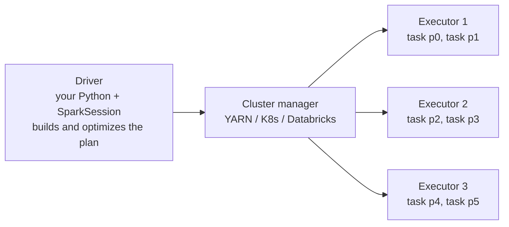
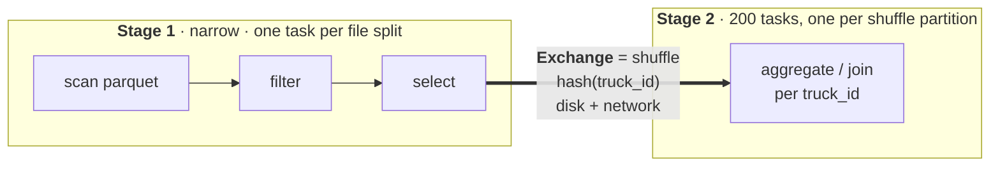

# PySpark – Interview Study Guide

## TL;DR

- **Spark splits data into partitions, one task per partition, running on executors. The driver only plans and coordinates.** If one task is slow, the whole stage is slow.
- **Transformations are lazy. An action builds the DAG, and every shuffle (`Exchange`) cuts it into stages.** Shuffles are where time and money go.
- **To debug a slow job, open the Stages tab.** Max task time ≫ median means skew. Big shuffle read means too few partitions or a missing broadcast. High GC means memory. Pending tasks mean no executors.
- **Skip data before you process it.** Partition pruning, Parquet row-group skipping, Delta file skipping and Snowflake micro-partition pruning are the same idea.
- **For skew, first ask whether the hot key is junk (a NULL or a test device).** Only then reach for AQE skew join or salting.

---

## 1. The problem Spark solves

You have **2 TB/day of GPS pings** from 100k trucks (≈ 100k × 1 ping/5 s ≈ 1.7B rows/day), and you need daily per-truck mileage and idle time.

- **Pandas** needs it in one machine's RAM, so it's out beyond tens of GB.
- **Snowflake SQL** handles this fine if the logic is SQL-shaped.
- **Spark** fits when the logic is programmatic: reusable Python functions, metadata-driven pipelines, ML features, unit-testable transformations, or data sitting as files in a lake.

**Decision rule:** logic expressible in SQL on data already in the warehouse → SQL or dbt. Complex, reusable or testable Python logic on lake files, or anything beyond one machine → PySpark. Single-machine analysis under ~10 GB → pandas or DuckDB (approx. threshold).

---

## 2. The mental model: driver, executors, partitions

**One sentence:** *the driver turns your code into a plan of tasks, and executors run one task per partition in parallel.*



| Term | What it is | Bridge |
|---|---|---|
| **Driver** | Runs your script, plans, schedules and collects small results | The Snowflake cloud-services layer (compiles, plans) |
| **Executor** | A JVM process on a worker that runs tasks and holds cache | A node in a Snowflake warehouse |
| **Partition** | One slice of a DataFrame in flight. Reads default to ~128 MB per partition | Similar to a micro-partition, but a Spark partition is a unit of *work*, not a file |
| **Task** | One partition × one stage | – |
| **Stage** | Tasks that run without a shuffle between them | – |

**PySpark vs Spark.** Spark is the JVM engine, written in Scala. PySpark is the Python API. Your DataFrame calls go through **Py4J** into a JVM plan, so DataFrame and SQL code runs at essentially JVM speed. Python only executes on the executors for **Python UDFs** and pandas UDFs, and that is where the serialization cost comes from.

<details><summary>Local setup in 30 seconds</summary>

`pip install pyspark` bundles the engine jars, and you still need a JVM. **Spark 3.5 runs on Java 8u371+/11/17. Spark 4.x requires Java 17 or 21** (checked 2026-09, spark.apache.org).

```python
from pyspark.sql import SparkSession
spark = SparkSession.builder.master("local[*]").appName("dev").getOrCreate()  # local[*] = all cores, one JVM
```
Spark UI: `http://localhost:4040` while the session is alive (4041 for a second app). On Databricks, use the cluster's **Spark UI** tab or the "Spark Jobs" link under a cell. For finished runs, use the History Server.
</details>

---

## 3. Lazy DAG, stages and shuffles

| Type | Examples | Effect |
|---|---|---|
| **Transformation** (lazy) | `filter`, `select`, `withColumn`, `join`, `groupBy` | Adds to the plan |
| **Action** | `count`, `show`, `collect`, `write`, `toPandas` | Optimizes and runs the plan |

Laziness lets **Catalyst** optimize the whole chain before running anything: pushing filters into the scan, pruning columns, choosing join strategies.

**Narrow** transformations (`filter`, `select`, `withColumn`) keep each output partition fed by one input partition, so there's no data movement. **Wide** transformations (`groupBy`, `join`, `distinct`, `orderBy`, `repartition`, windows) need every row of a key on the same executor. That is a **shuffle**: executors write rows to local disk hashed by key, send them over the network, and the next stage reads them back.



**Bridge:** a Spark `Exchange` is the data redistribution behind a Snowflake join or aggregate. In Query Profile it's "Bytes sent over network". Same cost, different name.

**Decision rule:** count the `Exchange` nodes. Every one should be justified by a join or aggregate you actually need. Broadcast small sides, and aggregate before joining when you can.

---

## 4. Reading `explain()` and the Spark UI

```python
daily.explain("formatted")    # or explain(True) for parsed → analyzed → optimized → physical
```

Read the physical plan **bottom-up**:
```
HashAggregate (final)      ← merges partial results per key, on EXECUTORS in stage 2
  Exchange hashpartitioning(truck_id)   ← shuffle
    HashAggregate (partial)  ← pre-aggregates each partition before the shuffle (shrinks it)
      Filter
        FileScan parquet  PartitionFilters: [event_date = 2026-09-01]  PushedFilters: [IsNotNull(truck_id)]
```
The final aggregation runs on executors. The driver only receives what an action returns, such as `collect()` or `count()`.

| Node | Meaning | Worry when |
|---|---|---|
| `FileScan` | Read, with `PartitionFilters` / `PushedFilters` | Both are empty on a big table |
| `Exchange` | Shuffle | There are many of them, or huge ones |
| `BroadcastHashJoin` | Small side copied to every executor | The "small" side is actually large |
| `SortMergeJoin` | Both sides shuffled and sorted | One side is tiny (should be broadcast) |
| `BroadcastNestedLoopJoin` / `CartesianProduct` | Non-equi or `OR` join | Almost always a bug |
| `BatchEvalPython` / `ArrowEvalPython` | Python UDF | It sits in a hot path |

**Spark UI tabs, the ones that matter:**
- **SQL/DataFrame** shows the plan with real row counts and sizes per node.
- **Stages** shows the task summary: min, median and max duration and shuffle read. This is where you find skew.
- **Executors** shows GC time and failed tasks.
- **Storage** shows what's cached.

---

## 5. Joins: broadcast vs sort-merge

**Broadcast hash join:** the small side is sent to every executor, and the big side isn't shuffled at all. Spark picks it automatically below `spark.sql.autoBroadcastJoinThreshold` (default **10 MB**, measured on estimated size), or you force it:

```python
from pyspark.sql.functions import broadcast
enriched = pings.join(broadcast(trucks_dim), "truck_id")   # 100k-row dim, a few MB
```

**Sort-merge join:** both sides are shuffled by key and sorted. This is the default for two large tables.

When a broadcast goes wrong, it shows up as driver OOM, "broadcast timeout", or long broadcast stages. The table isn't really small, or the size estimate was wrong. **Lower the threshold or disable it** (`-1`), and drop the `broadcast()` hint. Never raise the threshold to "fix" a slow broadcast.

**AQE** (Adaptive Query Execution, on by default since Spark 3.2) re-plans at runtime from real shuffle sizes. It coalesces small shuffle partitions, converts sort-merge to broadcast when a side turns out small, and splits skewed join partitions.

**Decision rule:** a small side (a dim, or after a filter, up to tens of MB) → broadcast. Two big sides → sort-merge, and make sure keys are the same type and pre-filtered. Remember that a broadcast costs driver and executor memory.

---

## 6. Skip data before you process it

**Bridge, all the same idea:**

| Engine | Skipping mechanism | Works best when |
|---|---|---|
| Hive-style folders (`event_date=…/`) | **Partition pruning**: whole directories skipped, exact | Filtering on the partition column |
| Parquet | **Row-group skipping** from min/max footers (predicate pushdown) | Data is sorted or clustered on the filter column |
| Delta Lake | **File skipping** from min/max stats in `_delta_log` | Clustered on the filter column (see [databricks.md](databricks.md)) |
| Snowflake | **Micro-partition pruning** from min/max metadata | Same (see [snowflake-performance.md](snowflake-performance.md)) |

**A real contrast.** The table is `s3://fleet/pings/` partitioned by `event_date`, and it also has an `event_ts` column.

```python
from pyspark.sql import functions as F
pings = spark.read.parquet("s3://fleet/pings/")

# GOOD: filter on the partition column → reads 1 folder of 365
pings.filter(F.col("event_date") == "2026-09-01")
# explain: PartitionFilters: [isnotnull(event_date), (event_date = 2026-09-01)]

# BAD: same business meaning, but on a non-partition column → lists and opens every folder
pings.filter(F.to_date("event_ts") == "2026-09-01")
# explain: PartitionFilters: []   (the row-group stats can't help either: the function hides the column)

# BAD: filter through a Python UDF → nothing is pushed down; every row is deserialized into Python
is_day = F.udf(lambda ts: ts.date().isoformat() == "2026-09-01", "boolean")
pings.filter(is_day("event_ts"))
```

**Decision rule:** filter on the partition column with plain comparisons, using the native type. Keep functions and UDFs off filter columns. Always confirm by checking `PartitionFilters` and `PushedFilters` in `explain()`.

---

## 7. Debugging a slow job: the trucks walkthrough

**Scenario.** A nightly job reads **2 TB** of pings (Parquet), joins `trucks_dim` (100k rows), and computes idle gaps with `LAG(ts) OVER (PARTITION BY truck_id ORDER BY ts)`. It used to take 25 min and now runs for 4 h. One stage shows 199/200 tasks done.

**Step 1: Stages tab → task summary metrics for the stuck stage.**

| Metric | Min | Median | Max |
|---|---|---|---|
| Duration | 40 s | 55 s | **3.6 h** |
| Shuffle read | 6 GB | 9 GB | **310 GB** |

This tells you two things.
- **Skew:** max is about 34× the median on shuffle read.
- **Partitions too big overall:** 2 TB ÷ 200 default shuffle partitions ≈ 10 GB each. A healthy target is ~100–200 MB per task (approx.).

**Step 2: find the hot key.**
```python
pings.groupBy("truck_id").count().orderBy(F.desc("count")).show(5)
# truck_id = 'UNKNOWN'  → 290M rows (≈1/6 of the data)
```
A firmware bug makes unregistered devices report `truck_id = 'UNKNOWN'`, so every such ping hashes into one shuffle partition.

**Step 3: fix in order of cheapness.**

1. **Is the hot key junk?** It usually is: NULL, `'UNKNOWN'`, `0`, or a test device. Filter it or route it to a quarantine table. That removes 15% of the work and the skew in one line.
2. **Fix partition sizing.** Let AQE coalesce from a generous start:
   ```python
   spark.conf.set("spark.sql.adaptive.enabled", "true")                 # default since 3.2
   spark.conf.set("spark.sql.shuffle.partitions", "12000")              # ≈ 2 TB / ~170 MB
   spark.conf.set("spark.sql.adaptive.coalescePartitions.enabled", "true")
   ```
3. **Is the skew in a join?** Enable AQE skew join (`spark.sql.adaptive.skewJoin.enabled`, default on). It splits a join partition that is several times the median and above a size threshold. It only helps **sort-merge joins**, not windows or aggregations.
4. **Is the key legitimately hot in a join?** Salt it:
   ```python
   N = 16
   big   = pings.withColumn("salt", (F.rand() * N).cast("int"))
   small = trucks_dim.withColumn("salt", F.explode(F.array([F.lit(i) for i in range(N)])))
   joined = big.join(small, ["truck_id", "salt"]).drop("salt")
   ```
5. **Is the skew in a window?** Salting breaks ordering within a key. Instead, **narrow the window key**: `PARTITION BY truck_id, event_date` (or hour), which caps each group's size. Then handle the gap that crosses midnight separately.
6. A plain `groupBy(...).sum()` on a hot key is usually **fine**, because the partial `HashAggregate` collapses rows before the shuffle. Skew hurts joins, windows, `collect_list` and `countDistinct`.

**Databricks note:** the old `/*+ SKEW('table','col') */` hint is Databricks-only and now retired in favour of AQE skew handling (checked 2026-09, Databricks docs). It was never standard Spark.

**Symptom → cause → fix**

| Symptom | Cause | Fix |
|---|---|---|
| One task ≫ median | Skewed key | Filter junk key → AQE skew join → salt, or narrow the window key |
| All post-shuffle tasks slow, multi-GB shuffle read each | Too few shuffle partitions | Raise `shuffle.partitions` and let AQE coalesce |
| Thousands of tiny tasks, few MB each | Too many partitions for small data | Lower it, or rely on AQE coalescing |
| Executor OOM / high GC | Huge partitions, big broadcast, heavy `collect_list` | More partitions, disable the bad broadcast, more memory per core |
| Driver OOM | `collect()` / `toPandas()` on big data, or a large broadcast | `write` instead, `limit`, lower the broadcast threshold |
| Long `FileScan`, empty `PartitionFilters` | Filter not on the partition column, or a UDF | See §6 |
| Tasks pending, 0 running | No executors: quota, autoscaling or spot loss | Cluster events, allocation logs |

**Practice:** [`practical/backend/pyspark_practice/diagnose_slow_query.py`](../../practical/backend/pyspark_practice/diagnose_slow_query.py) creates too many shuffle partitions, a missed broadcast and skew on purpose. Run it with the UI open.

---

## 8. Caching, repartitioning, UDFs

```python
df.cache()        # memory, spilling to disk; materialized on the first action
df.unpersist()

df.repartition(400, "truck_id")   # full shuffle; balances or co-locates by key
df.coalesce(50)                   # merges partitions without a shuffle; only reduces; can be uneven
df.write.partitionBy("event_date").parquet(path)   # folder layout on disk, for future pruning
```

- **Cache** only a DataFrame reused by 2+ actions, and unpersist it afterwards. Caching a single-use DataFrame only costs memory.
- **`repartition` vs `partitionBy`:** the first shapes partitions in memory now. The second shapes folders on disk for later readers. Partition on disk by a low-cardinality column like date, never by `truck_id`, which would create 100k folders full of small files.
- **UDFs:** a Python UDF is opaque to Catalyst (no pushdown) and pays JVM↔Python serialization. Prefer built-in `F.*` functions. If you must use Python, a pandas UDF (Arrow, vectorized) is far cheaper than a row UDF.
- **Fault tolerance:** lineage. A lost partition is recomputed from its DAG. `checkpoint()` truncates very long lineages.

**Decision rule:** cache when reused, and remove it when done. `repartition` to fix balance before a heavy wide operation, and `coalesce` to reduce file count on write. Use built-in functions first, then pandas UDFs, and row UDFs only as a last resort.

---

## Common wrong answers

- **"A broadcast join is slow, so raise `autoBroadcastJoinThreshold`."** That makes it worse. A slow or failing broadcast means the side is too big: lower or disable the threshold.
- **"The final aggregation happens on the driver."** No: both partial and final `HashAggregate` run on executors. The driver only receives what an action returns.
- **"Skew? Add more executors."** The hot task still runs on one core. Parallelism doesn't split a single partition, but filtering the key, AQE skew join, salting or a narrower key does.
- **"Set `shuffle.partitions` to 2–4× the cores."** Size by data instead: aim for ~100–200 MB per shuffle partition and let AQE coalesce. 200 partitions on 2 TB means 10 GB tasks.
- **"PySpark is slow because Python is slow."** DataFrame and SQL code runs in the JVM. Python only runs for UDFs.

---

## Self-check

<details><summary><b>Q1.</b> What decides how many tasks a stage has, and what creates a new stage?</summary>

One task per partition. For a scan, that's file splits (~128 MB by default). After a shuffle, it's `spark.sql.shuffle.partitions`, possibly coalesced by AQE. A new stage starts at every shuffle boundary (`Exchange`), caused by wide transformations like `join`, `groupBy`, windows, `distinct` or `repartition`.

</details>

<details><summary><b>Q2.</b> Two filters mean the same thing: <code>event_date == '2026-09-01'</code> and <code>to_date(event_ts) == '2026-09-01'</code>. Why can one be 365× faster, and how do you prove it?</summary>

If the data is folder-partitioned by `event_date`, the first filter prunes to one directory. The second is on a different column wrapped in a function, so Spark can't map it to folders and scans them all. Prove it with `explain()`: the first shows `PartitionFilters: [... event_date = 2026-09-01]` and the second shows `PartitionFilters: []`.

</details>

<details><summary><b>Q3.</b> A stage is 199/200 done; the last task has read 300 GB of shuffle while the median is 9 GB. Walk through what you do.</summary>

It's skew. Find the key with `groupBy(key).count()`, then:
1. If it's junk (NULL, `'UNKNOWN'`), filter or quarantine it.
2. Size shuffle partitions by data and let AQE coalesce.
3. If the skew is in a sort-merge join, rely on AQE skew join or salt the key.
4. If it's in a window, narrow the partition key, for example (`truck_id`, `event_date`).

Adding executors doesn't help, because one partition runs on one core.

</details>

<details><summary><b>Q4.</b> A job fails with driver OOM right after someone added <code>broadcast(carrier_invoices)</code>. What went wrong?</summary>

`carrier_invoices` isn't small. The broadcast is built through the driver and copied to every executor. Remove the hint and lower or disable `autoBroadcastJoinThreshold` if Spark picked it on a bad estimate. Let the join be a sort-merge join, or pre-filter or aggregate the side until it really is small.

</details>

<details><summary><b>Q5.</b> Why is <code>groupBy("truck_id").sum("km")</code> usually fine on a hot key, while <code>LAG(ts) OVER (PARTITION BY truck_id ORDER BY ts)</code> is not?</summary>

Sum is decomposable: a partial `HashAggregate` on each executor collapses the hot key's rows to one row per input partition before the shuffle. A window needs **all** of that truck's rows, sorted, in one task. No partial step exists, so the hot key becomes one enormous task.

</details>

<details><summary><b>Q6.</b> Mini design: 100k trucks, 2 TB/day of pings in S3, finance wants daily per-truck km by 06:00. Sketch the Spark job's layout choices.</summary>

- **Storage:** write the raw data partitioned by `event_date`, never by `truck_id`. Better still, use a Delta table with clustering on `truck_id`.
- **Job:** read only yesterday's partition (pruning shows in `PartitionFilters`) and drop junk ids.
- **Join:** broadcast the 100k-row truck dim.
- **Shuffles:** shuffle partitions sized ≈ data/150 MB, with AQE on.
- **Computation:** gaps via a window on (`truck_id`, `event_date`), then aggregate per truck.
- **Output:** write one small daily partition, or `MERGE` for late data.

</details>

---

## Related

- [sql-advanced.md](sql-advanced.md): the joins, anti-joins and windows, in SQL
- [databricks.md](databricks.md): Delta file skipping, liquid clustering, compute and cost
- [snowflake-performance.md](snowflake-performance.md): the same "skip, spill, explode" diagnosis in Snowflake
- [truck-stream-processor case](../system_design/truck-stream-processor/README.md): the same pings as a stream
- [cloud/architecture-comparison.md](../cloud/architecture-comparison.md): where Spark sits in the core toolkit
