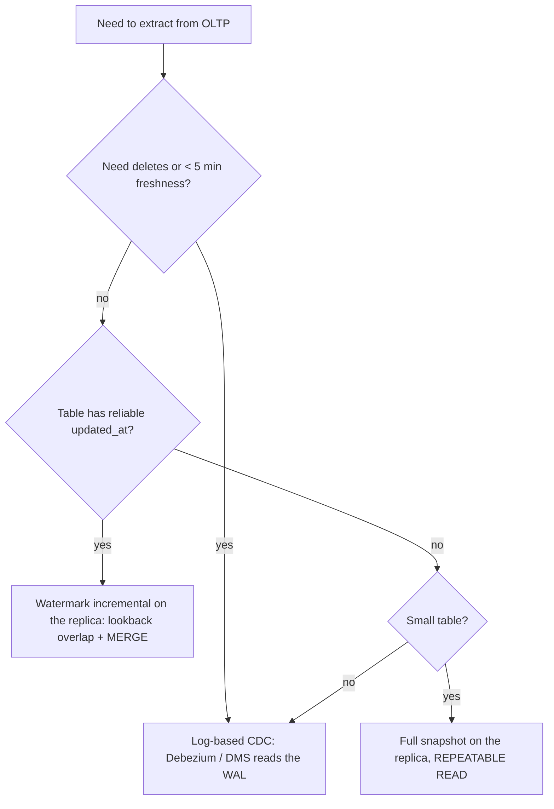

# SQL Advanced – Interview Study Guide

## TL;DR

- **`OR` in a join predicate blocks hash and merge joins, pushing the planner toward nested loops, and it fans out duplicates.** Split it into two joins or a `UNION`.
- **`NOT IN` against a nullable column silently returns zero rows.** Use `NOT EXISTS` (or `LEFT ANTI JOIN` in Spark).
- **Dedup = `ROW_NUMBER()` over the business key with a *total* ordering.** In Snowflake, write it with `QUALIFY`.
- **Never bulk-read the primary.** Use a read replica for batch and log-based CDC for freshness. Use an `updated_at` watermark only with a lookback overlap plus an idempotent `MERGE`, and only when hard deletes don't matter.
- **The ANSI isolation table is the textbook view; engines differ.** Postgres `REPEATABLE READ` is a real snapshot, and that's what a consistent multi-table export needs.

Part 1 is query correctness and performance. Part 2 covers extracting from a live OLTP database, and this doc is the canonical home for that topic.

---

# Part 1 — Writing queries that are correct and fast

## 1. The OR-join

**The problem.** You match GPS devices to trucks. Some rows carry a `truck_id` and older ones only carry a `device_hash`. Someone writes this:

```sql
SELECT a.*
FROM table_a a
JOIN table_b b
    ON a.id = b.id
    OR a.hash = b.hash;
```

With 5M rows on each side, it runs for hours and returns more rows than `table_a` has.

### Why it's bad

1. **No hash or merge join.** An equi-join lets the engine build a hash table on one side and probe it with the other (O(n+m)), or sort both sides and merge them. An `OR` across two different columns fits neither strategy, so most planners fall back to a **nested loop** (O(n×m)). At 5M × 5M, that is 25 trillion comparisons.
2. **Indexes go unused.** In theory the engine could union two index scans. In practice, join planners rarely do that well.
3. **Fan-out, which makes it a correctness bug.** If row `a` matches one `b` row on `id` and a *different* `b` row on `hash`, it comes back twice.
4. **The intent is usually wrong.** The author meant "match on id, and fall back to hash only if id doesn't match". `OR` returns both at once.

**Bridge:** in Spark the same query shows up as a `BroadcastNestedLoopJoin` or `CartesianProduct` in `explain()`. In the Snowflake Query Profile you see a join node emitting far more rows than it took in.

### Fixes

**Option 1: two LEFT JOINs plus COALESCE (the "id first, hash as fallback" intent).**
```sql
SELECT a.*,
       COALESCE(b1.value, b2.value) AS value
FROM table_a a
LEFT JOIN table_b b1 ON a.id = b1.id
LEFT JOIN table_b b2 ON a.hash = b2.hash AND b1.id IS NULL   -- only fall back when id missed
WHERE b1.id IS NOT NULL OR b2.hash IS NOT NULL;
```
This **still fans out** if `table_b` has several rows per `id` or per `hash`. Each join is only as clean as the uniqueness of its key. When the key isn't unique, dedup `table_b` first:

```sql
WITH b_by_id AS (
  SELECT * FROM (
    SELECT b.*, ROW_NUMBER() OVER (PARTITION BY id ORDER BY updated_at DESC, pk DESC) AS rn
    FROM table_b b) t
  WHERE rn = 1
)
-- ...same for b_by_hash, then join to the deduped CTEs
```

**Option 2: UNION, when "matched either way" is the real intent.**
```sql
SELECT a.* FROM table_a a JOIN table_b b ON a.id   = b.id
UNION
SELECT a.* FROM table_a a JOIN table_b b ON a.hash = b.hash;
```
Each branch is a clean equi-join. `UNION` dedups whole rows, which costs a sort or hash pass. `UNION ALL` skips that pass, so use it when the branches can't overlap.

**Option 3: EXISTS, when you only need to know *whether* a match exists.** It never duplicates `a` rows. The `OR` inside is still hard to plan, so rewrite it as `EXISTS (…id…) OR EXISTS (…hash…)`, which gives two semi-joins.

**Decision rule:** fallback semantics → Option 1, with the right side deduped. Either-match semantics → Option 2. Filtering only → split `EXISTS`. Never leave `OR` in the join predicate.

> *"An OR in the join predicate prevents hash and merge joins, so the planner degrades toward O(n×m) nested loops. It also returns a row twice when both conditions match different rows. I split it into two equi-joins, dedup the lookup side, and COALESCE."*

---

## 2. NULL traps and anti-joins

**The problem.** "Which trucks have never been assigned a load?" Someone writes `WHERE truck_id NOT IN (SELECT truck_id FROM loads)`. The result is empty, because one load has `truck_id = NULL`.

**Mechanism.** `x NOT IN (1, 2, NULL)` expands to `x <> 1 AND x <> 2 AND x <> NULL`, and `x <> NULL` is `UNKNOWN`. That makes the whole predicate `UNKNOWN` for every row, and `WHERE` drops them all.

An **anti-join** returns the left rows that have *no* match on the right. Here are three ways to write it:

```sql
-- 1. NOT EXISTS: NULL-safe, and planners turn it into a hash anti-join
SELECT t.* FROM trucks t
WHERE NOT EXISTS (SELECT 1 FROM loads l WHERE l.truck_id = t.truck_id);

-- 2. LEFT JOIN ... IS NULL: portable and NULL-safe
SELECT t.* FROM trucks t
LEFT JOIN loads l ON l.truck_id = t.truck_id
WHERE l.truck_id IS NULL;

-- 3. Spark / Databricks SQL has native syntax
SELECT t.* FROM trucks t LEFT ANTI JOIN loads l ON l.truck_id = t.truck_id;
```

| Pattern | NULL-safe | Notes |
|---|---|---|
| `NOT EXISTS` | Yes | Usually the best plan (hash anti-join) |
| `LEFT JOIN … IS NULL` | Yes | Portable. Test the right side's **join key**, not a nullable column |
| `NOT IN (subquery)` | **No** | Only safe with `WHERE col IS NOT NULL` in the subquery |
| `LEFT ANTI JOIN` | Yes | Spark/Databricks only |

**Typical ETL use:** finding staging rows not yet in the target, or orphaned foreign keys.

Other NULL and type traps in the same family:
- `WHERE status <> 'cancelled'` also drops rows where `status IS NULL`.
- An implicit cast in a join (`VARCHAR id = INT id`) casts every row and disables the index. Fix the type rather than the query.

**Decision rule:** default to `NOT EXISTS`. Use `LEFT ANTI JOIN` in Spark. Only use `NOT IN` with a literal list or a provably non-null column.

---

## 3. Window functions and dedup

**The problem.** A CDC feed delivers every version of every load, 40 versions for a busy one, and the model needs the latest row per `load_id`.

Window functions compute across related rows **without collapsing them**, which is the difference from `GROUP BY`.

```sql
-- Running total per carrier
SELECT invoice_id, carrier_id, amount,
       SUM(amount) OVER (PARTITION BY carrier_id ORDER BY invoice_date
                         ROWS BETWEEN UNBOUNDED PRECEDING AND CURRENT ROW) AS running_total
FROM invoices;

-- Previous ping per truck (gap detection)
SELECT truck_id, ts,
       ts - LAG(ts) OVER (PARTITION BY truck_id ORDER BY ts) AS gap
FROM gps_pings;

-- Latest price: LAST_VALUE needs an explicit frame, or it stops at the current row
SELECT DISTINCT lane_id,
       LAST_VALUE(rate) OVER (PARTITION BY lane_id ORDER BY quoted_at
                              ROWS BETWEEN UNBOUNDED PRECEDING AND UNBOUNDED FOLLOWING) AS latest_rate
FROM lane_quotes;
```

**Dedup, the portable way:**
```sql
SELECT * FROM (
  SELECT l.*,
         ROW_NUMBER() OVER (PARTITION BY load_id
                            ORDER BY updated_at DESC, _loaded_at DESC) AS rn
  FROM raw.loads l
) t
WHERE rn = 1;
```

**Snowflake aside: `QUALIFY`.** It filters on a window result without a subquery. Databricks SQL supports it too.
```sql
SELECT * FROM raw.loads
QUALIFY ROW_NUMBER() OVER (PARTITION BY load_id ORDER BY updated_at DESC, _loaded_at DESC) = 1;
```

Gotchas:
- **Make the ordering total.** If two versions share `updated_at`, `ROW_NUMBER` picks one arbitrarily, and the "latest" row changes between runs. Chain tie-breakers until the ordering is unique.
- `ROW_NUMBER` gives exactly one row per key. `RANK` keeps ties, so it can return two "latest" rows.
- With `ORDER BY`, the default frame is `RANGE … CURRENT ROW`. That is why `LAST_VALUE` looks broken and why running sums lump ties together. Spell out `ROWS BETWEEN`.

**Bridge:** a window's `PARTITION BY` is a shuffle by that key in Spark. A hot key such as one chatty truck becomes one giant task. See [pyspark.md](pyspark.md).

**Decision rule:** "one row per key" → `ROW_NUMBER` with a total order (`QUALIFY` where available). "Top N with ties" → `RANK`. Aggregate that collapses rows → `GROUP BY`.

---

## 4. Reading a plan: EXPLAIN

**The problem.** A query that took 2 s last month now takes 4 min. Read the plan before guessing.

```sql
EXPLAIN SELECT ...;                    -- estimated plan
EXPLAIN (ANALYZE, BUFFERS) SELECT ...; -- Postgres: runs it, shows actual rows, time and I/O
```

| Plan node | Read it as |
|---|---|
| `Seq Scan` on a big table with a selective filter | Missing index, or a predicate that can't use one |
| `Index Scan` / `Bitmap Heap Scan` | Index in use |
| `Hash Join` | Good for large equi-joins |
| `Nested Loop` with a large inner side | Trouble. Look for an `OR` or a non-equi predicate |
| `Sort` / `Hash` with "external merge" or "Disk" | Spilled past `work_mem` |
| Estimated rows ≪ actual rows | Stale statistics. Run `ANALYZE` |

**Predicates that can't use an index** (the Postgres cousin of "kills pruning" in Snowflake):
```sql
WHERE EXTRACT(YEAR FROM created_at) = 2024                   -- function on the column: no index
WHERE created_at >= '2024-01-01' AND created_at < '2025-01-01' -- range: index / pruning works
```
Other cheap wins: drop `SELECT *` (columnar engines read and bill per column), and don't join on mismatched types.

**Bridge:** `EXPLAIN ANALYZE` ≈ Spark's SQL tab ≈ Snowflake Query Profile. The same three questions apply everywhere: did it skip data, did it spill, did a join explode?

---

# Part 2 — Extracting from a live OLTP database

## 5. The problem

The TMS runs on Postgres. The `loads` table has about 50M rows (~40 GB) and takes ~3M updates/day from dispatchers and the 10k-truck app. The warehouse needs it, and **the app must not notice.** What can go wrong:

- A 20-minute full-table `SELECT` on the primary competes for I/O and buffer cache, so app p99 latency spikes.
- A long transaction blocks vacuum, and the tables bloat.
- A naive incremental query silently misses rows, and finance reconciles wrong invoice totals.
- The export sees `loads` at 02:00 and `invoices` at 02:15, so the joins don't match.

Sizing: ~3M changed rows × ~800 bytes ≈ **2.4 GB/day** of change, versus a 40 GB full copy. A daily full copy at ~40 MB/s over JDBC takes ~17 min (approx.). An incremental hourly pull moves ~100 MB.

## 6. Four ways to extract



| Option | How | Catches deletes | Freshness | Main risk |
|---|---|---|---|---|
| **Read replica + full snapshot** | `REPEATABLE READ` export on an async replica | Yes (by diff) | Hours | Replica query cancellations; cost grows with table size |
| **Watermark incremental** | `WHERE updated_at >= last_watermark - lookback` | **No** | Minutes to hours | Missed rows (see below) |
| **Log-based CDC** | Debezium/DMS reads WAL/binlog → Kafka/S3 → `MERGE` | Yes | Seconds | Replication slot retention, ops burden |
| **Primary, direct** | Don't | – | – | Hurts the app |

**Read replicas are normally asynchronous.** Lag is typically sub-second to seconds and can grow to minutes under heavy writes or long replay conflicts (approx.). Synchronous replication exists, but it's used for durability, not as your ETL target.

### The watermark done correctly

Why rows get **missed**. A missing index is *not* the reason: that only makes the extract slow, as a full scan.

1. **Late commits.** A transaction sets `updated_at = 10:00:05` but commits at 10:00:40. Your 10:00:30 run read up to `10:00:30`, so the next run asks for `> 10:00:30` and never sees the row.
2. **Clock skew.** App servers stamp `updated_at` with their own clocks instead of the DB's `now()`.
3. **The `>` boundary.** Several rows share the max timestamp. You store it and use `>`, while the rows that commit later with that same timestamp are skipped.
4. **Hard deletes** leave nothing to select.

```sql
-- Watermark = max(updated_at) actually *seen*, never wall-clock "now"
SELECT * FROM loads
WHERE updated_at >= :last_watermark - INTERVAL '15 minutes';   -- overlap window
-- then in the warehouse: MERGE INTO loads USING stage ON load_id ... (idempotent, re-reads are harmless)
```

The overlap re-reads some rows on purpose, and the idempotent `MERGE` makes that free. Size the lookback above your longest normal transaction. Ask the DBA for an index on `updated_at` so the extract is a range scan. For deletes, either use soft deletes (`deleted_at`) or switch to CDC.

### CDC, in one paragraph

Debezium creates a **logical replication slot**, takes an initial consistent snapshot, then streams every insert, update and delete from the WAL in commit order with no table locks. Downstream you turn the change log into current state with `MERGE`. The full design (slots, snapshots, schema evolution, backfills) lives in the [CDC Postgres → warehouse case](../system_design/cdc-postgres-to-warehouse/README.md). CDC and outbox *as patterns* (versus dual writes) live in [sql-vs-nosql.md](../system_design/99-reference/sql-vs-nosql.md).

**Decision rule:** a batch-only table with `updated_at` and no hard deletes → watermark on the replica. Deletes matter, freshness under ~5 min, or many tables → CDC. A small reference table → full snapshot. Always read the replica, never the primary.

---

## 7. Isolation levels and MVCC

**Why a data engineer cares.** A 20-minute export under `READ COMMITTED` gives each statement its own snapshot. `loads` is read at 02:00 and `invoices` at 02:15, so invoices reference loads your extract doesn't contain.

### The anomalies

| Anomaly | Meaning |
|---|---|
| Dirty read | You see another transaction's uncommitted change |
| Non-repeatable read | The same row, read twice, has a different value |
| Phantom read | The same query, run twice, returns a different *set* of rows |
| Serialization anomaly | The result can't be produced by any serial order (e.g. write skew) |

### The ANSI table, the textbook view

| Level | Dirty | Non-repeatable | Phantom |
|---|---|---|---|
| READ UNCOMMITTED | Possible | Possible | Possible |
| READ COMMITTED | – | Possible | Possible |
| REPEATABLE READ | – | – | Possible |
| SERIALIZABLE | – | – | – |

**Engines differ from this table. The Postgres reality:**
- `READ UNCOMMITTED` **behaves as `READ COMMITTED`**. Postgres never shows dirty reads.
- `READ COMMITTED` (the default) takes a new snapshot **per statement**.
- `REPEATABLE READ` is **snapshot isolation**: one snapshot for the whole transaction, and it **does prevent phantoms**. It can still allow write skew.
- `SERIALIZABLE` is **SSI (Serializable Snapshot Isolation)**. It doesn't take strict read locks. It detects dangerous patterns and **aborts** with `could not serialize access`, so the client must retry.
- MySQL/InnoDB defaults to `REPEATABLE READ`. SQL Server defaults to **lock-based** `READ COMMITTED`, where readers block writers, unless the DBA enables `READ_COMMITTED_SNAPSHOT`.

### MVCC in one picture

```
UPDATE loads SET status='delivered' WHERE load_id=42   (commits at 02:05)
  row 42 v1 'in_transit'  ← still visible to snapshots taken before 02:05
  row 42 v2 'delivered'   ← visible to snapshots taken after
v1 becomes a dead tuple once no snapshot needs it → VACUUM reclaims it
```
Readers never block writers, but **old snapshots pin dead tuples**. That is the cost behind the first failure mode below.

### SQL Server: the one DBA ask

```sql
ALTER DATABASE tms SET READ_COMMITTED_SNAPSHOT ON;      -- READ COMMITTED uses row versions; no app change
-- or: ALLOW_SNAPSHOT_ISOLATION ON, then the ETL session runs SET TRANSACTION ISOLATION LEVEL SNAPSHOT
```

### Which level for which extract

| Extract | Level | Why |
|---|---|---|
| Consistent multi-table export (Postgres, replica or primary) | `REPEATABLE READ` (`READ ONLY`) | One snapshot across all tables |
| Single-table watermark pull | `READ COMMITTED` | One statement is already one snapshot. The overlap plus `MERGE` handles the rest |
| CDC | N/A | Reads the WAL in commit order. The initial snapshot is taken consistently by the tool |
| Export from a **read replica** | Still `REPEATABLE READ` for multi-table consistency | The replica keeps **applying changes during your export**, so being "behind" doesn't make it static |

```sql
BEGIN TRANSACTION ISOLATION LEVEL REPEATABLE READ READ ONLY;
SELECT * FROM loads;
SELECT * FROM invoices;   -- same point in time as loads
COMMIT;
```
To parallelize, `pg_export_snapshot()` lets several sessions share one snapshot, which is what `pg_dump -j` does.

**Decision rule:** more than one table must agree → one `REPEATABLE READ` transaction. One table read incrementally → `READ COMMITTED` plus an idempotent merge. Never `SERIALIZABLE` for reads on a busy OLTP system.

---

## 8. Failure modes

| Failure | How it shows up | Detect | Mitigate |
|---|---|---|---|
| **Long transaction → table/index bloat** | Tables and indexes grow and queries slow down. Vacuum can't remove dead tuples that an old snapshot might still need. (It's *bloat*, not WAL growth.) | `pg_stat_activity` where `now() - xact_start` is large; `n_dead_tup` climbing | Export from the replica, split big exports, set `idle_in_transaction_session_timeout` |
| **Replica query cancelled** | `canceling statement due to conflict with recovery` mid-export | Replica logs, job retries | Raise `max_standby_streaming_delay` on the ETL replica (more lag), or `hot_standby_feedback = on`, which moves the bloat back onto the primary |
| **Abandoned replication slot fills the disk** | Debezium was stopped days ago, and the primary keeps **all WAL** since the slot's position. `pg_wal` grows until the disk is full and the primary goes down | Alert on `pg_wal_lsn_diff(pg_current_wal_lsn(), confirmed_flush_lsn)` from `pg_replication_slots` | Drop unused slots; `max_slot_wal_keep_size` (PG13+) caps retention (the slot is then invalidated → re-snapshot) |
| **Watermark misses rows** | Warehouse counts drift below source, with no errors | Daily count/sum reconciliation per day | Lookback overlap + `MERGE`, DB-side `now()`, CDC for deletes |
| **ETL starves the app** | Connection errors in the app during extract | Connections per role | `ALTER ROLE etl_user CONNECTION LIMIT 5`, `statement_timeout` |

## 9. What to ask the DBA

1. **A read-only ETL role** with `CONNECTION LIMIT` and `statement_timeout`:
   ```sql
   CREATE ROLE etl_user LOGIN PASSWORD '...' CONNECTION LIMIT 5;
   GRANT CONNECT ON DATABASE tms TO etl_user;
   GRANT USAGE ON SCHEMA public TO etl_user;
   GRANT SELECT ON ALL TABLES IN SCHEMA public TO etl_user;
   ALTER DEFAULT PRIVILEGES IN SCHEMA public GRANT SELECT ON TABLES TO etl_user;
   ALTER ROLE etl_user SET statement_timeout = '30min';
   ```
2. **A replica connection string** for batch reads.
3. **An index on `updated_at`**, built with `CREATE INDEX CONCURRENTLY` so it doesn't lock writes.
4. **For CDC:** `wal_level = logical` (needs a restart; on RDS, `rds.logical_replication = 1`), a slot, a publication, and **an alert on slot lag**. MySQL needs `binlog_format = ROW`. SQL Server needs CDC enabled per table.
5. **SQL Server only:** `READ_COMMITTED_SNAPSHOT ON`.

## 10. Permissions, briefly

```sql
-- Row-level security (Postgres): each carrier sees only its own loads
ALTER TABLE loads ENABLE ROW LEVEL SECURITY;
CREATE POLICY carrier_isolation ON loads
  USING (carrier_id = current_setting('app.carrier_id')::int);

-- Column-level: analysts get no bank details
GRANT SELECT (load_id, carrier_id, origin, destination, rate) ON loads TO analyst_role;
```
Unity Catalog grants, row filters and column masks are covered in [databricks.md](databricks.md).

---

## Common wrong answers

- **"Add `DISTINCT` to fix the OR-join duplicates."** That hides a grain bug, costs a full sort, and still runs the nested loop. Fix the join.
- **"The watermark misses rows because `updated_at` isn't indexed."** No: the index only affects speed. Rows are missed because of late commits, clock skew, `>` at the boundary, and hard deletes.
- **"Reading from a replica means I don't need a consistent snapshot."** The replica keeps replaying writes during your 20-minute export. Multi-table consistency still needs one `REPEATABLE READ` transaction.
- **"REPEATABLE READ allows phantoms, so use SERIALIZABLE for exports."** That's textbook ANSI. In Postgres, RR is a full snapshot with no phantoms, while SERIALIZABLE adds abort-and-retry for nothing on read-only work.
- **"A long transaction bloats the WAL."** It bloats *tables and indexes* by blocking vacuum. Unbounded WAL growth comes from a *replication slot* nobody is consuming.

---

## Self-check

<details><summary><b>Q1.</b> Why does <code>ON a.id = b.id OR a.hash = b.hash</code> get slow, and why is splitting it into two LEFT JOINs + COALESCE not automatically correct?</summary>

The `OR` across two columns can't drive a hash or merge join, so planners fall back toward nested loops (O(n×m)). The two-join rewrite gives clean equi-joins, but each join still fans out if `table_b` has several rows per `id` or per `hash`. Dedup the lookup side first, for example `ROW_NUMBER()` per key with a total order and `rn = 1`, and only fall back to the hash join when the id join missed.

</details>

<details><summary><b>Q2.</b> <code>SELECT * FROM trucks WHERE truck_id NOT IN (SELECT truck_id FROM loads)</code> returns 0 rows, but you know idle trucks exist. What happened and what do you write instead?</summary>

At least one `loads.truck_id` is NULL. `x NOT IN (…, NULL)` evaluates to UNKNOWN for every row, so nothing passes the `WHERE`. Use `NOT EXISTS (SELECT 1 FROM loads l WHERE l.truck_id = t.truck_id)`, or `LEFT ANTI JOIN` in Spark.

</details>

<details><summary><b>Q3.</b> Your hourly <code>WHERE updated_at > :last_run</code> job reconciles 0.3% short against the source every day. Name the likely causes and the fix.</summary>

- Transactions that committed after your run but carry an `updated_at` from before it.
- App-server clock skew.
- The strict `>` on a shared max timestamp.
- Hard deletes, which never appear at all.

The index is not the cause. Fix: set the watermark to the max `updated_at` seen, re-read a lookback window (`>= watermark - 15 min`), and `MERGE` idempotently on the primary key. Use DB-side `now()`. If deletes matter, move to CDC.

</details>

<details><summary><b>Q4.</b> You export <code>loads</code> and <code>invoices</code> from a Postgres read replica in one 20-minute job. Which isolation level, and what can still go wrong on the replica?</summary>

Use one `REPEATABLE READ READ ONLY` transaction, so both tables come from the same snapshot. The replica keeps applying changes while you read. On the replica, a long query can be cancelled with "conflict with recovery". Mitigate that with `max_standby_streaming_delay` on a dedicated ETL replica, or with `hot_standby_feedback = on`, which pushes the bloat back to the primary.

</details>

<details><summary><b>Q5.</b> On-call gets paged: the primary Postgres disk is 95% full, but table sizes haven't changed. Last week someone paused the Debezium connector. What's going on?</summary>

The logical replication slot still exists, so Postgres retains every WAL segment since the slot's `confirmed_flush_lsn`. `pg_wal` grows until the disk fills and the primary stops. Check `pg_replication_slots` with `pg_wal_lsn_diff`. Resume the consumer or drop the slot, which means re-snapshotting later. Prevent it with slot-lag alerts and `max_slot_wal_keep_size`.

</details>

<details><summary><b>Q6.</b> Mini design: extract 30 TMS tables (the largest is 50M rows, and dispatchers hard-delete cancelled loads) into Snowflake for next-morning finance reports. Batch or CDC?</summary>

Next-morning freshness alone would allow batch. **Hard deletes** break watermarks, though, and 30 tables makes per-table watermark logic brittle. Pick log-based CDC (Debezium or DMS) from a logical slot into S3/Snowflake, then `MERGE` to current state, with an alert on slot lag. If CDC isn't allowed, fall back to a nightly replica snapshot in `REPEATABLE READ` for the tables with deletes and lookback watermarks for the rest.

</details>

---

## Related

- [CDC: Postgres → warehouse](../system_design/cdc-postgres-to-warehouse/README.md): the full extraction design
- [sql-vs-nosql.md](../system_design/99-reference/sql-vs-nosql.md): dual writes, outbox, CDC as a pattern
- [snowflake-performance.md](snowflake-performance.md): pruning, Query Profile, `QUALIFY` in context
- [pyspark.md](pyspark.md): the same joins, anti-joins and windows at cluster scale
- [performance-and-security.md](../backend/performance-and-security.md): N+1 queries, indexing, SQL injection
