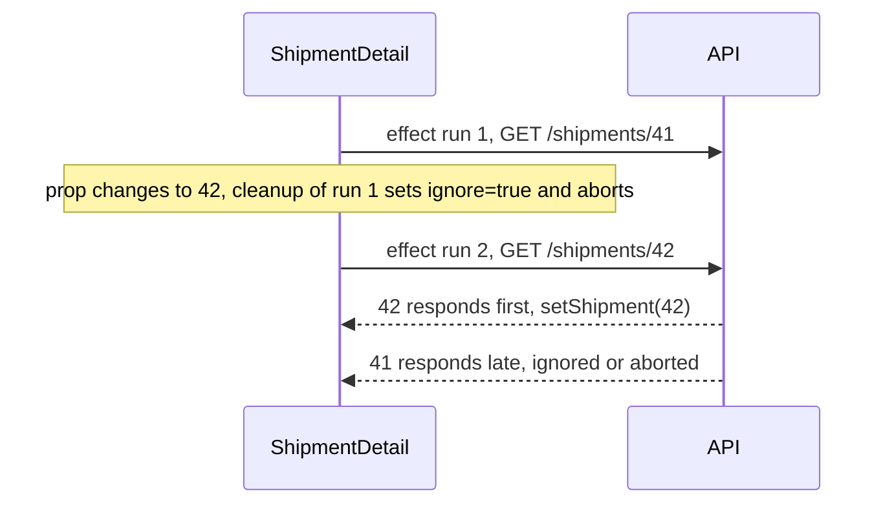

# React

Examples come from a **reference dashboard** (Vite + React, outside this repo): `App.tsx` for hooks and forms, `api.ts` for typed fetch calls, `types.ts` for shared shapes.

## TL;DR

- **UI = f(state).** A component is a pure function from props + state to JSX. Change the state and React re-runs the function and patches the DOM.
- **Data flows down, events flow up.** Props go parent → child like a DAG; children report changes through callback props.
- **State is a snapshot per render.** A setter schedules a new render. It doesn't change the variable you're holding, so use `setX(prev => ...)` when the update depends on the previous value.
- **Effects sync with the outside world, not with user actions.** Fetch on click in the handler. Fetch-on-prop-change in an effect needs cleanup, or a stale response wins the race.
- **Strict Mode runs effects setup → cleanup → setup in development.** If that breaks your component, the missing cleanup was already a bug.

---

## The problem

A dispatcher types a load number, sees the shipment, logs a check-in, and the status badge, the timeline and the "last updated" text must all change. With plain DOM code you find and update each element by hand, and the one you forget shows stale data.

**The mental model:** the UI is a *derived view* of state. **Bridge:** a dbt model. You don't `UPDATE` a mart row by row; you declare the `SELECT` and the tool rebuilds it. A component declares JSX from props and state, and React rebuilds and diffs it. Props are DAG lineage; lifting state up is moving a shared CTE into an upstream model.

---

## 1. Components, JSX, props, keys

A **component** is a function that returns JSX.

```tsx
function ShipmentCard({ shipment }: { shipment: Shipment }) {
  return (
    <div className="card">
      <h2>{shipment.loadNumber}</h2>
      <p>{shipment.status}</p>
    </div>
  );
}
```

**JSX is not HTML.** It compiles to function calls (`jsx()` from `react/jsx-runtime` with the modern transform, `React.createElement` before it). That's why `{}` embeds JS expressions, why it's `className` (`class` is reserved), and why you return one root element or a Fragment (`<>...</>`, no extra DOM node).

**Props** are inputs from the parent, **read-only** inside the component. Anything can be a prop, including JSX. `children` is the prop holding whatever sits between the tags. React shares structure through this composition, not inheritance:

```tsx
function Panel({ title, children }: { title: string; children: React.ReactNode }) {
  return <section><h3>{title}</h3>{children}</section>;
}

<Panel title="Shipment"><ShipmentCard shipment={shipment} /></Panel>
```

**Keys** identify list items across renders. Use a stable ID from the data, never the array index:

```tsx
{shipments.map((s) => <ShipmentCard key={s.loadNumber} shipment={s} />)}
```

With index keys, when the list is reordered, filtered or has an item inserted, React matches old and new rows by position, and a row's local state (a half-typed note, an expanded panel) follows the wrong load.

---

## 2. Rendering: Virtual DOM and reconciliation

1. **Trigger:** state changes (or the parent re-renders).
2. **Render:** React calls your components and gets a new element tree (the "virtual DOM").
3. **Reconcile:** it diffs the new tree against the previous one, using element type and `key` to match children.
4. **Commit:** it applies only the changed DOM operations, then runs effects.

A re-render is not a DOM update: React re-runs your function but touches the DOM only where output differs. **By default, a parent re-render re-renders all its children**, even with unchanged props. That's usually cheap; `React.memo` exists for when it isn't (§4).

---

## 3. State

### `useState`: the snapshot model

```tsx
const [shipment, setShipment] = useState<Shipment | null>(null);
```

- **Annotate when the initial value doesn't reveal the type.** `useState(null)` infers `null`, and nothing else can be set without a cast.
- **The value is fixed for the render.** After `setShipment(x)`, `shipment` in the same handler is still the old value; the new one arrives on the next render.
- **Updates are batched.** Since React 18, several `set` calls in one event, promise or timeout produce one re-render.
- **Use the updater form when the next value depends on the previous one:** `setCount(c => c + 1)`. Calling `setCount(count + 1)` three times in one handler adds 1, not 3, because all three read the same snapshot.
- **Never mutate state.** `shipment.status = "delivered"; setShipment(shipment)` passes the same object, so React may skip the render. Create a new object: `setShipment({ ...shipment, status: "delivered" })`.
- **Don't store derived values.** Compute `const isLate = eta < now` during render instead of syncing it into state with an effect.

### `useReducer`: several fields that change together

```tsx
type State =
  | { status: "idle" }
  | { status: "loading" }
  | { status: "success"; data: Shipment }
  | { status: "error"; error: string };

type Action =
  | { type: "fetch" }
  | { type: "success"; data: Shipment }
  | { type: "failure"; error: string };

function reducer(_state: State, action: Action): State {
  switch (action.type) {
    case "fetch":   return { status: "loading" };
    case "success": return { status: "success", data: action.data };
    case "failure": return { status: "error", error: action.error };
  }
}

const [state, dispatch] = useReducer(reducer, { status: "idle" });
```

The discriminated union makes impossible states (loading *and* error) unrepresentable, and TypeScript narrows `state.data` once you check `status === "success"`.

### Controlled forms

Every input in the reference dashboard's `App.tsx` is **controlled**: its value comes from state, and each keystroke goes through `onChange` back into state.

```tsx
<form onSubmit={handleLookup}>
  <input value={loadNumber} onChange={(e) => setLoadNumber(e.target.value)} />
</form>
```

State is the single source of truth, so you can validate, transform or disable the submit button on every keystroke. An **uncontrolled** input keeps its own value, read through a `ref` at submit time. That's fine for simple forms. In submit handlers call `e.preventDefault()` first, or the browser reloads the page.

### Loading and error states

```tsx
async function handleLookup(e: FormEvent) {
  e.preventDefault();
  setLoading(true);
  setError(null);
  try {
    setShipment(await getShipment(loadNumber));
  } catch (err) {
    setError(err instanceof ApiError ? err.message : "network error");
  } finally {
    setLoading(false); // without this, a failed request leaves the spinner forever
  }
}
```

A common live-coding gap is writing the happy path and forgetting the error branch and the `finally`.

---

## 4. Hooks

This is the canonical hooks table for the repo.

| Hook | Purpose | Reach for it when |
|---|---|---|
| `useState` | A value that re-renders the component when set | Almost always first |
| `useReducer` | State with several fields or named transitions | One event updates several fields together |
| `useContext` | Read a value provided higher in the tree | Genuinely global values: auth user, theme, locale |
| `useRef` | A mutable box that persists across renders **without** re-rendering | DOM nodes, timer IDs, previous values |
| `useEffect` | Synchronize with something outside React after commit | Subscriptions, timers, fetch keyed on a prop |
| `useMemo` | Cache a computed **value** between renders | A measured expensive calculation |
| `useCallback` | Cache a **function's identity** between renders | Passing callbacks to a `React.memo` child |
| Custom `useX` | Your function that calls hooks, to reuse stateful logic | The same effect + state pair appears twice |

**Rules of hooks:** call them only at the top level of a component or custom hook, never inside conditions, loops or nested functions. React matches hook state to calls **by call order**, so a conditional hook shifts every later hook onto the wrong state. React 19's `use()` is the exception: it reads a promise or context and may be called conditionally.

### `useEffect`: what it's for

**Event handler or effect?**
- **Event handler:** "what happens *because the user did X*?" It runs once per interaction. A fetch on submit belongs here, as in the dashboard's `handleLookup`.
- **Effect:** "what must this component stay *synchronized with* while mounted?" It runs after commit, and again whenever dependencies change.

```tsx
useEffect(() => {
  const id = setInterval(poll, 5000);
  return () => clearInterval(id); // cleanup runs before the next run and on unmount
}, []); // [] = after mount only
```

### Fetching in an effect: the race condition

`ShipmentDetail` receives `loadNumber` as a prop. The user clicks load 41, then 42. The request for 41 is slow and resolves **after** 42's, so the screen shows load 41 under the heading "42".



```tsx
useEffect(() => {
  const controller = new AbortController();
  let ignore = false;

  getShipment(loadNumber, { signal: controller.signal })
    .then((s) => { if (!ignore) setShipment(s); })
    .catch((err) => {
      if (!ignore && err.name !== "AbortError") setError(String(err));
    });

  return () => {
    ignore = true;       // any late result is dropped
    controller.abort();  // and the network request is cancelled
  };
}, [loadNumber]);
```

The React docs call the `ignore` flag the reliable fix, because more async steps can follow the fetch. `AbortController` additionally frees the network request ([react.dev](https://react.dev/learn/synchronizing-with-effects), checked Sept 2026). In real apps, a data library (TanStack Query, SWR) or your framework's loaders handle races, caching and retries for you.

**Strict Mode in development** runs one extra setup → cleanup → setup cycle for every effect when a component mounts. You'll see two requests in the Network tab. With proper cleanup the first is aborted and harmless. Production runs effects once. Don't "fix" it with a `useRef` guard; fix the cleanup.

**Effect mistakes, in order of frequency:**
1. **Missing dependencies.** The effect reads a stale value. Trust the `react-hooks/exhaustive-deps` lint rule.
2. **No cleanup.** Intervals, subscriptions and requests leak or race.
3. **Effects for derived state:** `useEffect(() => setFiltered(items.filter(f)), [items, f])` costs an extra render. Compute during render, and add `useMemo` if it's measurably expensive.
4. **Objects or functions created during render as dependencies.** They're new every render, so the effect runs every render.

### `useRef`

```tsx
const inputRef = useRef<HTMLInputElement>(null);
const timerRef = useRef<number | undefined>(undefined);
<input ref={inputRef} />;
inputRef.current?.focus();
```

Writing `.current` doesn't re-render. Don't read or write refs during render (only in handlers and effects), or the output stops being a function of props and state. In React 19 function components receive `ref` as a regular prop; `forwardRef` still works but is slated for deprecation.

### `useContext`

```tsx
const ThemeContext = createContext<"light" | "dark">("light");

function Toolbar() {
  const theme = useContext(ThemeContext);
  return <div className={theme}>...</div>;
}

// React 19: <ThemeContext value="dark">. Earlier versions: <ThemeContext.Provider value="dark">
<ThemeContext value="dark"><Toolbar /></ThemeContext>
```

`<Context.Provider>` still works but is planned for deprecation ([React 19 release notes](https://react.dev/blog/2024/12/05/react-19), checked Sept 2026). Every consumer re-renders when the value changes, so keep fast-changing data out of big contexts. Use context only past ~3 levels of prop drilling or for genuinely global values.

### `useMemo`, `useCallback`, `React.memo`

This is the canonical explanation for the repo.

```tsx
// useMemo caches a VALUE
const sorted = useMemo(() => [...shipments].sort(byEta), [shipments]);

// useCallback caches a FUNCTION identity. Same as useMemo(() => fn, deps)
const handleCheckIn = useCallback((id: string) => api.checkIn(id), []);

// React.memo skips re-rendering a child whose props are shallow-equal
const Row = React.memo(function Row({ load, onCheckIn }: RowProps) { /* ... */ });
```

They only work together: `useCallback` does nothing for a child not wrapped in `React.memo`, and `React.memo` does nothing if a prop is a fresh object or arrow each render. Use them when the Profiler shows a cost, like sorting 10k loads per keystroke. With **React Compiler**, memoization is automatic and manual hooks are mostly unnecessary.

### Lifting state and callbacks

- **Lift state up** to the nearest common parent when siblings share it. In the reference dashboard, `App` owns `shipment`, so both `ShipmentCard` and `CheckInForm` see it.
- **Pass callbacks down** (`onCheckIn`) instead of children reaching into parent state. Data flows one way, and the child stays testable on its own.

---

## 5. Purity and Strict Mode

A component must be **pure**: same props and state → same JSX, and no side effects during render (no fetch, no `localStorage` write, no mutation of props or outer variables). Side effects go in event handlers or effects.

React may call your component more than once per commit. `<StrictMode>` makes that visible in development: it double-calls component bodies and the functions passed to `useState`, `useMemo` and `useReducer`, and adds an extra setup + cleanup cycle for effects and ref callbacks. All of these checks are development-only ([react.dev StrictMode](https://react.dev/reference/react/StrictMode), checked Sept 2026).

---

## 6. Escape hatches: Portals, Suspense, Error Boundaries

| Feature | What it's for |
|---|---|
| **Portals** | Render a child into another DOM node, like a modal at `document.body` so an ancestor's `overflow: hidden` doesn't clip it: `createPortal(<Modal />, document.body)` |
| **Suspense** | Show a fallback while children aren't ready: `React.lazy` code splitting, `use(promise)`, Suspense-aware data libraries |
| **Error boundaries** | Catch errors thrown **during render** in a subtree and show a fallback instead of a blank app. They don't catch errors in event handlers or async code |

Error boundaries are still class components (`getDerivedStateFromError` / `componentDidCatch`). react.dev says there's currently no way to write one as a function component and suggests `react-error-boundary` (checked Sept 2026).

---

## 7. Debugging

- **React DevTools:** live props and state; the Profiler shows what rendered, how long, and why.
- **Stuck spinner:** a state-machine bug. Check every `setLoading`/`setError` path runs (§3).
- **Effect runs twice** in dev: Strict Mode (§4). **Every render:** an object or function dependency recreated each render.

---

## 8. TypeScript quick reference

```ts
type ShipmentStatus = "in_transit" | "arrived" | "delivered" | "delayed"; // literals beat bare string

type Result<T> = { ok: true; data: T } | { ok: false; error: string };   // discriminated union

class ApiError extends Error {                                            // narrow in catch via instanceof
  constructor(public status: number, message: string) { super(message); }
}

type RowProps = { load: Shipment; onCheckIn: (id: string) => void };      // callback props are typed too
```

`interface` vs `type`: interfaces merge when redeclared and extend cleanly; type aliases express unions and mapped types. Follow the codebase. **Types are erased at runtime.** `await res.json() as Shipment` checks nothing, so validate untrusted responses (zod, or manual checks) and validate again on the server.

---

## Decide

- **`useState`** by default; **`useReducer`** when one event updates several fields.
- **Fetch in the handler** for user actions; **in an effect with cleanup** when a prop drives it; **a data library** beyond a small demo.
- **Props** within ~3 levels; **context** for global, slow-changing values; **an external store** when distant components write the same state.
- **Memoize** only after profiling shows a cost.

## Common wrong answers

- **"`setState` is async, so `await` it."** It doesn't return a promise. The new value arrives on the next render; use the updater form or compute the next value in a local variable.
- **"Use the index as key, it's unique."** It's unique but not *stable*, so state follows positions instead of items.
- **"useEffect with `[]` runs exactly once."** Once per mount in production. In dev with Strict Mode, setup runs, cleans up and runs again.
- **"useCallback makes the child not re-render."** Only if the child is wrapped in `React.memo` and every other prop is stable.

---

## Self-check

<details><summary><b>Q1.</b> What's the difference between `useState` and `useRef`, and when do you pick each?</summary>

Setting state schedules a re-render, and the value is a per-render snapshot. Writing `ref.current` doesn't re-render, and the box is the same object across renders. Use state for anything the UI displays. Use a ref for values the UI doesn't display: DOM nodes, timer IDs, the previous value, an in-flight `AbortController`.

</details>

<details><summary><b>Q2.</b> A detail view fetches by `loadNumber` prop in an effect. Users clicking quickly sometimes see the wrong load. Why, and what's the fix?</summary>

It's a race: an earlier, slower response resolves after a newer one and overwrites state. Return a cleanup from the effect that sets an `ignore` flag (so late results are dropped) and calls `controller.abort()` on an `AbortController` passed to `fetch`. Include `loadNumber` in the dependency array. A data library like TanStack Query also solves it.

</details>

<details><summary><b>Q3.</b> In development your mount effect fires two API requests. Is that a bug, and should you add a ref to stop it?</summary>

It's Strict Mode running setup → cleanup → setup to surface missing cleanup. Production runs it once. Don't suppress it with a ref guard. Make the effect correct under remounting: abort or ignore the first request in cleanup. If running twice would still cause a real problem, such as a POST, that code belongs in an event handler, not an effect.

</details>

<details><summary><b>Q4.</b> You wrapped `LoadRow` in `React.memo`, but the Profiler shows all 5,000 rows re-rendering on every keystroke in the search box. Why?</summary>

The parent passes a new prop identity each render: an inline arrow `onCheckIn={() => ...}` or an object literal `style={{...}}`. Shallow comparison fails, so memo never skips. Stabilize with `useCallback`/`useMemo`, or move the search state into a sibling so the list's parent doesn't re-render. At 5,000 rows, virtualize the list too.

</details>

<details><summary><b>Q5.</b> Why must hooks be called at the top level, never inside an `if`?</summary>

React stores hook state in a list per component and matches each call to its slot **by call order**. If a hook is skipped on one render, every later hook reads the wrong slot, like a positional `INSERT` with a missing column. React 19's `use()` is the documented exception.

</details>

<details><summary><b>Q6.</b> Mini design: a dispatcher dashboard shows 2,000 active loads with live status and a search box, and statuses update every 10 s. How do you structure state and rendering?</summary>

Server state (loads) in a data-library query refetching every 10 s (or a websocket), not hand-written effects. Search text stays local, debounced ~300 ms. Filter with `useMemo` over loads + debounced query. Render a virtualized list of memoized rows keyed by `loadId` with stable callbacks. Show explicit loading, error and stale states, and profile before adding more.

</details>

---

## Related

- [frontend-concepts.md](frontend-concepts.md): hook vs webhook, middleware in three frameworks, CSR/SSR/SSG, bundlers
- [performance-and-security.md](../backend/performance-and-security.md): Core Web Vitals, XSS and token storage
- [rest-apis-webhooks.md](../backend/rest-apis-webhooks.md): the API side of the dashboard, including CORS
