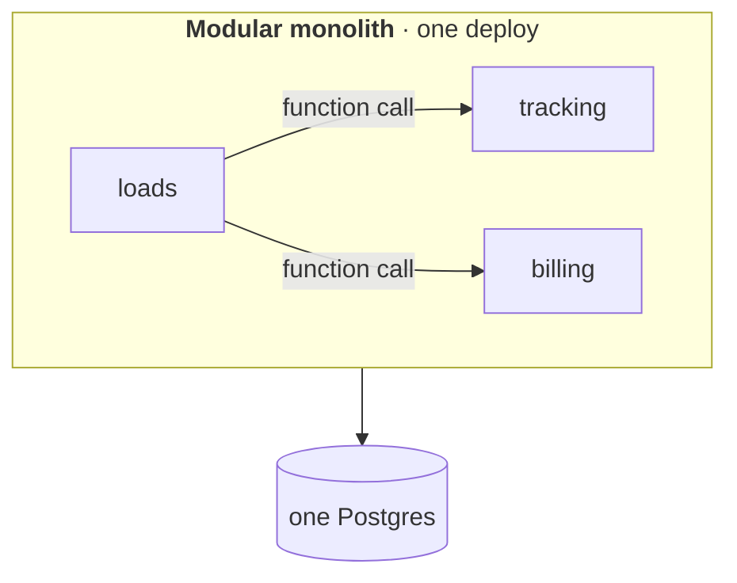
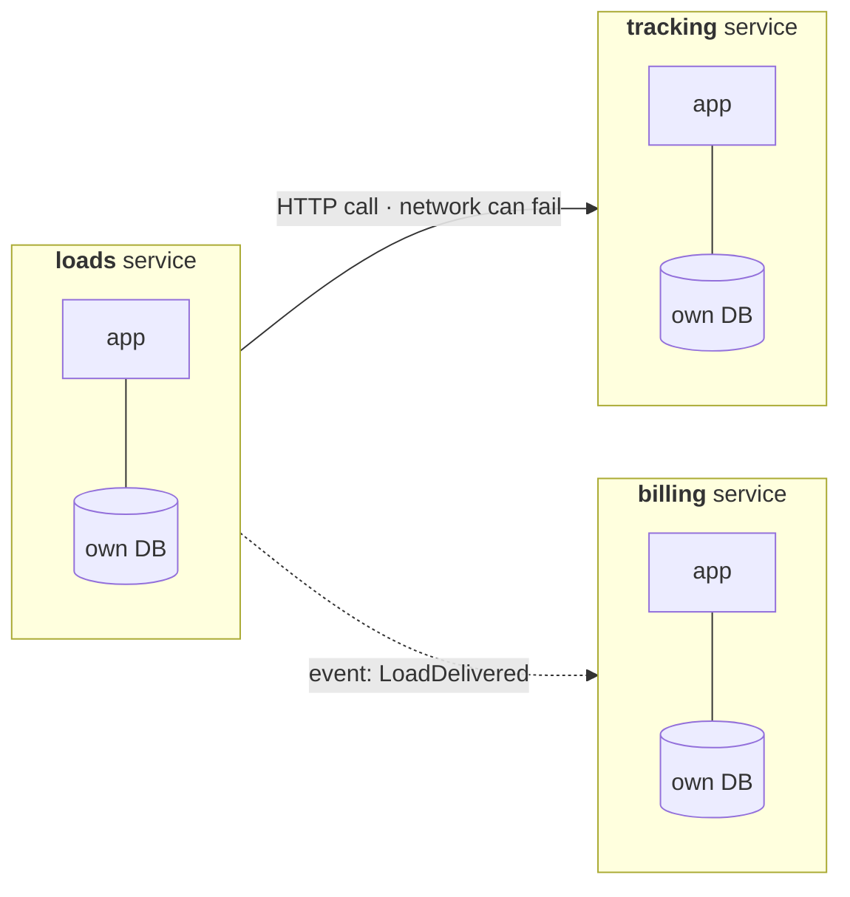
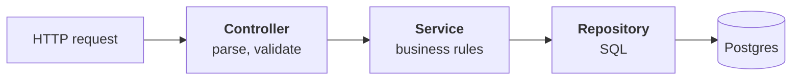
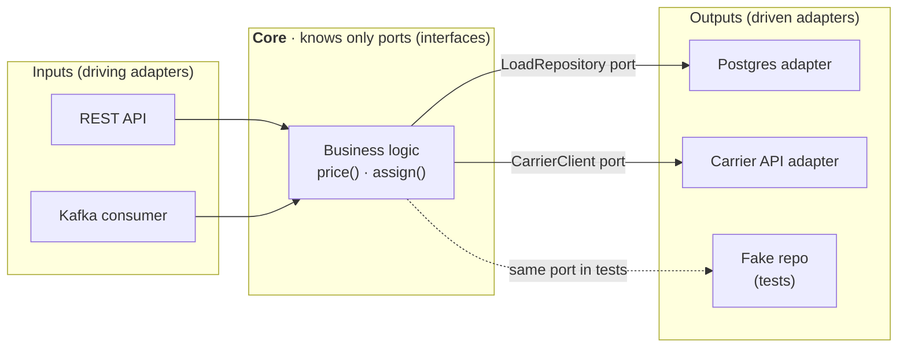

# Software Architecture: how to split and connect a system

Design patterns are about arranging **functions and classes**. Architecture is the same question one level up: how you arrange **modules, services and the messages between them**, and what happens when one piece fails.

> This doc is about *software* architecture styles. For *which cloud tools* to pick (Kinesis, Snowflake, Fivetran…) see [cloud/architecture-comparison.md](../cloud/architecture-comparison.md).

## TL;DR

- "I start with a modular monolith and split out a service only when a team, scaling need or failure boundary asks for it."
- "Inside a service I keep business logic in the middle and push databases and APIs to the edges, so they're swappable and testable."
- "Synchronous calls are simple but couple uptime; async events decouple, at the cost of eventual consistency."
- "Every network call gets a timeout, a retry with backoff, and an idempotency key."

---

## 0. If you only memorize this

| Style | One-line idea | Analogy | Pick it when |
|---|---|---|---|
| **Monolith** (modular) | One deployable app, split into clear modules inside | One restaurant, separate kitchen stations | Default. Small team, new product |
| **Microservices** | Many small apps, each owns its data, talk over the network | A food court: each stall runs itself | Many teams stepping on each other, parts need different scaling |
| **Layered** | Controller → Service → Repository → DB | Front desk → manager → archive room | Almost every web backend, inside one app |
| **Hexagonal** (ports & adapters) | Business logic in the centre, DB/APIs plugged in at the edges | A laptop with USB ports: devices plug in, laptop doesn't change | Lots of integrations, you want tests without real infra |
| **Event-driven** | Services announce events, others react | Radio broadcast vs phone call | One action triggers many reactions; producer shouldn't wait |
| **Serverless** | Functions run on demand, you manage no servers | Taxi instead of owning a car | Spiky or low traffic, glue code, webhooks |

**The rule of thumb:** *monolith first, layered inside, events between parts that don't need to wait.*

---

## 1. The problem

A freight app starts small: create loads, track trucks, send invoices. Two ways it goes wrong:

- **Big ball of mud**: everything calls everything. Changing invoice logic breaks tracking. Nobody dares deploy on Friday.
- **Microservices too early**: 3 engineers, 12 services, a request hops through 5 of them, and debugging needs distributed tracing before there are customers.

Architecture is picking the amount of separation that matches the team and the load *today*, with a clear path to split later.

---

## 2. The mechanism

### Monolith vs microservices

- **Monolith**: function calls are fast and transactions are easy. Downside: one deploy for everyone, scales as one unit.
- **Microservices**: independent deploys and scaling. Downside: network failures, data spread across DBs (no cross-service transaction), much more ops.
- **Modular monolith** is the middle: strict module boundaries inside one app, so splitting later is a cut, not a rewrite.

### Layered (inside one app)

Each layer only calls the one below. Bridge from data engineering: it's like **raw → staging → marts** in dbt, where each layer has one job.

### Hexagonal (ports & adapters)

It's the **Adapter + Repository patterns** from [design-patterns.md](design-patterns.md) applied to the whole app. In tests you plug in fakes.

### Sync vs async communication

| | Synchronous (HTTP/gRPC) | Asynchronous (queue/events) |
|---|---|---|
| Caller | waits for the answer | drops a message and moves on |
| If the other side is down | caller fails too | message waits in the queue |
| Consistency | immediate | eventual |
| Use for | "I need the answer now" (get price quote) | "go do this" (send invoice, update map) |

### Resilience: the four things every network call needs

1. **Timeout**: never wait forever.
2. **Retry with exponential backoff + jitter**: for temporary failures only.
3. **Idempotency**: retries must not charge twice. See [rest-apis-webhooks.md](../backend/rest-apis-webhooks.md).
4. **Circuit breaker**: after N failures, stop calling for a while and fail fast, like a fuse in your house.

---

## 3. Decide

- **Start**: modular monolith, layered inside, one Postgres.
- **Split a service out when**: a separate team owns it, it needs very different scaling (tracking pings vs monthly invoices), or its failure must not take down the rest.
- **Go async when**: the caller doesn't need the result right now, or several systems react to the same thing.
- **Use hexagonal when**: many external integrations or you want fast tests without real infra.
- **Serverless when**: traffic is spiky or low, or it's glue (webhook receivers, small jobs).
- **Need data in two places across services** → outbox or CDC, never dual writes. Canonical home: [sql-vs-nosql.md](../system_design/99-reference/sql-vs-nosql.md).

---

## 4. Failure modes and common wrong answers

- **"Microservices because it scales"**: scaling is rarely the blocker early; team coordination is. A monolith behind a load balancer scales far.
- **Distributed monolith**: services that must deploy together and call each other synchronously in chains. All the cost of microservices, none of the benefit.
- **Shared database between services**: couples them through the schema; one migration breaks another team.
- **Retries without idempotency**: duplicate invoices, double charges.
- **Retry storms**: everyone retries at once with no backoff and kills the recovering service. Add jitter and a circuit breaker.
- **Going async and forgetting the user**: if the UI needs a result, you now need status polling, webhooks or websockets.

---

## Self-check

1. A 4-person startup asks: monolith or microservices?

Modular monolith. One deploy, easy transactions, fast debugging. Keep clear module boundaries so a module can become a service later if a team or scaling need appears.

2. What's a "distributed monolith"?

Services split over the network that still have to change and deploy together, often chained with synchronous calls. You pay network and ops costs without getting independence.

3. When would you use a queue instead of an HTTP call between two services?

When the caller doesn't need the result immediately, when the receiver may be slow or down (the queue buffers), or when several consumers react to the same event.

4. Explain hexagonal architecture in one sentence.

Business logic sits in the centre and only knows interfaces; databases, APIs and queues are adapters plugged in at the edges, so they can be swapped or faked in tests.

5. Name four things a call to an external carrier API should have.

Timeout, retry with exponential backoff and jitter, an idempotency key, and a circuit breaker.

---

## Related

- [design-patterns.md](design-patterns.md): the same ideas at class/function level
- [cloud/architecture-comparison.md](../cloud/architecture-comparison.md): which concrete tools to use
- [sql-vs-nosql.md](../system_design/99-reference/sql-vs-nosql.md): outbox, CDC, saga, consistency
- [streaming-tools.md](../system_design/99-reference/streaming-tools.md): queue vs log, delivery semantics
- [rest-apis-webhooks.md](../backend/rest-apis-webhooks.md): idempotency keys and webhook retries
