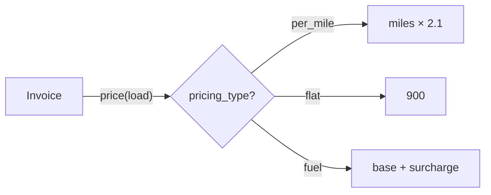
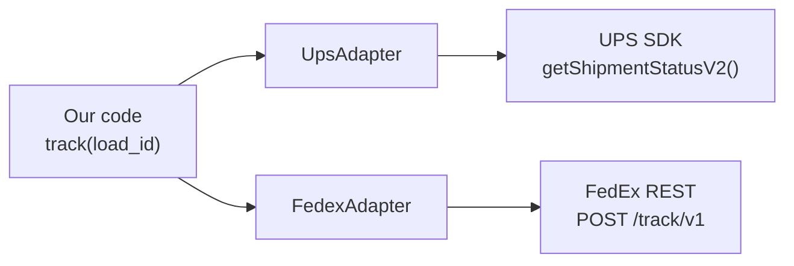
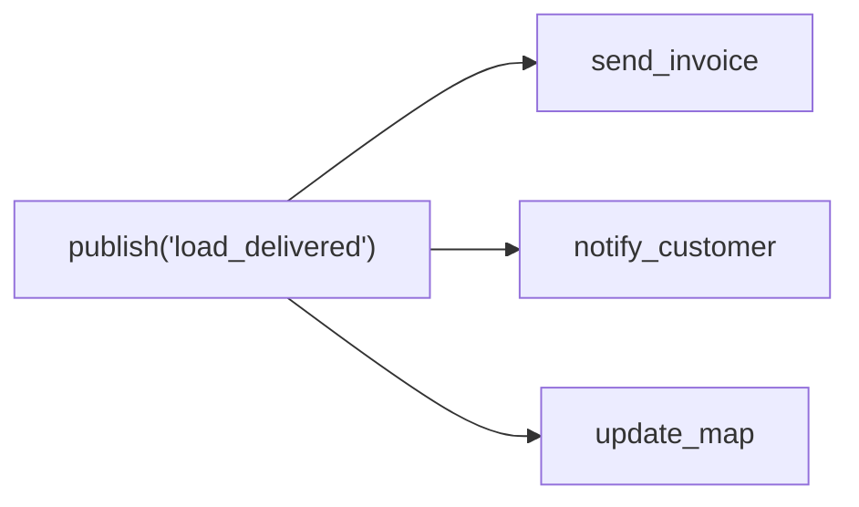
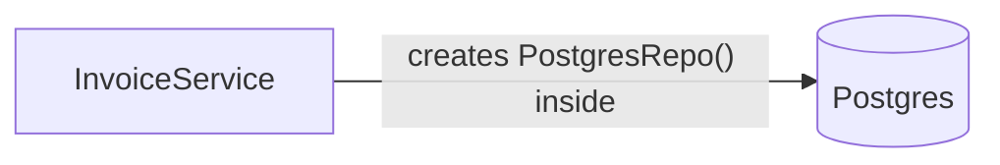
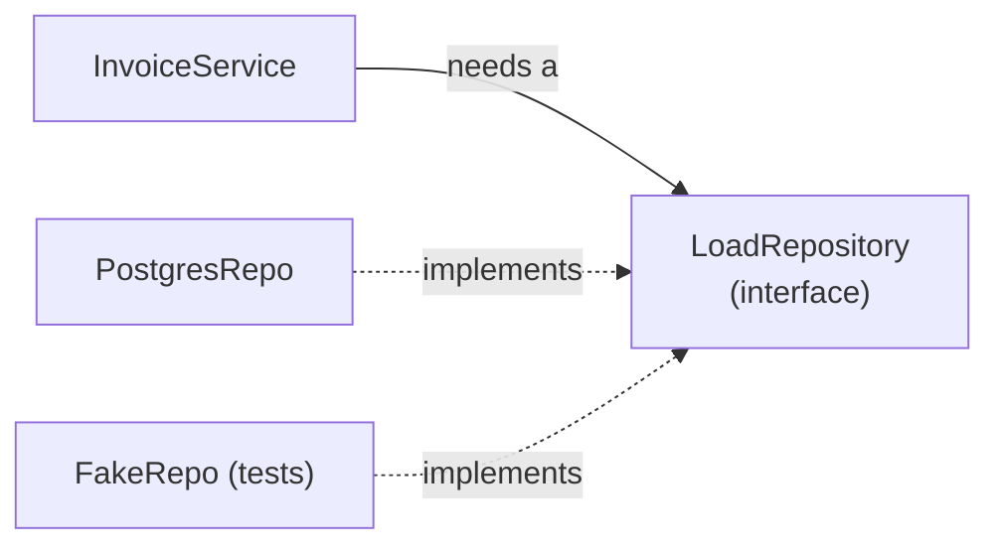

# Design Patterns: the small set that actually comes up

A design pattern is a **named, reusable shape of code** for a problem that keeps coming back. The value in an interview is mostly the name: "I'd use a Strategy here" says in four words what would otherwise take a paragraph.

## TL;DR

- "A pattern is a common fix with a name. I reach for one when I feel the pain it removes, not before."
- "Most patterns boil down to one idea: put what changes behind a small interface so the rest of the code doesn't care."
- "Strategy swaps behaviour, Adapter makes something foreign fit, Decorator adds behaviour around a call, Observer tells others something happened."
- "I prefer composition over inheritance: pass objects in instead of building deep class trees."
- "SOLID in short: one reason to change, add don't edit, subtypes must behave, small interfaces, depend on interfaces and inject the real thing."

---

## 0. If you only memorize this

| Pattern | One-line idea | Everyday analogy | Truck/invoice example |
|---|---|---|---|
| **Strategy** | Swap *how* something is done at runtime | Choosing a route: fastest vs cheapest | Pricing: per-mile vs flat-rate vs fuel-surcharge |
| **Factory** | One place decides *which* object to create | A restaurant kitchen: you order, they pick the cook | `get_carrier_client("fedex")` returns the right client |
| **Adapter** | Wrap a foreign API so it looks like yours | A power plug adapter | Every carrier's weird API → one `track(load_id)` method |
| **Decorator** | Add behaviour around a function without changing it | Gift wrap around a present | `@retry`, `@log_time`, `@cache` on an API call |
| **Observer** (pub/sub) | "Something happened" → everyone subscribed reacts | A newsletter | `LoadDelivered` → send invoice, notify customer, update map |
| **Repository** | Hide *where* data lives behind simple methods | A librarian: you ask for a book, not a shelf number | `loads.get(id)` works with Postgres or an in-memory fake in tests |
| **Singleton** | Only one instance exists | The one office printer | DB connection pool. **Usually avoid**: it's a hidden global |

If you only remember three: **Strategy, Adapter, Decorator.** They are the ones you'll actually draw on a whiteboard or type in live coding.

---

## 1. The problem patterns solve

Without them, code that varies ends up as a growing `if/elif` chain:

```python
def price(load):
    if load.type == "per_mile":
        return load.miles * 2.1
    elif load.type == "flat":
        return 900
    elif load.type == "fuel":
        ...  # every new rule edits this function, and every test of it
```

Each new carrier or pricing rule means editing the same function, which means re-testing everything. Patterns move the "what changes" into its own little box.

---

## 2. The mechanism, one short example each

### Strategy: swap the behaviour

```python
PRICING = {
    "per_mile": lambda load: load.miles * 2.1,
    "flat":     lambda load: 900,
}

def price(load):
    return PRICING[load.pricing_type](load)
```



In Python a Strategy is often just **a dict of functions**. No classes needed. Adding a rule = adding one entry.

### Factory: one place picks the object

```python
def get_carrier_client(name: str) -> CarrierClient:
    clients = {"fedex": FedexClient, "ups": UpsClient}
    return clients[name]()
```

The rest of the code never writes `FedexClient()` directly, so adding a carrier touches one place.

### Adapter: make a foreign API fit yours



```python
class UpsAdapter:
    def __init__(self, ups_sdk):
        self.ups = ups_sdk

    def track(self, load_id: str) -> str:          # our interface
        resp = self.ups.getShipmentStatusV2(ref=load_id)  # their interface
        return resp["statusInfo"]["code"].lower()
```

This is what you write in almost every integration job (very common in FDE work).

### Decorator: add behaviour around a call

```python
import time, functools

def retry(times=3):
    def wrap(fn):
        @functools.wraps(fn)
        def inner(*args, **kwargs):
            for attempt in range(times):
                try:
                    return fn(*args, **kwargs)
                except Exception:
                    if attempt == times - 1:
                        raise
                    time.sleep(2 ** attempt)
        return inner
    return wrap

@retry(times=3)
def fetch_status(load_id): ...
```

Same idea as Express middleware or Airflow's retry settings: the core function stays clean.

### Observer: tell whoever cares



```python
subscribers = {"load_delivered": [send_invoice, notify_customer]}

def publish(event, payload):
    for handler in subscribers[event]:
        handler(payload)
```

In code it's a list of callbacks. **At system scale the same idea is SQS/SNS/Kafka**, see [architecture.md](architecture.md).

### Repository: hide the storage

```python
class LoadRepository:
    def get(self, load_id): ...
    def save(self, load): ...
```

Business logic calls `repo.get(id)`. Tests pass a fake repo backed by a dict; production passes one backed by Postgres.

---

## 3. Two principles behind all of them

- **Composition over inheritance**: give an object the pieces it needs (`Invoice(pricer=per_mile)`) instead of `class PerMileInvoice(Invoice)`. Inheritance trees get rigid fast.
- **Dependency injection**: pass dependencies *in* (a client, a repo, a clock) instead of creating them inside. That's what makes code testable. It's just "function arguments", not a framework.

---

## 4. SOLID: five rules for code that's easy to change

SOLID was coined for Java-style classes, but every rule also works for **functions, modules and pipelines**. They all fight the same pain: *"I changed one thing and three unrelated things broke."*

### Memorize only this

| Letter | Rule | Plain words | Say it in the interview | Pattern that applies it |
|---|---|---|---|---|
| **S** | Single responsibility | One piece of code, one reason to change | "Fetching, pricing and emailing change for different reasons, so they live apart." | Repository, Adapter |
| **O** | Open/closed | Add new behaviour by *adding* code, not *editing* working code | "A new pricing rule is a new entry, not a new `elif`." | Strategy, Decorator |
| **L** | Liskov substitution | Anything that claims to be a `Carrier` must work wherever a `Carrier` is expected | "If a subclass throws on a method the parent supports, the hierarchy is wrong." | (a rule for inheritance) |
| **I** | Interface segregation | Many small interfaces beat one giant one | "A carrier that only tracks shouldn't have to fake `cancel()`." | Adapter with a small port |
| **D** | Dependency inversion | Business logic depends on an interface; the concrete DB/API is passed in | "The invoice service takes a repo as an argument, so tests pass a fake." | Repository + injection, hexagonal |

If you only remember two: **S** and **D**. They're the ones that make code testable, and they come up most.

### S: Single responsibility

```python
# ❌ one function, four reasons to change
def process_invoice(load_id):
    row = psycopg.connect(...).execute("SELECT ...")   # storage changes
    total = row.miles * 2.1                            # pricing changes
    pdf = render_pdf(total)                            # layout changes
    smtp.send(row.email, pdf)                          # email provider changes

# ✅ each piece changes alone; the top function just wires them
def process_invoice(load_id, repo, pricer, mailer):
    load = repo.get(load_id)
    mailer.send(load.email, render_pdf(pricer(load)))
```

Data bridge: it's why a dbt model does **one** thing (staging cleans, marts aggregate) instead of one 800-line SQL file.

### O: Open/closed

```python
# ❌ every new rule edits (and risks) the same function
if load.type == "per_mile": ...
elif load.type == "flat": ...

# ✅ add a rule without touching existing code
PRICING["fuel_surcharge"] = lambda load: load.miles * 2.1 + 150
```

This is exactly the Strategy pattern from §2. "Closed" doesn't mean "never edit", it means **adding a feature shouldn't require editing code that already works**.

### L: Liskov substitution

```python
class Carrier:
    def track(self, load_id) -> str: ...

class PickupOnlyCarrier(Carrier):
    def track(self, load_id):
        raise NotImplementedError   # ❌ code that loops over all carriers now crashes
```

Fix: don't pretend it's a `Carrier`. Give it its own smaller type, or make `track` return a valid value like `"unknown"`. Test for it: *"can I swap in the subclass without the caller noticing?"*

### I: Interface segregation

```python
from typing import Protocol

# ❌ one fat interface: every carrier must implement all of it
class CarrierClient(Protocol):
    def track(self, load_id): ...
    def quote(self, lane): ...
    def book(self, load): ...
    def cancel(self, load_id): ...

# ✅ small interfaces; each caller asks only for what it uses
class Tracker(Protocol):
    def track(self, load_id) -> str: ...

class Booker(Protocol):
    def book(self, load) -> str: ...

def refresh_map(trackers: list[Tracker]): ...
```

In Python, `Protocol` means "anything with these methods fits". No inheritance needed.

### D: Dependency inversion

❌ **Depends on the concrete thing** (can't test without Postgres):



✅ **Depends on an interface** (swap the real thing for a fake):



```python
# ❌ hard-wired: can't test without a real database
class InvoiceService:
    def __init__(self):
        self.repo = PostgresRepo()

# ✅ injected: prod passes PostgresRepo, tests pass FakeRepo
class InvoiceService:
    def __init__(self, repo: LoadRepository):
        self.repo = repo
```

**Inversion vs injection:** *inversion* is the rule (depend on interfaces). *Injection* is the technique (pass the thing in). Hexagonal architecture is this rule applied to a whole app, see [architecture.md](architecture.md).

---

## 5. Decide

- Growing `if/elif` on a *type* → **Strategy** (dict of functions).
- Talking to an external API with its own shape → **Adapter**.
- Same cross-cutting concern (retry, logging, timing, auth) on many functions → **Decorator**.
- One event, several reactions, and you don't want the producer to know them → **Observer**.
- Want to test logic without a real database → **Repository** + inject it.
- Tempted by a **Singleton** → pass the object in instead, unless it's truly a process-wide resource like a connection pool.

---

## 6. Failure modes and common wrong answers

- **Pattern-first design**: adding a Factory for one class "just in case". Three `if`s are fine; reach for a pattern at the fourth, or when it hurts.
- **Java-style Python**: writing `AbstractPricingStrategyFactory` classes when a dict of functions does the job.
- **Singleton as a global**: hides dependencies and makes tests share state.
- **Confusing Decorator (the pattern) with `@decorator` (Python syntax)**: Python's syntax is one convenient way to apply the pattern, not the only one.
- **Observer with no error handling**: one failing subscriber shouldn't block the others. At scale, that's why you move to a queue.
- **SOLID taken to the extreme**: one-line classes and an interface for everything. SOLID is a tool for code that *changes often*; a 20-line script doesn't need it.
- **"Single responsibility = one method per class"**: no. It means one *reason to change* (one owner, one kind of change).

---

## Self-check

<details><summary>1. You have 6 carriers, each with a different API. Which pattern, and why?</summary>

Adapter per carrier, all exposing the same `track(load_id)` interface, plus a small Factory that picks the adapter by carrier name. The rest of the code never knows which carrier it's talking to.
</details>

<details><summary>2. What's the simplest way to implement Strategy in Python?</summary>

A dict mapping a key to a function: `PRICING[load.type](load)`. No classes needed.
</details>

<details><summary>3. Why is Singleton often called an anti-pattern?</summary>

It's a global in disguise: hidden dependency, shared state between tests, hard to swap. Prefer passing the object in (dependency injection).
</details>

<details><summary>4. How does the Observer pattern relate to SNS/Kafka?</summary>

Same idea at different scales: a producer announces an event and doesn't know who reacts. In-process it's a list of callbacks; across services it's a topic/queue, which adds durability and retries.
</details>

<details><summary>5. What does "composition over inheritance" mean in one sentence?</summary>

Build behaviour by giving an object the parts it needs (passing a pricer in) instead of creating subclasses for every variation.
</details>

<details><summary>6. Name the five SOLID principles with one plain phrase each.</summary>

Single responsibility: one reason to change. Open/closed: add, don't edit. Liskov: a subtype works wherever the parent is expected. Interface segregation: small interfaces. Dependency inversion: depend on interfaces and pass the concrete thing in.
</details>

<details><summary>7. A `PickupOnlyCarrier(Carrier)` raises NotImplementedError on `track()`. Which principle breaks, and how do you fix it?</summary>

Liskov substitution: code that loops over carriers crashes on this one. Fix it by giving it a smaller type (e.g. a separate `Booker` interface) instead of inheriting from `Carrier`, or by returning a valid value.
</details>

<details><summary>8. How do the Strategy pattern and dependency inversion relate to SOLID?</summary>

Strategy puts Open/closed into practice (new rule = new entry). Injecting a repository puts Dependency inversion into practice (logic depends on an interface, tests pass a fake).
</details>

---

## Related

- [architecture.md](architecture.md): the same ideas one level up (services instead of classes)
- [python-general.md](../backend/python-general.md): retry with backoff template
- [nodejs-express.md](../backend/nodejs-express.md): middleware = the Decorator/chain idea in Express
