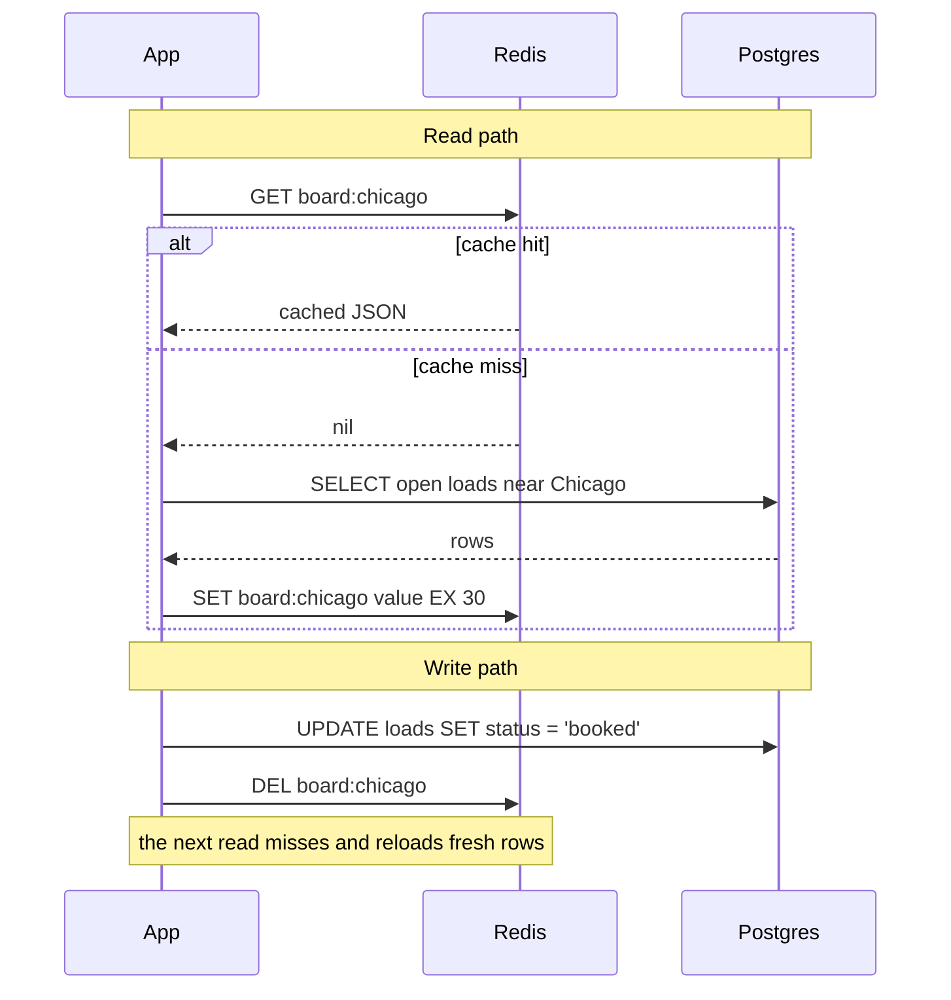

# In-Memory Databases & Caching

## TL;DR

- "A cache is a copy of hot data in RAM that I'm allowed to lose. The database stays the source of truth."
- "My default is cache-aside with a TTL: read the cache; on a miss, read Postgres and set the key with a TTL. On a write, update Postgres, then delete the key."
- "Redis is more than a cache. A sorted set scored by last-seen time answers 'which trucks went silent?' without scanning a table."
- "I name the failure modes: stampede, penetration, avalanche, and silently evicting state I can't rebuild."
- "I measure before adding a cache. A low hit rate adds latency, cost and an invalidation bug."

## Memorize only this

One tool: **Redis**. On AWS that means ElastiCache, where the **Valkey** engine (the BSD-licensed fork, same commands) is the cheaper default. Four patterns: **cache-aside + TTL**, **delete on write**, a **`SET NX` lock** against stampedes, and a **sorted set** for "latest per truck". Memcached, Dragonfly, MemoryDB and DAX are in the [Reference](#reference-the-landscape) section.

---

## 1. The problem

Live load board. 800 dispatchers' screens refresh "open loads near me" every 5 s, which is **160 reads/s**. Each read is a ~30 ms Postgres query with a geo filter and joins *(approx.)*, so roughly **5 CPU-seconds of query work every second** spent recomputing an answer that changes a few times a minute.

The answer itself is small: ~20k open loads × ~1 KB ≈ **20 MB**. That fits in RAM many times over. RAM access is roughly 1,000× faster than an SSD random read *(classic latency numbers, approx.)*, and a Redis `GET` over the network typically returns in well under a millisecond.

## 2. The mental model

**A cache is a derived view you're allowed to lose.** If Redis disappears, the app gets slower but not wrong.

**Bridge from Snowflake:** Snowflake's *result cache* returns a repeated query instantly while the underlying data hasn't changed, and Snowflake invalidates it for you. With Redis, **you** own invalidation, and that's where the bugs live.

---

## 3. The mechanism: cache-aside read and write paths



- **Delete, don't set, on write.** Two writers that both `SET` can finish in the wrong order and leave the older value cached. A `DEL` forces the next reader to load the truth.
- **Keep the TTL anyway.** The write path's `DEL` is itself a small dual write (see [sql-vs-nosql.md](sql-vs-nosql.md)). If it's lost, the TTL bounds how long stale data lives. For stronger guarantees, drive the `DEL` from CDC on the table.
- **Resilient to cache loss:** on an empty cache every read falls through to Postgres. That's correct, but make sure Postgres can survive it (see *cold cache* below).

### The other patterns

| Pattern | Behaviour | Use it when |
| --- | --- | --- |
| **Cache-aside** | The app reads the cache, loads the DB on a miss, and populates | **The default** |
| **Read-through** | Same, but a library or DAX does the loading | You want it hidden from app code |
| **Write-through** | Write the cache and the DB synchronously | Reads must be fresh; every write pays both latencies |
| **Write-behind** | Write the cache, flush to the DB asynchronously | Only loss-tolerant data (counters, metrics). **Can lose data** |
| **Refresh-ahead** | Refresh hot keys before their TTL expires | A few very hot keys where a miss is unacceptable |

### Invalidation, in order of preference
1. **TTL**: set it to how stale you can tolerate. Most problems end here.
2. **Delete on write**: accurate, but easy to miss a code path. That bug looks like inexplicable stale data.
3. **Event-driven**: CDC or DynamoDB Streams → invalidation consumer. Correct and decoupled, with more moving parts.
4. **Versioned keys**: `board:chicago:v7`. Bump the version to invalidate a whole family; old keys expire by TTL.

---

## 4. Redis data structures as design tools

| Structure | Commands | Problem it solves |
| --- | --- | --- |
| **Sorted set** | `ZADD`, `ZRANGE … BYSCORE` | "Who hasn't been seen since T" (score = epoch), leaderboards, sliding-window rate limits |
| **Hash** | `HSET`, `HGETALL` | An object as fields, e.g. update one field of a truck without rewriting the blob |
| **String + TTL** | `SET k v EX 300` | Cache entry, session, idempotency key |
| **`SET k v NX PX 5000`** | atomic set-if-absent with expiry | Lock, stampede guard, "already processed this event" guard |
| **Stream** | `XADD`, `XREADGROUP` | A lightweight log with consumer groups for modest volume ([streaming-tools.md](streaming-tools.md)) |
| **Pub/Sub** | `PUBLISH`, `SUBSCRIBE` | Fan-out to WebSocket servers. Fire-and-forget: no persistence, no delivery guarantee |
| **Geo** | `GEOADD`, `GEOSEARCH` | "Trucks within 50 km of this warehouse" |
| **HyperLogLog** | `PFADD`, `PFCOUNT` | Unique counts in at most 12 KB, 0.81% standard error |
| **Bitmap** | `SETBIT`, `BITCOUNT` | Daily-active flags: 1M trucks or users ≈ 125 KB |

### Worked example: silence detection without scanning

```
# on every ping (333/s at 10k trucks: trivial for Redis)
ZADD trucks:last_seen <epoch_now> truck:4471

# which trucks have been silent for more than 15 minutes?
ZRANGE trucks:last_seen -inf (<epoch_now - 900> BYSCORE
```

This is O(log N + M) instead of a table scan, and the result comes back sorted by how long each truck has been quiet. `ZRANGEBYSCORE` is the older spelling of the same command. **Bridge:** a sorted set is an index on one column you can range-scan, like `WHERE last_seen < now() - interval '15 min' ORDER BY last_seen` on a B-tree. For 10k trucks the whole set is on the order of a megabyte *(approx.)*.

---

## 5. Eviction: what happens when RAM fills

| `maxmemory-policy` | Behaviour |
| --- | --- |
| `allkeys-lru` | Evict the least-recently-used key. **Right for a pure cache** |
| `allkeys-lfu` | Evict the least-frequently-used key. Better when a stable hot set exists |
| `volatile-lru` | Only evict keys that have a TTL |
| `noeviction` | Reject writes when full. **Right when Redis holds state you can't regenerate**: fail loudly |

---

## 6. Decide

- **Add Redis** when reads far outnumber writes, a few seconds of staleness is acceptable, and the hot set fits in RAM.
- **Use Redis as a state store** (latest position, rate limits, locks) when the state can be rebuilt from the log or its loss is tolerable. Run it with `noeviction` and replicas. If losing it isn't acceptable, use a durable store (MemoryDB, DynamoDB, Postgres).
- **Don't cache** when the data must be strongly consistent at read time (booking status at commit), when the hit rate would be low, or when the query is already fast. As a *rule of thumb*, a cache below ~80% hit rate often isn't paying for itself.
- **What would make me change it:** invalidation bugs piling up → a materialized view in Postgres instead. One key saturating a node → replicate that key or add an in-process cache.

## 7. Failure modes

| Failure | How it shows up | How you notice | Mitigation |
| --- | --- | --- | --- |
| **Stampede** (thundering herd) | A hot key expires, and thousands of requests miss together and hit Postgres | DB CPU spikes lined up with key expiry; miss-rate spikes | `SET lock:key NX PX 5000` so one request refills while the others briefly wait or serve stale data; probabilistic early refresh |
| **Penetration** | Repeated lookups for keys that *don't exist* always reach the DB | High miss rate on a small set of keys | Cache the negative result with a short TTL; a Bloom filter |
| **Avalanche** | Many keys with identical TTLs expire at the same instant | Periodic, regular DB load spikes | Jitter the TTL (`300 + rand(60)`) |
| **Silent eviction of state** | State stored on `allkeys-lru` vanishes under memory pressure with no error | `evicted_keys` > 0 (ElastiCache `Evictions`) | `noeviction` + a memory alarm; size for the state |
| **Stale after write** | A booked load still shows as open | Complaints; cache-vs-DB spot checks | Delete on write + short TTL; CDC-driven invalidation |
| **Cold cache** | After a failover or flush, 100% of traffic hits a DB sized for 10% | DB saturation right after a cache restart | Warm critical keys first, rate-limit refills, keep replicas |

## 8. Common wrong answers

- **"Add a cache"** as the first response to any slow query. First check the query plan and indexes ([performance-and-security.md](../../backend/performance-and-security.md)). A cache hides the problem and adds an invalidation bug.
- **"On write, update the cache with the new value."** Concurrent `SET`s race and can leave the old value. Delete the key and let the next read reload.
- **"Redis is in memory, so it can't be durable"** or its opposite, **"Redis is durable."** Redis can snapshot (RDB) and append to a log (AOF), but replication is asynchronous, so a failover can lose recent writes. For durability with the Redis API, use MemoryDB.
- **"Valkey is a different thing to learn."** It's a fork of Redis 7.2.4 with the same commands and clients. The difference is the license and the price.

---

## Self-check

<details><summary><b>Q1.</b> Draw the cache-aside read and write paths. Why delete the key on write instead of setting the new value?</summary>

Read: `GET` → on a hit, return. On a miss, `SELECT` from Postgres, then `SET key value EX ttl`. Write: `UPDATE` Postgres, then `DEL key`. Delete instead of set because two concurrent writers doing `SET` can finish out of order and leave the older value cached indefinitely. A delete forces the next read to load the current truth, and the TTL covers a lost `DEL`.

</details>

<details><summary><b>Q2.</b> A hot key "open loads in Chicago" expires at 09:00:00 and Postgres CPU jumps to 100%. Name the failure and two fixes.</summary>

A **cache stampede** (thundering herd): every concurrent request misses at once and runs the same expensive query. Fixes: (1) a short lock with `SET lock:board:chicago NX PX 5000`, so only one request rebuilds while the others wait briefly or serve the stale value; (2) refresh the key early (probabilistic early expiry or refresh-ahead). If many keys expire together, also jitter the TTLs.

</details>

<details><summary><b>Q3.</b> You store the latest position of every truck in Redis with `allkeys-lru`. What's the risk and the fix?</summary>

Under memory pressure Redis silently evicts positions, and the map shows trucks as missing, with no error anywhere. That data is state, not a cache. Use `noeviction` so writes fail loudly, alarm on memory, size the node for 10k–100k small hashes, and make sure the state can be rebuilt from the stream if it's lost.

</details>

<details><summary><b>Q4.</b> How do you find trucks that have been silent for 15 minutes using Redis, and what's the SQL bridge?</summary>

On every ping, `ZADD trucks:last_seen <epoch> truck:<id>`. To query, `ZRANGE trucks:last_seen -inf (<now-900> BYSCORE` returns the silent trucks, oldest first, in O(log N + M). It's the equivalent of a B-tree range scan: `WHERE last_seen < now() - interval '15 minutes' ORDER BY last_seen`.

</details>

<details><summary><b>Q5.</b> When would you *not* add a cache to the load board?</summary>

When the hit rate would be low (dispatchers all filter differently, so most keys are unique), when the answer must be exactly current (the booking confirmation itself), or when the query can be made fast with an index or a materialized view. Measure the hit rate and latency first. A cache that rarely hits adds a network hop and an invalidation bug.

</details>

---

## Reference: the landscape

| | **Redis** | **Valkey** | **Memcached** |
| --- | --- | --- | --- |
| Data types | Strings, hashes, lists, sets, sorted sets, streams, geo, HLL, bitmaps | Same (fork of Redis 7.2.4) | Strings only |
| Persistence | RDB snapshots + AOF | Same | None |
| Cluster | Redis Cluster (hash slots) | Same | Client-side sharding |
| License | ≤ 7.2: BSD. 7.4: RSALv2/SSPLv1 (March 2024 change). 8.0+: tri-license RSALv2 / SSPLv1 / **AGPLv3** | **BSD-3-Clause**, Linux Foundation | BSD |
| Use it for | Everything Redis does, where the license suits you | The same, without license questions | A pure string cache |

Licensing checked against redis.io, 2026-09. Since 8.0, Redis is OSI open source again via the AGPLv3 option. Valkey remains the no-questions default for managed services.

- **AWS:** ElastiCache (Valkey, Redis OSS, Memcached). Valkey is priced ~20% below the other engines on node-based clusters and ~33% below on ElastiCache Serverless *(checked 2026-09)*. **MemoryDB** is the Redis/Valkey API with a durable multi-AZ transaction log, so it can be a primary database rather than a cache. **DAX** is a read-through/write-through cache for DynamoDB only.
- **GCP:** Memorystore. **Azure:** Azure Managed Redis; Azure Cache for Redis retires on September 30, 2028 *(checked 2026-09)*.
- **Others you may hear:** DragonflyDB (Redis-compatible, multi-threaded, vertical scaling first), Hazelcast (JVM in-memory data grid).
- **When not to use RAM at all:** data that doesn't fit economically (RAM costs tens of times more per GB than SSD, approx.), complex queries and joins (Postgres/Snowflake), or strict durability without a replication window.

---

## Related
- [SQL vs NoSQL](sql-vs-nosql.md) (dual writes, CDC-driven invalidation) · [Streaming tools](streaming-tools.md) · [AWS services map](aws-services-map.md) · [Architecture comparison](../../cloud/architecture-comparison.md)
- Web-side caching and indexing: [performance-and-security.md](../../backend/performance-and-security.md)
- Applied in: [live-load-board](../live-load-board/README.md) · [truck-stream-processor](../truck-stream-processor/README.md)
- Drill: [databases-caching-questions.md](../../questions/databases-caching-questions.md)
