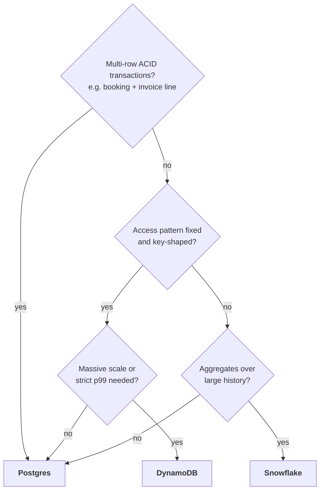
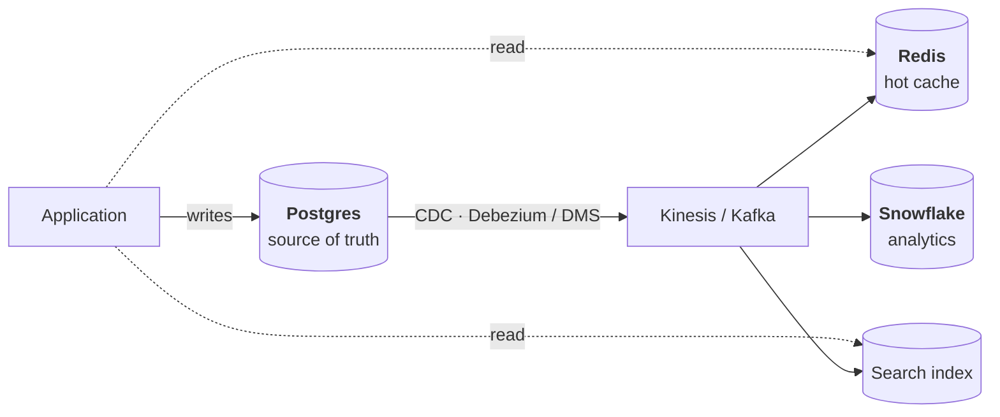
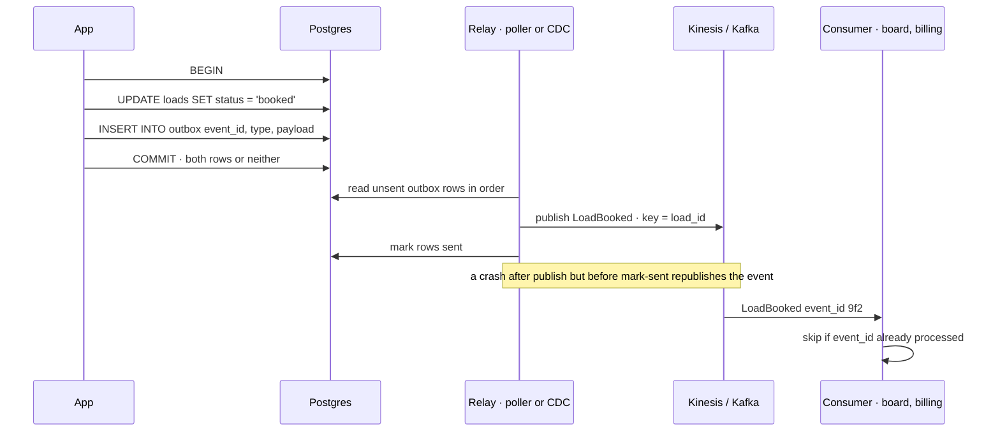
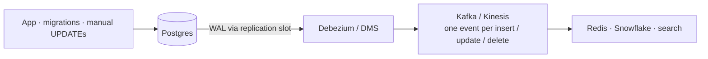

# SQL, NoSQL, and Keeping Them Consistent

## TL;DR

- "Default to Postgres. I move one specific access pattern to DynamoDB when it's a simple key lookup at a scale Postgres can't serve cheaply."
- "The real question isn't which database. It's which data goes where, and how the copies stay consistent."
- "One store owns the truth. Every other store (cache, search index, warehouse) is a derived view that can be rebuilt from a log."
- "Never dual-write. I use a transactional outbox when I own the app and want a clean event contract, and CDC when I need every change, including ones that bypass the app."
- "I choose consistency per piece of data: bookings and payments need strong consistency; the live map is fine being eventually consistent."

## Memorize only this

From the [core toolkit](../../cloud/architecture-comparison.md): **Postgres** is the app database, **DynamoDB** is the switch for key lookups at massive scale, **Redis** holds latest values, **Snowflake** does analytics, and **CDC (Debezium / DMS)** feeds them. The patterns are **outbox**, **CDC** and the **idempotent consumer**. The other database families (document, wide-column, search, graph, time-series) are in the [Reference](#reference-database-families) section.

---

## 1. The problem

Live load board. A carrier books a load. The app updates `loads` in Postgres, then publishes `LoadBooked` to Kinesis so the board (Redis) and billing find out.

Say there are 5,000 bookings a day, and the process dies or times out between those two writes 1 time in 1,000 *(illustrative rate)*. That's **5 loads a day** still shown as open (so they get double-booked) or never invoiced, roughly **1,800 a year**, and not one error in the logs. That is **dual-write drift**, and this page is about never building it.

---

## 2. Choosing a store

### The mechanism, bridged from what you know

- **Postgres is a row store with B-tree indexes.** `UPDATE loads SET status = 'booked' WHERE id = ?` touches a page or two. Snowflake is the mirror image: it scans compressed columns across micro-partitions, which makes it great for `SUM` over a billion rows and poor at 500 single-row updates a second. So Snowflake is never the app database.
- **DynamoDB is a table you may only filter by its key.** The partition key picks the storage node; the sort key allows a range within it. Picture a Snowflake clustering key that is also the *only* fast `WHERE`. Any other query is a scan or a new GSI (a second copy of the table with a different key).
- **Redis keeps the hot set in RAM**, covered in [in-memory-databases.md](in-memory-databases.md).



### Trucks arithmetic: the "latest position per truck" table

| Rung | Writes | Hot set | Store |
| --- | --- | --- | --- |
| 10 trucks @ 30 s | 0.33 upserts/s | 10 rows | Postgres, nothing else |
| 10k trucks @ 30 s | 333 upserts/s | 10k rows × ~0.5 KB ≈ 5 MB | Postgres copes (approx.). Add Redis when the map *reads* it thousands of times a second |
| 100k trucks @ 5 s | 20,000 upserts/s | 100k rows ≈ 50 MB | DynamoDB or Redis. 20k small writes/s on one Postgres primary is possible, but it's a tuning project (approx.) |

### Decide

- **Postgres** when you need transactions, queries you can't predict yet, or moderate write rates. Postgres covers JSONB (documents), PostGIS (geo), pgvector, full-text search and partitioning, and running one database beats running four.
- **DynamoDB** when the access pattern is fixed and key-shaped (latest position per truck, idempotency keys, sessions) and volume or predictable p99 matters. Its real constraint: you model the table around the queries, so an unforeseen access pattern means a new GSI or a migration.
- **Snowflake** for history and aggregates, fed by CDC or Fivetran. Never for serving the app.
- **What would make me change it:** GSI sprawl on DynamoDB (the product keeps inventing new queries) → move those reads to Postgres or the warehouse. Postgres write latency or replica lag hurting the hot path → move just that key-value path out.

---

## 3. Polyglot persistence: one truth, many derived views



One store owns the truth. Every other store is a **derived view**, rebuilt from the log if it's lost. That single principle resolves most "how do we keep these in sync?" questions: you don't sync peers, you replay into replicas.

---

## 4. Keeping stores consistent

### ❌ Dual writes: the anti-pattern
```python
db.save(booking)                  # succeeds
kinesis.put_record(booked_event)  # process crashes here → permanent, silent drift
```
Two writes to two systems without a shared transaction give no atomicity and no ordering. You can't fix it by wrapping both in one transaction: Kinesis doesn't take part in Postgres transactions, and Kafka transactions don't include Postgres.

### ✅ Transactional outbox

Write the business row **and** an event row in **one local transaction**. A relay publishes the event later.



```sql
BEGIN;
  UPDATE loads SET status = 'booked', carrier_id = $1 WHERE id = $2;
  INSERT INTO outbox (event_id, aggregate_id, event_type, payload)
  VALUES (gen_random_uuid(), $2, 'LoadBooked', $3);
COMMIT;
```

- **Atomicity** comes from the local transaction: the event exists if and only if the booking does.
- **Delivery is at-least-once** (see the note in the diagram), so consumers must be idempotent on `event_id`. Delivery semantics in full: [streaming-tools.md §7](streaming-tools.md).
- **Housekeeping:** delete or partition-drop sent rows, or the outbox table grows forever.

### ✅ CDC (Change Data Capture) as a pattern

Read the database's own replication log (Postgres WAL, MySQL binlog) and turn every committed change into an event.



**Bridge:** CDC is a **Snowflake stream on your production database**. A Snowflake `STREAM` on a table gives you the changed rows since you last read it; Debezium does the same from the Postgres WAL, row by row, within seconds.

Tools in one line each: **Debezium** (open source, Kafka Connect), **AWS DMS** (managed, into Kinesis/S3), **Fivetran** (minutes, batch-ish, zero ops), **DynamoDB Streams** (native to DynamoDB, 24 h retention, triggers Lambda). Setup details (replication slots, initial snapshot, isolation) live in [sql-advanced.md](../../data-engineering/sql-advanced.md) and the [CDC case](../cdc-postgres-to-warehouse/README.md).

### Outbox or CDC?

| | **Outbox** | **CDC** |
| --- | --- | --- |
| Event contract | Events you design (`LoadBooked`) | Your table schema, so a column rename breaks consumers |
| Captures | Only writes that insert an outbox row | Every committed change, including migrations and manual `UPDATE`s |
| App change | Yes | None |
| Ops | Relay + table cleanup | Replication slot + connector |

**Pick outbox** when you own the app and want a stable contract. **Pick CDC** when you don't control every writer or need completeness (warehouse feeds). **The common combination:** run CDC *on the outbox table* (Debezium's outbox event router), which gives you a clean contract and no poller.

### Saga: a workflow across services

When a workflow spans services that can't share a transaction, run it as a sequence of local transactions, each with a **compensating action** (charge → refund, reserve load → release). Orchestrate it with Step Functions or Temporal rather than a chain of events, so failures are visible in one place.

---

## 5. Consistency vocabulary

- **Strong:** a read always sees the last write. Postgres primary, DynamoDB with `ConsistentRead=true`.
- **Eventual:** replicas converge in milliseconds to seconds. Read replicas, DynamoDB default reads, any cache. *Bridge:* it's like querying a Snowflake table fed by Snowpipe, which is a minute behind the source. Fine for a dashboard, not fine for "did my booking go through?"
- **Read-your-writes:** users always see *their own* change, even on eventually consistent reads. The usual fix is to pin that user's reads to the primary for a few seconds after a write. This is what people mean by "the UI didn't update".
- **CAP in practice:** network partitions happen, so during one you choose availability or consistency. Say *which* and *why for this data*: bookings choose consistency; the truck map chooses availability.

---

## 6. Failure modes

| Failure | How it shows up | How you notice | Mitigation |
| --- | --- | --- | --- |
| **Dual-write drift** | Booked loads still on the board; loads never invoiced | Reconciliation counts: Postgres vs Snowflake vs Redis | Outbox or CDC; keep a nightly reconciliation job as the safety net |
| **Replication slot bloat** (CDC) | The connector is down for a weekend and Postgres keeps WAL for the slot until the disk fills | Slot lag in `pg_replication_slots`; disk alarm | Alarm on slot lag; cap it with `max_slot_wal_keep_size` (Postgres 13+) |
| **Schema change breaks consumers** | A column rename turns downstream fields null or fails dbt models | Contract tests; schema-registry compatibility checks | Outbox with versioned events, or additive-only migrations |
| **Stale read after write** | A carrier books, and the board still shows the load | Replica-lag metric; user reports | Read-your-writes: read the primary briefly after a write |
| **DynamoDB hot partition** | One huge shipper's key exceeds a partition's throughput (1,000 WCU / 3,000 RCU) and gets throttled | `ThrottledRequests`; CloudWatch Contributor Insights | Add a suffix to spread the key; rethink the key design |
| **Duplicate events** | The relay republishes after a crash | Repeated `event_id`s | Idempotent consumers |

## 7. Common wrong answers

- **"NoSQL scales, SQL doesn't."** Postgres handles far more than most products ever reach. DynamoDB scales because it forbids the queries that don't scale; that's a trade, not magic.
- **"Write to the database, then to the cache/bus, in the same request."** That's a dual write. It works in every demo and drifts in production.
- **"Wrap the Postgres write and the publish in one transaction."** There's no shared transaction between Postgres and Kinesis/Kafka. The outbox *is* how you get that effect.
- **"CAP means pick two of three."** Partitions aren't optional. The real choice is what to give up *during* one, per piece of data.

---

## Self-check

<details><summary><b>Q1.</b> Why is "save to Postgres, then publish to Kinesis" wrong, even with retries?</summary>

There is no atomicity across the two systems. A crash, timeout or deploy between the writes leaves the booking without an event (or an event without a booking, if you publish first), and retries don't help because the process that would retry is gone. The drift is silent. Fix it with an outbox or CDC.

</details>

<details><summary><b>Q2.</b> Walk through the outbox. Where can a duplicate appear, and who handles it?</summary>

The app commits the business row and the outbox row in one local transaction. A relay reads unsent rows, publishes them, then marks them sent. If it crashes after publishing but before marking, it publishes again. Consumers handle that by deduplicating on `event_id` (or making the write an upsert), which gives effectively-once.

</details>

<details><summary><b>Q3.</b> Outbox or CDC for feeding Snowflake from the billing database, where ops engineers sometimes run manual `UPDATE`s?</summary>

CDC. Manual `UPDATE`s bypass the application, so they would never create outbox rows and the warehouse would silently diverge. CDC reads the WAL and captures every committed change. Accept the cost: the table schema becomes the contract, so coordinate renames with the dbt staging models.

</details>

<details><summary><b>Q4.</b> Explain a DynamoDB table to someone who knows Snowflake. What's the constraint that bites later?</summary>

It's a table where the only fast filter is the key: the partition key chooses the partition, and the sort key allows a range inside it, like a clustering key that is also the only usable `WHERE`. Anything else is a full scan or a new GSI. The constraint that bites is that unforeseen access patterns mean new indexes or a migration, so it fits stable, key-shaped access and hurts while the product is still changing.

</details>

<details><summary><b>Q5.</b> Mini design: carriers book loads (5,000/day), a live board shows open loads, billing needs every booking. Which stores, and how do they stay consistent?</summary>

Postgres is the source of truth for loads and bookings (ACID; booking must not double-book). The booking transaction also writes an outbox row; Debezium on the outbox publishes `LoadBooked` to Kinesis. A Lambda consumer updates the Redis board idempotently, and billing consumes the same stream. Snowflake gets the tables via CDC for analytics. The board is eventually consistent, and the booking user reads their own write from the primary.

</details>

---

## Reference: database families

| Family | Examples | Best at | Bad at |
| --- | --- | --- | --- |
| **Relational** | **Postgres**, MySQL, Aurora | Transactions, integrity, ad-hoc queries | Horizontal write scaling, deeply variable documents |
| **Key-value** | **DynamoDB**, **Redis** | Predictable single-key access at any scale | Queries not aligned to the key, analytics |
| **Document** | MongoDB, DocumentDB | Variable schema, whole-object reads/writes | Cross-document transactions, joins, reporting |
| **Wide-column** | Cassandra, ScyllaDB, Keyspaces | Huge write throughput, time-series, multi-region writes | Ad-hoc queries, joins |
| **Search** | OpenSearch, Elasticsearch | Full-text, faceting, arbitrary filter combos | Being the source of truth |
| **Analytical (OLAP)** | **Snowflake**, Redshift, Athena | Scans and aggregations over billions of rows | Single-row lookups, frequent small writes |
| **Time-series** | TimescaleDB, InfluxDB | Downsampling, retention, `time_bucket` | General-purpose workloads |
| **Graph** | Neo4j, Neptune | Multi-hop traversal, fraud rings | Everything else |

**Bold** = in the core toolkit.

---

## Related
- [Streaming tools](streaming-tools.md) (delivery semantics, idempotent consumers) · [In-memory databases](in-memory-databases.md) (caching, invalidation) · [AWS services map](aws-services-map.md) · [Architecture comparison](../../cloud/architecture-comparison.md)
- Extraction from a live OLTP database: [sql-advanced.md](../../data-engineering/sql-advanced.md)
- Applied in: [cdc-postgres-to-warehouse](../cdc-postgres-to-warehouse/README.md) · [live-load-board](../live-load-board/README.md)
- Drill: [databases-caching-questions.md](../../questions/databases-caching-questions.md)
