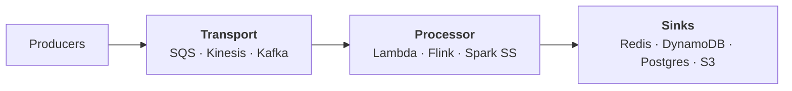
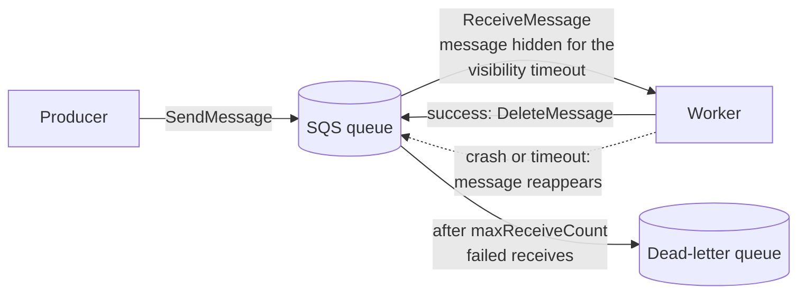
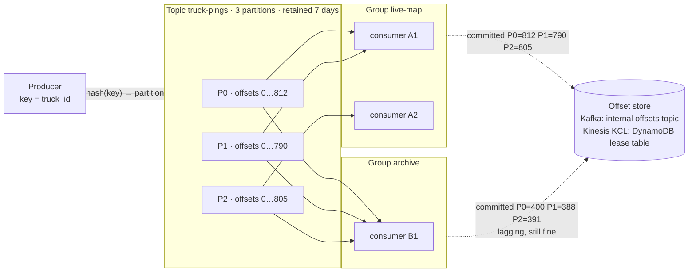
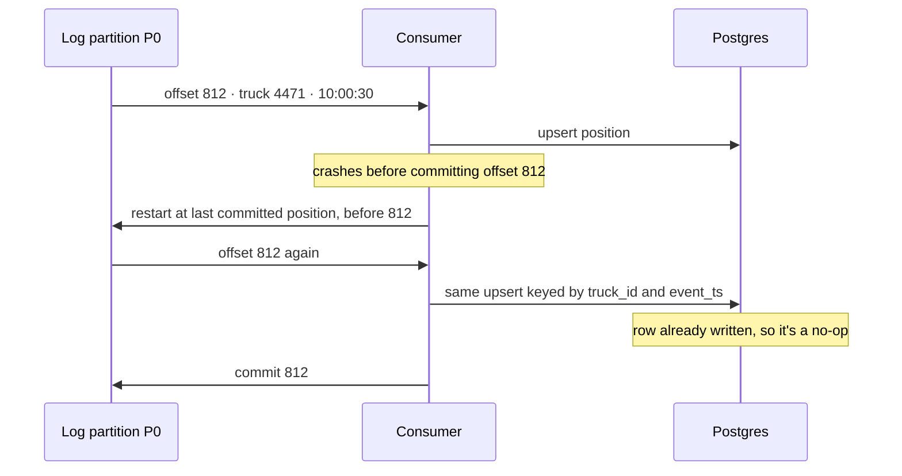

# Streaming Tools — Queue vs Log, Kinesis vs Kafka, Delivery Semantics

## TL;DR

- "A **queue** hands each message to one worker and forgets it. A **log** keeps events in order, and each consumer tracks its own offset, so many systems can read and replay the same data."
- "The deciding question: does anyone else need to re-read this event? No → SQS. Yes → Kinesis on AWS, or Kafka when many teams, compaction or multi-cloud are involved."
- "Transport and processing are separate layers. The log holds events. Lambda does stateless work; Flink does state, windows and timers."
- "I build at-least-once delivery with idempotent consumers. Exactly-once is real only in narrow cases: Kafka-to-Kafka transactions, or Flink with a two-phase-commit sink."
- "Partition key = ordering scope = throughput ceiling. Key by `truck_id`, never by `region`."

## Memorize only this

From the [core toolkit](../../cloud/architecture-comparison.md): **SQS** (hand off work), **Kinesis** → **Kafka** (the event pipe), **Lambda** → **Flink** (react to events). Pub/Sub, Event Hubs, Redpanda, Pulsar, Kafka Streams and streaming SQL are "same idea, different name" and live in the [Reference](#reference-same-idea-different-name) section at the end.

---

## 1. The problem

10k trucks send a ~1 KB ping every 30 s: **333 events/s, ~28 GB/day**. Three systems need every ping:

- the **live map** (latest position in Redis),
- **silence alerts** (a truck quiet for 15 minutes),
- the **archive** (S3 → Snowflake).

Put the pings on SQS and each message goes to *one* receiver: the map gets it and the alerting job never sees it. Next Tuesday you find a bug in the alert logic and want to rerun the last 6 hours, but the messages were deleted when they were consumed. Both problems are exactly what a **log** solves.

## 2. Two layers: transport and processor



Interviewers often blur the two. Keeping them separate in your answer immediately reads as experience.

---

## 3. The mechanism: queue vs log

### Queue (SQS): one worker gets the message, then it's gone



You scale by adding workers pulling from the same queue. There are no offsets, no replay and no second reader.

### Log (Kinesis, Kafka): events stay, and each consumer group keeps its own offset



1. The producer's **partition key** is hashed to a partition. The same truck always lands in the same partition, so its pings stay in order. There is no global order.
2. **Inside a group**, each partition is read by exactly one consumer. **Across groups**, every group reads every partition independently.
3. A consumer **commits the offset** it has processed. After a restart it resumes there. **Replay** means resetting the offset to an earlier position or timestamp.
4. Data is deleted by **retention** (time or size), never by being read.

### Bridge from Spark and Snowflake

| Log concept | What you already know |
| --- | --- |
| Partition (Kinesis calls it a shard) | A Spark partition: the unit of parallelism, and here also the unit of ordering |
| Consumer group | The set of Spark tasks reading those partitions. More consumers than partitions sit idle, just as extra tasks would |
| Committed offset / KCL checkpoint | A Structured Streaming checkpoint: "processed up to here". Spark's Kafka source actually stores offsets in its own checkpoint |
| Partition key | The column you `repartition()` on. A skewed key hurts exactly like a skewed join key |
| Retention + replay | Snowflake Time Travel: go back to the data as it was, then reprocess |
| Log compaction (Kafka) | A `MERGE` that keeps only the latest row per key |

---

## 4. SQS vs Kinesis vs Kafka

| | **SQS** | **Kinesis Data Streams** | **Kafka** (MSK / Confluent) |
| --- | --- | --- | --- |
| Model | Queue: gone once deleted | Partitioned log | Partitioned log |
| Replay | No | Yes: 24 h default, up to 365 d | Yes: retention you configure. Tiered storage (production-ready since Kafka 3.9) makes long retention cheap |
| Ordering | FIFO queues only, per message group | Per shard | Per partition |
| Scaling unit | None to manage. FIFO: 300 API calls/s per action by default (3,000 msg/s with batches of 10), far more in high-throughput mode | Shard: **1 MB/s or 1,000 records/s in, 2 MB/s out** | Partition, plus brokers |
| Many consumers | One consumer per message. Fan out with SNS → one queue per subscriber | Standard consumers share 2 MB/s and 5 reads/s per shard. Enhanced fan-out gives each consumer 2 MB/s (20 per stream, 50 in On-demand Advantage) | Cheap: add a consumer group |
| Compaction | No | No | Yes |
| Ops | None | Low | MSK medium · Confluent low · self-hosted high |
| Cost shape | Per request | Per shard-hour or per GB (on-demand) | Per broker / cluster |

Limits checked against AWS docs, 2026-09.

**Sizing Kinesis** (AWS's own formula counts the read side too):
```
shards = ceil(max(write_MB/s ÷ 1, write_records/s ÷ 1000, total_shared_read_MB/s ÷ 2))

10k trucks, 3 standard consumers:
  max(0.33 ÷ 1, 333 ÷ 1000, 0.33 × 3 ÷ 2 = 0.49)  →  1 shard, 2 with headroom
```
The full scale ladder (10 / 10k / 100k trucks) is in [architecture-comparison.md §2](../../cloud/architecture-comparison.md).

**Capacity modes.** *Provisioned*: you set the shard count and reshard yourself. *On-demand*: a new stream starts at 4 MB/s of write capacity and handles up to double its peak of the previous 30 days. It can throttle if traffic more than doubles within 15 minutes, and it won't split a single hot key beyond one shard's 1 MB/s (checked 2026-09).

### Decide

- **Work queue, no replay** → **SQS**. If order per entity matters, use SQS FIFO with `MessageGroupId = truck_id`. It's the cheapest correct answer, and most systems need nothing more.
- **Several independent consumers, or replay, on AWS** → **Kinesis**.
- **Many teams, compaction, Kafka Connect, retention beyond 365 days, or multi-cloud** → **Kafka**.
- **Don't choose on "real-time".** All three deliver in milliseconds to seconds.
- **What would make me switch Kinesis → Kafka:** consumer count outgrowing enhanced fan-out, a need for "latest value per key" topics, or a second cloud.

---

## 5. Processing: Lambda vs Flink

| | **Lambda** | **Flink** | **Spark Structured Streaming** |
| --- | --- | --- | --- |
| Latency | ms–s | ms (event at a time) | seconds (micro-batch) |
| State | None between invocations | Keyed state (RocksDB), checkpointed | State store, coarser |
| Windows | DIY | Tumbling, sliding, session | Tumbling, sliding |
| Event-time timers | No | **Per-key timers** | Limited |
| Exactly-once | No. Effectively-once via idempotent writes | Exactly-once **state** via checkpoints. End-to-end only with a two-phase-commit or idempotent sink | End-to-end with a replayable source and an idempotent/transactional sink (e.g. Delta) |
| Ops | Zero | High (managed Flink: medium) | Medium (Databricks: low) |

**Bridge:** Flink keyed state is a tiny per-`truck_id` table that the job updates on every event and snapshots at each checkpoint. What makes it special is the **timer**: it fires even when *no event arrives*. That's why "truck silent for 15 minutes" is a Flink job and not a Lambda.

**Decide:**
- **Stateless per-message transform, route or upsert** → **Lambda**. Don't overthink it.
- **Windows, stream joins, detecting the *absence* of an event** → **Flink**.
- **The team already runs PySpark on Databricks and seconds are fine** → Spark Structured Streaming. Reusing skills beats a marginally better engine.

---

## 6. Time: event time, watermarks, windows

- **Event time vs processing time.** Event time is when the ping happened on the truck; processing time is when your job saw it. Anything with mobile devices, retries or replay *must* use event time, or a truck that reconnects after 3 hours in a dead zone poisons every window it lands in.
- **Watermark.** A watermark of `T` says "I don't expect events older than T any more." It is what lets a window close. Too tight drops late data; too loose makes alerts lag. It's an explicit latency-vs-completeness trade-off, and saying that sentence scores points.
- **Windows.** *Tumbling*: fixed and non-overlapping (hourly counts). *Sliding*: overlapping (a 5-min average updated every minute). *Session*: gap-based (activity until 30 min of quiet), the natural fit for detecting a trip.

---

## 7. Delivery semantics (say this precisely)

The whole topic is about **when the offset is committed relative to the side effect**:



| Guarantee | Order of steps | Result |
| --- | --- | --- |
| **At-most-once** | commit offset → process | Loses data on a crash |
| **At-least-once** | process → commit offset | Duplicates on a crash. **The realistic default** |
| **Effectively-once** | at-least-once + idempotent write | No visible duplicates in sinks you control. **What you build** |
| **Exactly-once** (narrow) | Kafka: idempotent producer + transactions that commit output records *and* consumer offsets atomically, read with `isolation.level=read_committed`. Flink: checkpoints + a two-phase-commit sink (e.g. the Kafka sink) | Exact results, but only inside those supported sinks |

Kafka transactions make **Kafka-in → Kafka-out** atomic. They can't make a Postgres write, an email or an HTTP call atomic with the offset. For those, effectively-once comes from the **idempotent consumer**: upsert on a natural key, dedupe on `event_id` with a TTL, or a conditional write (`event_ts > last_event_ts`). Idempotency keys for APIs and webhooks: [rest-apis-webhooks.md](../../backend/rest-apis-webhooks.md).

---

## 8. Failure modes

| Failure | How it shows up | How you notice | Mitigation |
| --- | --- | --- | --- |
| **Hot partition** | Keyed by `region`, 60% of pings go to one shard. It throttles while others idle | Per-shard `WriteProvisionedThroughputExceeded`; uneven bytes per partition | Key by `truck_id`. If the natural key is skewed, salt it (`region#bucket`) and re-aggregate downstream. On-demand mode doesn't fix a single hot key |
| **Poison message** | One malformed ping fails forever. The log is ordered, so the whole shard stops behind it | Iterator age rising on **one** shard only; the same batch erroring repeatedly | Bounded retries, then a dead-letter destination; alarm on DLQ depth. For Lambda on Kinesis: `MaximumRetryAttempts`, `BisectBatchOnFunctionError`, on-failure destination |
| **Backpressure** | Consumers slower than producers, and lag grows for hours | Kinesis `GetRecords.IteratorAgeMilliseconds`; Kafka consumer-group lag | Scale consumers up to the partition count, add shards/partitions, batch sink writes. Alarm well before lag approaches retention, or unread data is deleted |
| **Duplicates** | Retries after a crash or timeout; producer retries | More rows than source events; repeated `event_id`s | Idempotent consumers; idempotent producer in Kafka |
| **Late / out-of-order events** | A truck reconnects and sends 3 hours of pings at once | Count of events behind the watermark | Event time + allowed lateness; a side output for very late events; dedupe on `(truck_id, event_ts)` |
| **Rebalance storm** (Kafka) | Consumers keep joining and leaving, and processing pauses each time | Sawtooth lag; rebalance logs | Keep processing within `max.poll.interval.ms`; static membership; cooperative rebalancing |

## 9. Common wrong answers

- **"Kafka, because it's real-time."** SQS, Kinesis and Kafka are all real-time. Kafka is about many consumers, compaction and ecosystem.
- **"We need exactly-once, so Kafka guarantees it."** Only Kafka → Kafka with transactions. The moment you write to Postgres or call an API, you're back to at-least-once + idempotency.
- **"Add more consumers to catch up."** Parallelism is capped by the partition count. The 13th consumer on a 12-partition topic sits idle, and on Kinesis, standard consumers also share the 2 MB/s read limit.
- **"On-demand Kinesis, so no sizing needed."** A single hot key still caps at 1 MB/s. Traffic that more than doubles within 15 minutes can throttle, and read capacity still limits shared consumers.

---

## Self-check

<details><summary><b>Q1.</b> What single question decides between a queue and a log, and what does each do with a consumed message?</summary>

"Does anyone else need to re-read this event, now or later?" A queue (SQS) deletes the message once one worker processes it. A log (Kinesis/Kafka) keeps it until retention expires, and every consumer group tracks its own offset, so several systems can read it and replay it.

</details>

<details><summary><b>Q2.</b> A topic has 12 partitions. Group `live-map` runs 20 consumers and group `archive` runs 1. What happens? Give the Spark analogy.</summary>

In `live-map`, 12 consumers each own one partition and 8 sit idle: parallelism is capped at the partition count, just as a Spark stage can't use more tasks than partitions. The single `archive` consumer reads all 12 partitions on its own, independently of `live-map`, with its own offsets, like a second Spark job reading the same files with its own checkpoint.

</details>

<details><summary><b>Q3.</b> Your consumer upserts to Postgres, then crashes before committing the offset. What happens on restart, and why is it fine?</summary>

It resumes from the last committed offset and processes the same events again: at-least-once delivery. That's fine because the write is idempotent (an upsert keyed on `truck_id, event_ts`, or a dedupe on `event_id`), so the replay is a no-op. That combination is effectively-once.

</details>

<details><summary><b>Q4.</b> When is "exactly-once" actually true?</summary>

In closed systems: Kafka transactions commit output records and consumer offsets atomically for Kafka-in → Kafka-out, with readers on `read_committed`. Flink offers exactly-once state via checkpoints, extended end-to-end by a two-phase-commit sink such as Kafka. Across arbitrary side effects (Postgres, email, HTTP) no transport can guarantee it; you build at-least-once + idempotent consumers.

</details>

<details><summary><b>Q5.</b> Iterator age is climbing on one Kinesis shard while the others sit near zero. What are the two most likely causes, and how do you tell them apart?</summary>

(1) A **hot partition**: that shard receives far more data, visible as throttling and higher incoming bytes on that shard. (2) A **poison message**: normal traffic, but the consumer keeps failing on the same batch, visible as repeated errors and retries on the same sequence numbers. Fix the first with a better or salted key; fix the second with bounded retries, bisecting the batch and a dead-letter destination.

</details>

<details><summary><b>Q6.</b> Mini design: 10k trucks at 30 s. A live map, silence alerts after 15 minutes, a Snowflake archive, and data science wants to replay the last 30 days. Sketch the transport and processors.</summary>

333 events/s ≈ 0.33 MB/s ≈ 28 GB/day → **Kinesis**, 1–2 shards, retention extended to 30 days for replay, partition key `truck_id`. **Lambda** upserts the latest position into Redis/DynamoDB for the map. **Managed Flink** with a per-truck event-time timer fires the silence alert. **Data Firehose** → S3 → Snowflake for the archive. Enhanced fan-out if more than two or three consumers appear. I'd move to Kafka only when many teams start consuming the stream.

</details>

---

## Reference: same idea, different name

Only if asked. Each is a variation on the mechanism above.

- **Google Pub/Sub**: managed pub/sub with no partitions to size, ordering keys, and replay via seek (topic retention up to 31 days). Google also offers *Managed Service for Apache Kafka*.
- **Azure Event Hubs**: a partitioned log that speaks the Kafka protocol (Standard tier and up). Retention up to 7 days on Standard and 90 days on Premium/Dedicated. Log compaction on every tier except Basic.
- **Redpanda**: the Kafka API reimplemented in C++, with no JVM. Same clients, fewer moving parts.
- **Apache Pulsar**: a log with compute and storage split (BookKeeper) and built-in tiering to object storage.
- **Kafka Streams**: a Java *library*, not a cluster, for Kafka-in → Kafka-out stateful processing (RocksDB + changelog topics).
- **Redis Streams**: a lightweight log with consumer groups for modest volume. See [in-memory-databases.md](in-memory-databases.md).
- **Streaming SQL / maintained views**: ksqlDB (SQL over Kafka topics), Materialize and RisingWave (Postgres-compatible incrementally maintained views), Snowflake Dynamic Tables, Databricks Lakeflow Declarative Pipelines (formerly DLT), and ClickHouse materialized views. When the question is "how does the dashboard stay fresh?", a maintained view often beats another microservice.

---

## Related
- [Architecture comparison](../../cloud/architecture-comparison.md) (core toolkit, scale ladder) · [SQL vs NoSQL](sql-vs-nosql.md) (outbox, CDC, consistency) · [In-memory databases](in-memory-databases.md) (caching) · [AWS services map](aws-services-map.md)
- Applied in: [truck-stream-processor](../truck-stream-processor/README.md)
- Drill: [streaming-questions.md](../../questions/streaming-questions.md)
