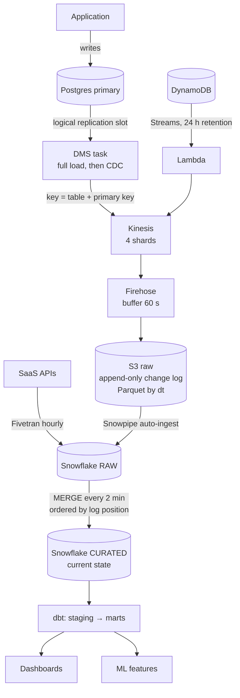

# Case: CDC from Postgres to the Warehouse

> **At a glance** · **Level:** Staff · **Scale:** 40 tables, 200 changes/s average (2,000 peak), ~14 GB/day, 5-minute freshness · **Core tools:** Postgres, DMS (CDC), Kinesis, S3, Snowflake, dbt, Airflow · **Key insight:** the freshness SLO picks the tool (15+ minutes → Fivetran or batch; ~5 minutes with deletes → log-based CDC). The replication slot is the part that can take production down.

---

## 1. Prompt and clarifying questions

**Prompt.** A transactional Postgres backs the product (loads, carriers, invoices). Analysts, dashboards and an ML feature store need that data fresh, without anyone querying the production primary. Some data also lives in DynamoDB and in SaaS APIs (billing, CRM). Build the path from operational stores to the warehouse.

The core tension: **the source is row-oriented and transactional; the consumers are columnar and analytical.**

| Ask | Assume | Why it changes the design |
| --- | --- | --- |
| How fresh? | 5 min for dashboards, 1 h for ML features | ≥ 15 min allows batch; 5 min pushes toward CDC |
| Do hard deletes happen? | Yes (cancelled loads) | `updated_at` extraction can't see deletes |
| Change volume? | 200/s average, 2,000/s peak | Shards, WAL retention risk, merge cost |
| Largest table? | 400M rows | Initial snapshot strategy |
| Who owns schema migrations? | App team, weekly deploys | Schema evolution contract |
| Do we need history (point-in-time)? | For rates and lanes only | SCD1 vs SCD2 per table |

---

## 2. Size it

| Quantity | Arithmetic | Result |
| --- | --- | --- |
| Changes/day | 200/s × 86,400 s | **~17M/day** |
| Change volume | 17M × ~800 B | **~14 GB/day** of change events |
| Peak throughput | 2,000/s × 0.8 KB | 1.6 MB/s → **2 Kinesis shards** minimum (by bytes *and* records); provision 4 |
| Stream cost | 4 × $0.015/h × 730 h + 518M PUT units × $0.014/M | ~$51/month (approx.) |
| Initial snapshot | 400M rows × 800 B | **~320 GB** for the largest table |
| WAL at risk | ≥ 14 GB/day × a 60 h weekend outage | **≥ 35 GB** of WAL retained, more with index and full-page-write overhead |
| Freshness budget | Firehose buffer 60 s + Snowpipe load ~1 min + merge every 2 min | **≤ ~4–5 min** (approx.) |
| Cost of freshness | An XS warehouse that never suspends: 1 credit/h × 720 h | ~720 credits/month ≈ $1.4k–2.9k at $2–4/credit (approx.) |

*Prices approx., US East list (checked 2026-09). Firehose S3 buffer interval ranges 0–900 s.*

**What the numbers say.** The pipe is cheap; the warehouse compute that keeps data 5 minutes fresh is the real cost, so confirm the SLO before building. The WAL line is why the slot lag alarm is a day-one item.

---

## 3. The design: boring first, then the growth path

| Scale | Design | Move up when |
| --- | --- | --- |
| **10 trucks** (tiny app DB) | Nightly `updated_at` extract from a **read replica** → Snowflake | Deletes matter, or daily is too stale |
| **~500 trucks**, many SaaS sources, 15–60 min freshness | **Fivetran** → Snowflake → dbt (the core-toolkit default) | Freshness ≤ 5 min at high change volume, MAR cost grows, or you need control over the stream |
| **10k trucks**, 5 min, deletes: *this answer* | **DMS** reads the WAL → Kinesis → Firehose → S3 (raw log) → Snowpipe → Snowflake `MERGE` → dbt | Many consumers of change events, before-images, or complex routing |
| **100k trucks**, many teams | **Debezium on Kafka** (MSK Connect) + schema registry; the warehouse is one consumer among many (search, cache invalidation, ML) | — |

**Buy vs build at this rung.** Fivetran offers 5-minute syncs on higher plans and 1-minute on Enterprise/Business Critical (checked 2026-09), so it's a legitimate "buy" answer. Choose DMS when monthly-active-rows pricing or pipeline control outweighs owning more moving parts. Name both.

---

## 4. How it works

### 4.1 The pipeline



**Three zones.** **Raw** is the change log: appended, never modified, and it's how you rebuild everything. **Curated** holds current state per entity. **Marts** are dbt-modelled, tested tables (`fct_loads`, `dim_carrier`). Dashboards never read raw, and a merge job is never the only copy of history.

**Why the WAL.** CDC reads Postgres's own replication log: every committed insert, update and delete in commit order, with no query load on the primary. How to extract safely from an OLTP database (replica vs CDC, isolation) is covered in [sql-advanced.md §4](../../data-engineering/sql-advanced.md). CDC as a pattern next to the outbox is in [sql-vs-nosql.md](../99-reference/sql-vs-nosql.md).

### 4.2 Postgres setup and the slot trap

```sql
-- postgresql.conf (RDS: parameter group, rds.logical_replication = 1)
wal_level = logical
max_replication_slots = 10
max_wal_senders = 10
max_slot_wal_keep_size = 100GB     -- PG 13+: cap WAL kept for a lagging slot

SELECT pg_create_logical_replication_slot('warehouse_cdc', 'pgoutput');

-- the alarm query: bytes of WAL each slot is holding back
SELECT slot_name, active,
       pg_size_pretty(pg_wal_lsn_diff(pg_current_wal_lsn(), confirmed_flush_lsn)) AS lag
FROM pg_replication_slots;
```

**The trap to name unprompted.** An unconsumed slot makes Postgres keep WAL indefinitely (the default `max_slot_wal_keep_size = -1`), and the primary's disk fills until writes stop. If the CDC consumer dies over a weekend, production goes down. Alarm on slot lag (on RDS: `OldestReplicationSlotLag`, `TransactionLogsDiskUsage`). Setting `max_slot_wal_keep_size` trades that risk for an invalidated slot and a re-snapshot, which is the right trade for a warehouse feed.

### 4.3 Change log → current state

```sql
MERGE INTO curated.loads AS t
USING (
  SELECT * FROM raw.loads_cdc
  WHERE dt >= :watermark_minus_overlap
  QUALIFY ROW_NUMBER() OVER (PARTITION BY load_id ORDER BY change_seq DESC) = 1
) AS s
ON t.load_id = s.load_id
-- the change_seq guard makes replays of older changes a no-op
WHEN MATCHED AND s.change_seq > t.change_seq AND s.op = 'D'
     THEN UPDATE SET is_deleted = TRUE, change_seq = s.change_seq
WHEN MATCHED AND s.change_seq > t.change_seq
     THEN UPDATE SET status = s.status, rate_usd = s.rate_usd, is_deleted = FALSE, change_seq = s.change_seq
WHEN NOT MATCHED THEN INSERT (load_id, status, rate_usd, is_deleted, change_seq)
                      VALUES (s.load_id, s.status, s.rate_usd, s.op = 'D', s.change_seq);
```

- **Order by the source log position, never `updated_at`.** Wall-clock values tie, skew and go backwards. Debezium gives the Postgres LSN; DMS can expose a change sequence (`AR_H_CHANGE_SEQ`).
- **Idempotent and monotonic.** Re-running an overlap window is safe because older positions never overwrite newer ones.
- **Soft deletes** in curated (`is_deleted`), so "what happened to load 4471" has an answer and incremental dbt models never see rows vanish.
- **SCD2 per table, not globally.** Keep `valid_from`/`valid_to` only where the business asks point-in-time questions (rates, lanes).

### 4.4 Schema evolution

| Change | Handling |
| --- | --- |
| Add nullable column | Safe; old rows are NULL |
| Drop column | Keep it in the warehouse, stop populating it |
| **Rename column** | CDC sees drop + add and history breaks. Treat it as add new → backfill → deprecate old |
| Type change | Widen only (int → bigint) |
| New table | Snapshot before streaming, or the first change has no baseline |

The social half matters most: a migration touching a replicated table is a coordinated change with the app team. dbt source contracts and a schema registry (at the Kafka rung) catch the rest.

### 4.5 Backfills and reprocessing

1. **Initial snapshot:** DMS full load, then CDC. Run the 320 GB table against a **read replica**, chunked by primary key ranges.
2. **Handoff:** streaming starts from the log position recorded at snapshot time. Overlap is fine because the merge is idempotent.
3. **Replay from raw:** a transform bug means re-running the merge over S3 raw, not re-extracting from Postgres.

---

## 5. Justify each block

| Block | Job | What breaks if I delete it |
| --- | --- | --- |
| Logical replication slot + DMS | Reads every committed change, including deletes, with no query load | Scheduled queries hit the primary and miss deletes |
| Kinesis | Buffer between DMS and loaders; a second consumer can read the same changes | DMS writes straight to one target; a slow loader backs up into the slot and the WAL |
| Firehose | Batches small change events into S3 files every 60 s | Millions of tiny objects, or custom batching code |
| S3 raw (append-only) | Replay and audit | A transform bug forces a full re-extract of 320 GB |
| Snowpipe | Continuous load without a scheduler | Loads wait for the next orchestrated run |
| `MERGE` into curated | One current row per entity, idempotent | Analysts dedupe every version themselves, differently |
| dbt | Tested, documented marts | Business logic ends up in dashboards |
| Airflow | Backfills, dbt runs, cross-system DAG | Fine to drop if everything moves into Snowflake Tasks/Dynamic Tables (§8) |

---

## 6. Failure modes

| Failure | How you notice | Mitigation |
| --- | --- | --- |
| **Consumer down → WAL fills the disk** | Slot lag bytes and free disk on the primary | Alarm on slot lag; `max_slot_wal_keep_size`; a runbook to drop the slot and re-snapshot |
| **Silent DMS task stop** | Task state and `CDCLatencySource` / `CDCLatencyTarget` metrics | CloudWatch alarms on task state and latency, not just errors |
| **Duplicates** (at-least-once) | `unique` test on curated primary key | Idempotent `MERGE` on key + change sequence |
| **Out-of-order changes** | Curated row older than raw's latest for that key | Partition by primary key (one row's changes stay on one shard) + position ordering in the merge |
| **Long source transaction** | Oldest transaction age on the primary | A 2-hour transaction emits nothing until commit and then floods; document it as outside the SLO |
| **DynamoDB Streams consumer outage > 24 h** | Lambda iterator age approaching 24 h | Alarm well before; recover with a DynamoDB export to S3 |
| **Late-arriving dimension** | dbt `relationships` test failures | Re-run the model; document eventual convergence |
| **PII in the stream** | Column audit of raw | Filter or mask at the DMS task (table/column mapping), not downstream |
| **Freshness SLO miss** | dbt source freshness on `_loaded_at` | Alert on the SLO itself, not only on task failures |

---

## 7. Common wrong answers

- **"Query the primary every 5 minutes."** Analytical scans compete with production traffic.
- **"`WHERE updated_at > :last_run` on a replica."** Fine for slow tables, but it can't see hard deletes and misses rows updated mid-read or with skewed clocks.
- **"The app writes to Postgres and to the warehouse."** Dual write: no atomicity, permanent silent drift.
- **"CDC gives exactly-once."** It's at-least-once; the merge makes it effectively-once.
- **"Firehose with a 5-minute buffer"** for a 5-minute SLO. The buffer alone uses the whole budget. Do the latency arithmetic.

---

## 8. What would make you change the design

- **SLO relaxes to ≥ 15 min** → Fivetran, and delete the DMS/Kinesis/Firehose path.
- **Many consumers, before-images, routing** → Debezium on Kafka with a schema registry.
- **Everything downstream lives in Snowflake** → Streams + Tasks or Dynamic Tables for the merge instead of Airflow; keep Airflow when the DAG spans S3, APIs and Snowflake.
- **Fewer hops to Snowflake** → Firehose's Snowflake destination (Snowpipe Streaming) instead of S3 + Snowpipe, if you don't need the S3 raw log for other readers. You lose the lake copy, so decide explicitly.
- **Seconds freshness for serving** (cache invalidation, live search) → consume Kinesis directly into Redis/DynamoDB. The warehouse is the wrong place for that.

---

## 9. Say it in two minutes

> "Five-minute freshness with hard deletes rules out batch extraction, so I'd use log-based CDC: DMS on a logical replication slot, keyed by primary key into Kinesis, Firehose with a 60-second buffer into an append-only raw log in S3, Snowpipe into Snowflake, and a `MERGE` every couple of minutes ordered by the source change sequence, not `updated_at`. That keeps us inside about four to five minutes. Deletes become soft deletes, and dbt builds the marts. The raw zone means a transform bug is a re-run, not a re-extract. I'd point out that the pipe costs about fifty dollars a month, but a warehouse that never suspends costs thousands, so confirm the SLO. And on day one I'd alarm on replication slot lag and set `max_slot_wal_keep_size`: an abandoned slot fills the primary's disk and takes production down. If freshness can be fifteen minutes, I'd just buy Fivetran."

---

## 10. Self-check

<details><summary><b>Q1.</b> Build the latency budget for a 5-minute freshness SLO. Where does the time go?</summary>

DMS → Kinesis takes seconds. The Firehose buffer is 60 s (not the 300 s default many people leave on). Snowpipe load is about a minute (approx.), and the merge runs every 2 min. Worst case is about 4–5 min. A 5-minute Firehose buffer alone would break the SLO.

</details>

<details><summary><b>Q2.</b> The CDC consumer dies Friday night. What happens to Postgres by Monday, and what two controls prevent the outage?</summary>

The slot pins WAL: ≥ 14 GB/day × ~60 h ≥ 35 GB, plus overhead, until the disk fills and the primary stops accepting writes. Controls: (1) an alarm on slot lag bytes / `OldestReplicationSlotLag`; (2) `max_slot_wal_keep_size` to cap retention, accepting a re-snapshot if the slot is invalidated.

</details>

<details><summary><b>Q3.</b> Why order the merge by LSN or change sequence rather than `updated_at`?</summary>

Timestamps tie within a transaction, skew across nodes and can go backwards. The log position is a total order over commits, so it's the only correct tiebreaker. It also lets the merge ignore replayed older changes.

</details>

<details><summary><b>Q4.</b> The app team renames `rate` to `rate_usd` in a migration. What does CDC see, and how should it be done?</summary>

CDC sees a dropped column and a new column: history stops under the old name, and downstream models break or go NULL. Do it as expand/contract instead: add `rate_usd`, backfill it, move readers, then deprecate `rate`, coordinated with the data team.

</details>

<details><summary><b>Q5.</b> Mini scenario: product says "actually, hourly is fine for everything". What do you remove, and what do you save?</summary>

Replace DMS → Kinesis → Firehose → Snowpipe with Fivetran on an hourly (or 15-minute) sync, and run dbt on a schedule. You remove a slot you operate, a stream and a delivery stream. More importantly, the warehouse can suspend between runs instead of burning ~720 XS credits a month.

</details>

<details><summary><b>Q6.</b> Why keep an append-only raw zone if curated already holds current state?</summary>

It turns every transform bug into a re-run over S3 instead of a 320 GB re-extract from production. It also keeps intermediate versions and deletes for audit, and it lets new models be built over full history.

</details>

---

## 11. Related

- [sql-advanced.md §4](../../data-engineering/sql-advanced.md): extracting from an OLTP database, replica vs CDC, isolation
- [SQL vs NoSQL](../99-reference/sql-vs-nosql.md): CDC vs outbox, dual writes, consistency
- [Streaming tools](../99-reference/streaming-tools.md): Kinesis vs Kafka, delivery semantics
- [Snowflake performance & cost](../../data-engineering/snowflake-performance.md): merge cost, warehouse sizing
- [Freight billing warehouse](../freight-billing-warehouse/README.md): the batch/Fivetran version of this ingestion
