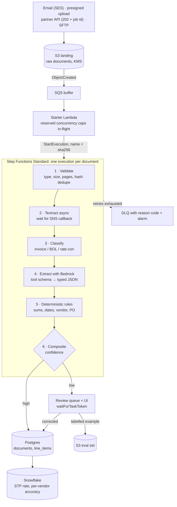

# Case: Document Ingestion Pipeline (AWS + LLM)

> **At a glance** · **Level:** Staff (Forward Deployed Engineer) · **Scale:** ~100k documents/month; 40k arrive in a 4-hour month-start burst (~2.8 docs/s) · **Core tools:** S3, SQS, Lambda, Postgres, Snowflake, plus Step Functions, Textract and Bedrock (justified below) · **Key insight:** the burst and the per-page OCR price shape the architecture. Composite confidence built on deterministic checks, not the model's opinion, decides what reaches the database.

---

## 1. Prompt and clarifying questions

**Prompt.** Customers email or upload PDFs: carrier invoices, bills of lading, rate confirmations. Extract structured fields (vendor, amount, line items, dates), validate them, write them to the operational database, and send anything doubtful to human review. Volume is bursty: quiet all month, then 40,000 documents on the first.

This is the archetypal FDE system: messy real-world input, an LLM in the middle, and a hard rule that wrong output is **caught, not silently written**.

| Ask | Assume | Why it changes the design |
| --- | --- | --- |
| Volume and shape? | 2,000/day steady, 40k in ~4 h on the 1st | Buffering and concurrency caps |
| Pages per document? | 1–20, ~3 on average | OCR cost is per page |
| What does "correct" mean? | Totals reconcile, vendor known, PO matches | Deterministic validation beats model confidence |
| SLO? Does it apply during the burst? | 95% within 10 min | Decides whether quotas must be raised before the 1st |
| Human reviewers available? | Yes, a small ops team | Human review is designed in, not an edge case |
| Data sensitivity? | Invoices carry bank details | Encryption, redaction, model data-retention posture |

---

## 2. Size it

| Quantity | Arithmetic | Result |
| --- | --- | --- |
| Steady rate | 2,000 ÷ 86,400 s | 0.023 docs/s, effectively idle |
| Burst rate | 40,000 ÷ (4 × 3,600 s) | **~2.8 docs/s**, ~120× the steady rate |
| In flight during burst | 2.8/s × ~15 s per document (OCR ~5 s + LLM ~8 s + steps) | **~42 concurrent workflows** |
| Monthly volume | 2,000 × 30 + 40,000 | **~100k docs**, ~300k pages |
| Textract cost | 300k pages × $1.50 / $10 / $65 per 1,000 (DetectDocumentText / AnalyzeExpense / AnalyzeDocument Tables + Forms) | **~$450 / ~$3,000 / ~$19,500 per month** |
| LLM cost | ~100k × (~6k input + ~500 output tokens) at Sonnet-class list prices | ~$2–3k/month (approx.) |
| Workflow cost | ~15 state transitions × 100k × ~$0.025 per 1,000 (Standard) | ~$40/month (approx.) |
| SLO under a concurrency cap | Capped at 20 in flight → 1.3 docs/s → 40k docs take ~8.3 h | Backlog grows to ~21k by hour 4, so the **SLO breaks** |

*Textract list prices checked 2026-09 (US East, first 1M pages). Bedrock and Step Functions figures approx.*

**What the numbers say.** Compute is nearly free and idle 29 days a month, so use serverless. The bill is **which Textract API you call** (a 40× spread) and LLM tokens. The SLO depends on quotas (Textract, Bedrock tokens/min, Lambda concurrency) being sized for ~42 in flight *before* the 1st.

---

## 3. The design: boring first, then the growth path

Document volume tracks loads, so it roughly follows the trucks ladder.

| Scale | Design | Move up when |
| --- | --- | --- |
| **10 trucks** (tens of docs/day) | Upload → S3 → one Lambda: Textract + Bedrock → Postgres; a person checks every result | Reviewers can't keep up; a failed step needs retrying without redoing everything |
| **~100k docs/month, 40k bursts**: *this answer* | S3 → SQS buffer → starter Lambda (capped concurrency) → **Step Functions** per document → Postgres; low confidence → review queue; metrics → Snowflake | Multi-tenant noisy neighbours, 10× volume, search needs |
| **10× this** (1M docs/month, many customers) | Per-tenant queues, Bedrock batch inference for backlogs, per-vendor templates for top layouts, OpenSearch for search | — |

**Why tools beyond the core toolkit:**
- **Textract** reads scanned tables better and cheaper than a general model, and it returns *geometry*, so reviewers see where on the page a value came from.
- **Bedrock** keeps documents inside the AWS account boundary and gives schema-constrained extraction via tool definitions.
- **Step Functions**: each document is a multi-step, failure-prone workflow that may wait hours for a human (see §4.2).

---

## 4. How it works

### 4.1 The pipeline

1. **One landing bucket.** Every channel is an adapter that writes to S3, so a fifth channel is a day of work. Never proxy file bytes through your API; hand out presigned URLs.
2. **The queue absorbs the burst.** A starter Lambda with reserved concurrency controls how many executions run. That keeps you inside Textract, Bedrock and Lambda quotas instead of throttling 750 workflows at once.
3. **Execution name = content hash.** Standard workflows reject a duplicate execution name, and Postgres has a `UNIQUE (sha256)` constraint. A re-sent invoice becomes a no-op at two layers.
4. **Human review pauses the workflow** with a task token and resumes it when the reviewer submits.

### 4.2 Why Step Functions, and which type

| Need | Step Functions gives |
| --- | --- |
| "Where is document 4471 stuck?" | A visual execution history per document |
| Per-step retry with backoff (Bedrock 429s) | Declarative `Retry` / `Catch` |
| Async Textract, human review taking hours | `.waitForTaskToken` callbacks; Standard runs up to 1 year |
| Per-page fan-out on long docs | `Map` state |

**Standard** is the per-document workflow, because callbacks (`.waitForTaskToken`) and `.sync` are *not supported* in Express, and Express executions max out at 5 minutes. **Express** fits high-volume, short, idempotent sub-steps. Chained Lambdas through SQS give the same throughput but none of the traceability, and on this system traceability is the product.

### 4.3 Extraction and composite confidence

- **OCR and reasoning are separate steps.** Textract gives text, tables and bounding boxes, and the LLM reasons over that text. Pick the Textract API per document class: `AnalyzeExpense` for invoices, `DetectDocumentText` when you only need text. Don't run Tables + Forms on every page.
- **Force structured output.** Pass the target JSON schema as a tool definition, which gives typed fields instead of regex over prose. Prompt structure and evals are covered in [llm-prompting-and-evals.md](../../ai/llm-prompting-and-evals.md).
- **Confidence is composite**, in this order of weight:
  1. Deterministic rules: line items sum to the total, dates are valid, the vendor exists, the PO is open.
  2. Cross-field agreement (PO number ↔ vendor ↔ amount).
  3. Textract per-field OCR confidence.
  4. Model uncertainty signals, weighted last.

  If the lines don't sum to the total, the extraction is wrong no matter how confident anything claims to be.

### 4.4 Human in the loop

The ~5% that fails validation is a **permanent, designed path**. A reviewer sees the page with the source region highlighted, corrects fields, and the correction writes to Postgres **and** to the S3 eval set. That set gates every prompt or model change in CI. The headline metric is the **straight-through-processing (STP) rate**, because it tracks what the customer actually pays for in manual work.

---

## 5. Justify each block

| Block | Job | What breaks if I delete it |
| --- | --- | --- |
| S3 landing | Single entry point, raw retention, replay | Four code paths; a parser bug can't be re-run on the originals |
| SQS buffer + starter Lambda | Absorbs the 40k burst and caps concurrency | 750 simultaneous executions hit Textract/Bedrock throttles and retry storms |
| Step Functions (Standard) | Retries, waits, per-document traceability | Hand-rolled state in tables; "where is doc 4471?" has no answer |
| Textract | OCR + geometry for review | The LLM reads scans worse, and reviewers can't see where values came from |
| Bedrock + tool schema | Field extraction into typed JSON | Template-only extraction breaks on every new vendor layout |
| Deterministic rules | The real correctness check | Hallucinated or misread values flow straight into Postgres |
| Review queue + UI | Catches the ~5% | Wrong invoices get paid, or everything needs manual review |
| Postgres (`UNIQUE sha256`) | Operational truth + idempotency | Duplicate invoices, no joins to vendors or POs |
| Snowflake | STP and accuracy trends per vendor | No evidence that changes improved anything |

---

## 6. Failure modes

| Failure | How you notice | Mitigation |
| --- | --- | --- |
| **Same invoice sent twice** | Unique-constraint hits and duplicate execution names | Content hash: execution name + `UNIQUE (sha256)` |
| **Bedrock / Textract throttling in the burst** | Throttle metrics; retry counts per step | Backoff with jitter in `Retry`; cap concurrency at the starter; raise quotas before the 1st |
| **Textract job never completes** | Wait state timeout | Treat a timeout as "route to human", not "fail" |
| **Corrupt, encrypted or 400-page PDF** | Validation step rejects | Fail fast with a reason code *before* paying for OCR; "unprocessable" is a visible outcome |
| **Hallucinated field** | Rules fail (vendor not in table, sums mismatch) | Route to review; never write unvalidated values |
| **Quality regression after a prompt change** | STP rate or eval score drops | Eval set in CI; prompts versioned like code and revertable |
| **Poison document loops** | DLQ depth; executions per hash | Bounded retries → DLQ → alarm |
| **Review backlog after the burst** | Queue age of review tasks | Staff review for the 1st; auto-approve rules for trusted vendors |
| **PII leakage** | Bucket policy audits; data-flow review | KMS, locked-down bucket, VPC endpoints, redaction before anything leaves the account, check the model's data-retention terms |

---

## 7. Common wrong answers

- **"Use the model's confidence score."** Models are poorly calibrated about their own errors. Arithmetic and reference data decide.
- **"Trigger Step Functions straight from every S3 event."** The burst starts hundreds of executions at once and throttles downstream services. Buffer and cap.
- **"Run Textract Tables + Forms on everything."** That's ~$19.5k/month versus ~$3k with `AnalyzeExpense` on invoices at this volume.
- **"Fully automatic, no humans."** The last 5% is where the money errors are. Design the review loop and feed it into evals.
- **"Chain Lambdas; Step Functions is overkill."** You lose waits of hours, retries per step and the per-document trace.

---

## 8. What would make you change the design

- **A few vendors send most documents with fixed layouts** → per-vendor templates, which are cheaper and more accurate than any model on a fixed form.
- **Backlog latency is acceptable** (month-start catch-up) → Bedrock batch inference at ~50% of on-demand price for supported models (approx., checked 2026-09).
- **Search across extracted content** → Postgres full-text first, OpenSearch when queries or volume outgrow it.
- **Many customers with uneven bursts** → per-tenant queues or SQS fair queues so one customer's 40k doesn't delay everyone.
- **Data residency or no-external-model rules** → region-pinned endpoints or a self-hosted model; the eval set tells you what accuracy you give up.

---

## 9. Say it in two minutes

> "Every channel lands the raw file in one S3 bucket. The month-start burst is 40k documents in four hours, about 2.8 a second and 120 times the steady rate, so S3 events go into SQS and a starter Lambda with capped concurrency starts one Step Functions Standard execution per document, named by the content hash so re-sends are no-ops. The workflow validates, runs Textract with the right API for the document class (that choice alone is a 40× cost difference), extracts fields with Bedrock using a tool schema, then applies deterministic rules. Confidence is composite: sums, known vendor and open PO first, model signals last. Low confidence pauses on a task token for human review, and corrections go to Postgres and into an eval set that gates every prompt change. I'd raise Textract and Bedrock quotas before the 1st, because at 20 in flight the burst takes eight hours, and I'd report straight-through-processing rate as the headline metric."

---

## 10. Self-check

<b>Q1.</b> 40,000 documents in 4 hours at ~15 s each. What concurrency do you need to keep up, and what happens if quotas cap you at 20?

40,000 ÷ 14,400 s ≈ 2.8 docs/s. × 15 s ≈ **42 in flight**. At 20 in flight, throughput is 1.33/s, so the burst takes ~8.3 h. By hour 4 the backlog is ~21k documents and the 10-minute SLO fails for most of them.

<b>Q2.</b> Why Step Functions Standard for the per-document workflow rather than Express?

Human review waits hours, which needs `.waitForTaskToken` callbacks and long durations. Express doesn't support callback or `.sync` patterns and is limited to 5 minutes. Standard also keeps per-execution history for "where is doc 4471?".

<b>Q3.</b> The model reports 0.97 confidence but the line items sum to $1,240 and the total says $1,420. What happens?

It goes to human review. Deterministic rules outrank model self-reports; a sum mismatch means the extraction (or the document) is wrong. The correction becomes a labelled eval example.

<b>Q4.</b> Where does the money go at ~300k pages/month, and what's the biggest lever?

Textract API choice: ~$450 (text only), ~$3,000 (`AnalyzeExpense`), ~$19,500 (Tables + Forms). Then LLM tokens (~$2–3k approx.), which you reduce with prompt caching, a smaller model for simple classes, templates for fixed layouts, and batch for backlogs. Compute and Step Functions are tens of dollars.

<b>Q5.</b> The same invoice arrives by email and by upload 10 minutes apart. How is it processed only once?

Both land in S3 with the same content hash. The execution name is the hash, so Standard rejects a second execution with the same name while the first runs, and Postgres `UNIQUE (sha256)` rejects a second insert afterwards. That's two independent layers.

<b>Q6.</b> Mini scenario: after a prompt tweak, STP drops from 92% to 85%. How would you have caught it before production, and what do you do now?

Before production, run the eval set (built from reviewer corrections) in CI on every prompt change, and block the merge on a score drop. Now: revert to the previous versioned prompt, compare failures by vendor and document class, and add the failing cases to the eval set.

---

## 11. Related

- [AWS services map](../99-reference/aws-services-map.md): Step Functions, Textract, Bedrock, SES
- [LLM prompting & evals](../../ai/llm-prompting-and-evals.md): schemas, guardrails, evals from transcripts
- [REST APIs & webhooks](../../backend/rest-apis-webhooks.md): 202 + job id, idempotency keys
- [SQL vs NoSQL](../99-reference/sql-vs-nosql.md): why Postgres holds the truth here
- [Cloud architecture comparison](../../cloud/architecture-comparison.md): core toolkit
