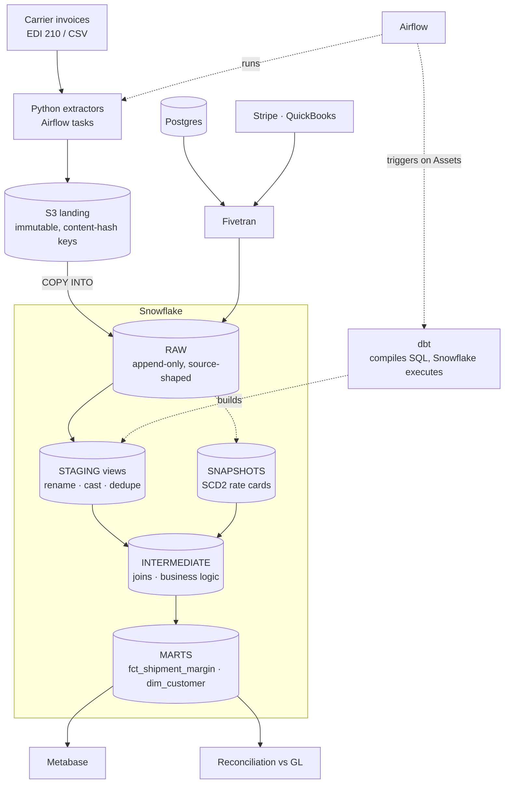

# Case: Freight Billing Warehouse (Python, SQL, dbt, Snowflake, Airflow)

> **At a glance** · **Level:** Intermediate → Staff · **Scale:** 500k shipments/month, 72M invoice lines at 3 years, well under 2 GB/day, 3 engineers · **Core tools:** Fivetran, S3, Snowflake, dbt, Airflow, Metabase · **Key insight:** there's no distributed-systems trick here. The job is correctness finance can close the books on: point-in-time rates, late invoices, and idempotent loads, run by a team small enough that one person can be on call.

---

## 1. Prompt and clarifying questions

**Prompt.** Finance needs daily revenue and margin per shipment, customer and lane. Inputs: an operational Postgres, carrier invoices as EDI 210/CSV files over SFTP and email, and billing data in Stripe and QuickBooks. Rates change over time, and finance needs **point-in-time** correctness: March shipments priced with March's rate card. Month-end close must be trustworthy.

| Ask | Assume | Why it changes the design |
| --- | --- | --- |
| How fresh? | T-1, marts green by 06:00 ET | Batch ELT; no streaming |
| How late do carrier invoices arrive? | 2–10 days after delivery | Lookback window; a fact isn't final on delivery day |
| Does the source keep rate history? | No, rates are overwritten in place | Snapshot rate cards from day one |
| What reconciles the numbers? | QuickBooks general ledger | Reconciliation test finance trusts |
| Team size? | 3 data engineers | Managed services; nothing self-hosted |
| Currencies? | USD + CAD + MXN | Store amount, currency and the FX rate used |

---

## 2. Size it

| Quantity | Arithmetic | Result |
| --- | --- | --- |
| Shipments | 500k/month × 36 months | 18M rows at 3 years |
| Invoice line items | 2M/month × 36 months | **72M rows** at 3 years (largest fact) |
| Carrier files | 30k/month ÷ 30 | ~1,000 files/day, ~67 lines per file |
| Daily new data | (~80k shipment changes + ~67k invoice lines) × ~1 KB | **~150 MB/day** of rows; budget ≤ 2 GB/day with raw files (assumed) |
| Full rebuild of the largest fact | 72M rows | Minutes on a Medium warehouse (approx.) |
| Transform compute | Medium = 4 credits/h × ~0.5 h/day × 30 | ~60 credits/month ≈ $120–240 at $2–4/credit (approx.) |

**What the numbers say.**
- **No Spark.** A few hundred MB a day is a Snowflake `MERGE`.
- **No self-hosted anything.** Three people means one on call.
- **Full rebuilds are still affordable at 72M rows.** Start with `table` materializations, and go incremental when a model outgrows its window or its credits. When you do, the late-invoice trap in §4.4 is what bites.

> **ELT, not ETL.** Land raw data untransformed and transform *inside* Snowflake with dbt. Transforming before loading throws away reprocessing. The exception: data you must mask or drop before it lands (PII) is handled in the E, not the T.

---

## 3. The design: boring first, then the growth path

| Scale | Design | Move up when |
| --- | --- | --- |
| **10 trucks** | QuickBooks reports + a spreadsheet; maybe a nightly Postgres query | More than one source must reconcile, or finance can't close by hand |
| **~500 trucks** | Fivetran → Snowflake → dbt `table` models → Metabase (the core-toolkit rung) | Custom file sources, point-in-time rates, SLA to finance |
| **~10k trucks** (500k shipments/month): *this answer* | Fivetran for Postgres/Stripe/QuickBooks + Python extractors for carrier files → S3 → Snowflake RAW → dbt staging/intermediate/marts + SCD2 snapshots; Airflow orchestrates | Rebuilds exceed the 06:00 window; intraday demand; many domains |
| **100k trucks**, many teams | CDC ingestion ([CDC case](../cdc-postgres-to-warehouse/README.md)), incremental/microbatch models, dbt projects per domain with contracts, cost attribution per team | — |

---

## 4. How it works

### 4.1 Architecture and the layer contract



| Layer | Materialization | Rule |
| --- | --- | --- |
| **RAW** | Tables, append-only | Only loaders write it; nobody queries it (revoke `SELECT` from analysts). This is your replay |
| **STAGING** | Views, 1:1 with source | Rename, cast, UTC, dedupe. No joins, no business logic |
| **INTERMEDIATE** | Ephemeral or tables | Joins and the genuinely complex logic |
| **MARTS** | Tables / incremental | Tested, documented, contracted. The only layer BI touches |

**Where dbt sits:** *inside* Snowflake. `dbt run` compiles Jinja + SQL and sends `CREATE TABLE AS` / `MERGE` statements; Snowflake does the work, and data never passes through dbt. It's the T only: no SFTP, no APIs, no moving bytes. That's what the extractors are for.

### 4.2 Extract and load

**Buy the boring connectors, build the weird ones.** Fivetran covers Postgres, Stripe and QuickBooks; nobody on a 3-person team should maintain QuickBooks OAuth refresh logic. Python handles the carrier files, because no vendor understands 12 carriers' dialects of "CSV". Every custom extractor follows four rules:

1. **Land raw bytes first**, keyed by content hash. A parser bug in three months is a re-run, not a request for the carrier to resend.
2. **Window, don't guess.** Read `[data_interval_start − overlap, data_interval_end)`, never `now()`.
3. **Overlap and dedupe.** Duplicates are cheap; gaps are silent and permanent.
4. **Idempotent per run window.** Scheduled run, retry and a backfill six months later produce the same objects.

```python
def extract_carrier_invoices(carrier, data_interval_start, data_interval_end):
    prefix = f"raw/carrier_invoices/carrier={carrier}/dt={data_interval_start:%Y-%m-%d}"
    manifest = []
    for f in sftp.list_files(carrier, since=data_interval_start - timedelta(hours=1),
                             until=data_interval_end):
        body = sftp.read(f.path)
        digest = hashlib.sha256(body).hexdigest()
        key = f"{prefix}/{digest}.raw"               # re-sent file → same key → no-op
        s3.put_object(Bucket=BUCKET, Key=key, Body=body)
        manifest.append({"key": key, "source_file": f.path, "sha256": digest})
    s3.put_object(Bucket=BUCKET, Key=f"{prefix}/_manifest/{data_interval_start:%H%M}.json",
                  Body=json.dumps(manifest).encode())  # "what did this run load?"
    return manifest
```

```sql
COPY INTO raw.carrier_invoices
FROM @s3_landing/raw/carrier_invoices/
FILE_FORMAT = (TYPE = CSV FIELD_OPTIONALLY_ENCLOSED_BY = '"')
PATTERN = '.*[.]raw'
ON_ERROR = CONTINUE;     -- load metadata skips files already loaded: a second idempotency layer
```

Pair `ON_ERROR = CONTINUE` with an alert on rejected rows (copy history or `VALIDATE()`). A load that "succeeds" while dropping 8% of rows is worse than one that fails.

### 4.3 Airflow 3 orchestration

| Decision | Choice | Why |
| --- | --- | --- |
| Granularity | One DAG per source domain + one transform DAG | A broken carrier SFTP never blocks Stripe |
| Cross-DAG dependency | **Assets** (called Datasets in 2.x) | Transform runs when inputs land, not at a hopeful fixed time |
| Run window | An interval timetable (`CronDataIntervalTimetable`) | In Airflow 3 a plain cron string gives a zero-width interval (start = end), which breaks window-based idempotency |
| dbt | **Cosmos** renders models as tasks | Retry model 140 alone, not a 40-minute monolithic `dbt run` |
| Warehouse protection | Pools; `max_active_runs=1`; explicit `catchup=True` for backfills (the default is now False) | Uncapped parallel backfills melt the warehouse |
| Alerting | Failure callbacks + **Deadline Alerts** (3.1+) for "not done by 06:00" | SLA-miss callbacks were removed in Airflow 3.0 |

```python
# dags/carrier_invoices_ingest.py  (Airflow 3)
import pendulum
from airflow.sdk import Asset, dag, task
from airflow.timetables.interval import CronDataIntervalTimetable

RAW_CARRIER_INVOICES = Asset("snowflake://raw/carrier_invoices")

@dag(
    schedule=CronDataIntervalTimetable("0 * * * *", timezone="America/New_York"),
    start_date=pendulum.datetime(2026, 1, 1, tz="America/New_York"),
    catchup=True, max_active_runs=1,
    default_args={"retries": 3, "retry_delay": pendulum.duration(minutes=5),
                  "on_failure_callback": slack_alert},
)
def carrier_invoices_ingest():
    @task(pool="snowflake_load")
    def extract(carrier: str, **context):
        return extract_carrier_invoices(carrier, context["data_interval_start"],
                                        context["data_interval_end"])

    @task(pool="snowflake_load", outlets=[RAW_CARRIER_INVOICES])
    def load(manifests):
        snowflake.run("COPY INTO raw.carrier_invoices ...")

    load(extract.expand(carrier=CARRIERS))   # one mapped task per carrier

carrier_invoices_ingest()

# the transform DAG has no clock: it runs when all its input Assets are updated
# @dag(schedule=[RAW_SHIPMENTS, RAW_CARRIER_INVOICES, RAW_STRIPE]) → Cosmos DbtTaskGroup
```

**Airflow orchestrates; it doesn't compute.** Pulling data through a worker's memory in a Python task is the classic anti-pattern. Tasks tell Snowflake or S3 to do work, then check the result.

### 4.4 dbt: the late-invoice trap, SCD2 and tests

**Incremental, once a full rebuild stops fitting.** The naive filter `updated_at > max(updated_at)` has a bug that's easy to miss here. A carrier invoice arriving 7 days after delivery changes `int_carrier_invoice_costs`, **not** `shipments.updated_at`, so an `updated_at` lookback never reprocesses that shipment, and margin stays wrong forever. Reprocess by delivery date to cover invoice lateness, plus recent shipment changes:

```sql
-- models/marts/finance/fct_shipment_margin.sql
{{ config(materialized='incremental', unique_key='shipment_id',
          incremental_strategy='merge', on_schema_change='append_new_columns') }}

with shipments as (
    select * from {{ ref('stg_postgres__shipments') }}
    
    where delivered_date >= dateadd(day, -14, current_date)            -- invoices land 2–10 days late
       or updated_at >= (select dateadd(day, -3, max(updated_at)) from {{ this }})
    
)
select
    s.shipment_id, s.customer_id, s.lane_id, s.delivered_date, s.updated_at,
    s.revenue_usd,
    c.carrier_cost_usd,
    r.contract_rate_per_mile,
    s.revenue_usd - c.carrier_cost_usd                               as margin_usd,
    (s.revenue_usd - c.carrier_cost_usd) / nullif(s.revenue_usd, 0)  as margin_pct,
    c.carrier_cost_usd is not null                                   as is_cost_final
from shipments s
left join {{ ref('int_carrier_invoice_costs') }} c using (shipment_id)
left join {{ ref('rate_cards_snapshot') }} r                          -- SCD2 point-in-time join
       on r.lane_id = s.lane_id
      and s.delivered_date >= r.dbt_valid_from
      and s.delivered_date <  coalesce(r.dbt_valid_to, '9999-12-31')
```

- **`merge` on `unique_key`** makes re-processing the window safe. On Snowflake the alternatives are `delete+insert` or `microbatch` (dbt 1.9+, with a `lookback`). Don't use `insert_overwrite`: on dbt-snowflake it replaces the whole table, not a partition.
- **A weekly job rebuilds the trailing 30 days** for invoices later than 14 days; a monthly full refresh in CI catches incremental drift.
- **The SCD2 join is what finance trusts.** Joining the current rate card would restate history every time pricing changed. `dbt_valid_from` is *capture* time, so snapshot daily, and prefer the source's `effective_date` if one exists.

**Snapshot rate cards before anything else.** The source overwrites in place, so history that wasn't captured can never be backfilled:

```yaml
# snapshots/rate_cards.yml  (dbt 1.9+)
snapshots:
  - name: rate_cards_snapshot
    relation: source('postgres', 'rate_cards')
    config:
      unique_key: rate_card_id
      strategy: timestamp
      updated_at: updated_at
      hard_deletes: invalidate        # replaces invalidate_hard_deletes
```

**Tests in two tiers:**

| Tier | Examples | Severity |
| --- | --- | --- |
| Structural | `unique` + `not_null` on `shipment_id`, `relationships` to `dim_customer`, contracts on marts | `error`: a duplicate `shipment_id` double-counts revenue |
| Business | Reconciliation to the GL, row-count deltas vs 7-day average, margin range | Usually `warn`: investigate, don't halt close |
| Absence | `dbt source freshness` per source | `error`: the only check that notices a carrier stopped sending files |

```sql
-- tests/assert_revenue_reconciles_to_gl.sql → passes when it returns 0 rows
select d.month, d.warehouse_revenue, g.gl_revenue
from {{ ref('fct_revenue_monthly') }} d
join {{ ref('stg_quickbooks__gl_monthly') }} g using (month)
where abs(d.warehouse_revenue - g.gl_revenue) > 0.01 * g.gl_revenue    -- 1% tolerance
```

### 4.5 Snowflake layout, cost and CI

| Warehouse | Size | Workload |
| --- | --- | --- |
| `LOADING_WH` | XS | `COPY INTO`: I/O-bound, size buys little |
| `TRANSFORM_WH` | S–M | dbt runs, the one place a bigger size can pay off |
| `BI_WH` | S, multi-cluster | Metabase: scale *out* for concurrency |
| `ADHOC_WH` | XS + resource monitor | Contains an analyst's accidental cross join |

- **Cost controls:** `AUTO_SUSPEND = 60`, resource monitors (notify → suspend), a `query_tag` per dbt model for attribution. Each size up doubles credits/hour, so scale up only while runtime halves. Details and the Query Profile are in [snowflake-performance.md](../../data-engineering/snowflake-performance.md).
- **Physical design:** no clustering at 72M rows. Micro-partitions (50–500 MB uncompressed each) already prune well when data loads in date order.
- **CI:** a zero-copy clone of prod per PR, and **slim CI** (`dbt build --select state:modified+ --defer --state prod-manifest/`) builds only changed models and their children. A CI that runs in minutes is one people wait for.
- **Undo:** Time Travel (`AT (OFFSET => -3600)`) recovers a table broken an hour ago.

---

## 5. Justify each block

| Block | Job | What breaks if I delete it |
| --- | --- | --- |
| Fivetran | Standard connectors, schema drift, soft deletes (`_fivetran_deleted`) | A 3-person team maintains API clients and OAuth instead of models |
| Python extractors + S3 raw | Carrier files, content-hash idempotency, replay | Re-sent files double-count revenue; parser bugs need the carrier to resend |
| RAW schema | Source-shaped, append-only history | Transform bugs force re-extraction |
| Staging views | One place for casts, UTC and dedupe | Each mart dedupes differently, and three revenue numbers appear |
| Snapshots (SCD2) | Rate history the source doesn't keep | Point-in-time margin is impossible, forever |
| Marts + tests + contracts | Numbers finance can close on | Silent duplicates and schema breaks reach dashboards |
| Airflow | Cross-system ordering, retries, backfills | Cron scripts with no dependencies, retries or run-window semantics |
| Separate warehouses | Cost attribution and isolation | One analyst's query delays the 06:00 build; nobody knows who spent what |

---

## 6. Failure modes

| Failure | How you notice | Mitigation |
| --- | --- | --- |
| **Late carrier invoices** | Margin for recent weeks drifts upward after publication; `is_cost_final` share | Delivery-date lookback + `merge`; weekly 30-day rebuild |
| **Duplicate file delivery** | `unique` test on the invoice natural key | Content-hash S3 keys + `COPY` load metadata + `unique` test: three layers |
| **Silent source stoppage** | `dbt source freshness` fails | Freshness on every source; tests on empty increments all pass, so freshness is the only guard |
| **Rows dropped at load** | Rejected-row count in copy history | Alert when rejected rows > 0 |
| **Source schema change** | Contract failure at build | `append_new_columns` for additive changes; renames as coordinated migrations |
| **Timezone / currency errors** | Reconciliation to GL off at month boundaries | UTC in staging; store amount + currency + FX rate used |
| **Backfill melts the warehouse** | Resource monitor alerts; queueing on `TRANSFORM_WH` | `max_active_runs=1`, pools, dedicated backfill warehouse |
| **Incremental drift** | Monthly full-refresh diff in CI | Fix the logic; keep full refresh working |
| **Marts late at 06:00** | Deadline Alert fires | Critical models first; partial delivery beats none |
| **Someone queries RAW** | `ACCESS_HISTORY` shows analyst reads | Revoke `SELECT`; enforce with permissions, not docs |

---

## 7. Common wrong answers

- **"Spark for the transforms."** ~150 MB/day. A cluster adds on-call burden for zero benefit.
- **"Incremental on `updated_at > max(updated_at)`."** Late invoices don't change the shipment's `updated_at`, so they're missed forever.
- **"Join to the current rate card."** It silently restates history whenever pricing changes.
- **"Transform in Python before loading."** You lose replay, and the transform runs somewhere weaker than Snowflake.
- **"One big `dbt run` task at 2 am."** A failure at model 140 reruns everything, and nobody knows where it broke.

---

## 8. What would make you change the design

- **Finance wants intraday** → Snowpipe continuous load + dbt every 15–30 min, or Dynamic Tables. Ask first; the warehouse stops suspending and the cost is real.
- **Everything is already inside Snowflake** → Streams + Tasks or Dynamic Tables can replace Airflow. Not here: SFTP, S3 and three APIs need cross-system orchestration and backfill ergonomics.
- **Volume grows to ~TB/day or non-SQL work** (ML features) → Spark/Snowpark for that piece only.
- **Postgres freshness under 15 min, or MAR cost** → CDC ([CDC case](../cdc-postgres-to-warehouse/README.md)).
- **A model's full rebuild exceeds its window** → incremental with the lookback above, or `microbatch`.
- **Many domains and teams** → split dbt projects with contracts at the boundaries.

---

## 9. Say it in two minutes

> "The volume is small, a few hundred MB a day, so this is ELT into Snowflake with no Spark, built for a three-person team. Fivetran for Postgres, Stripe and QuickBooks; Python extractors for the carrier files that land raw bytes in S3 keyed by content hash, so re-sent files are no-ops and parser bugs are re-runs. RAW is append-only; dbt builds staging views, intermediate logic and tested marts, and I'd snapshot rate cards on day one because the source overwrites them and finance needs March shipments on March rates. Airflow 3 runs one DAG per source with an interval timetable so every task is idempotent on its window, and the transform DAG triggers on Assets. Two correctness traps: invoices arrive up to ten days late and don't touch the shipment's `updated_at`, so the incremental window is by delivery date; and a carrier that stops sending files passes every test except source freshness. Separate warehouses with 60-second auto-suspend and query tags keep cost attributable, and a reconciliation test against the GL is what makes finance trust it."

---

## 10. Self-check

<details><summary><b>Q1.</b> Why does `where updated_at >= max(updated_at) - 3 days` miss late carrier invoices, and what filter fixes it?</summary>

The invoice updates the cost side (`int_carrier_invoice_costs`), not `shipments.updated_at`, so the shipment never re-enters the window. And 3 days is shorter than the 10-day lateness anyway. Filter on `delivered_date >= current_date - 14 days` **or** recent shipment changes, `merge` on `shipment_id`, and run a weekly 30-day rebuild.

</details>

<details><summary><b>Q2.</b> Why is the rate-card snapshot the first thing to build?</summary>

The operational DB overwrites rates in place, so history exists nowhere else. Any day without the snapshot is history lost permanently, and point-in-time margin for those days can never be reconstructed.

</details>

<details><summary><b>Q3.</b> Name the three layers that stop a re-sent carrier file from double-counting revenue.</summary>

(1) Content-hash S3 keys, so the same bytes land on the same key. (2) Snowflake `COPY INTO` load metadata skips files already loaded. (3) A `unique` test at `error` severity on the invoice natural key.

</details>

<details><summary><b>Q4.</b> In Airflow 3, why use `CronDataIntervalTimetable` instead of `schedule="0 * * * *"` for the extractor?</summary>

In Airflow 3 a cron string gets a zero-width data interval (`data_interval_start == data_interval_end`). An extractor that reads `[start, end)` would read nothing or depend on `now()`. The interval timetable restores a real hourly window, so runs, retries and backfills are idempotent.

</details>

<details><summary><b>Q5.</b> "Why not Spark?" Answer with numbers.</summary>

~500k shipments and 2M invoice lines a month is ~150 MB/day. The largest fact is 72M rows at 3 years, which a Medium warehouse rebuilds in minutes (approx.). A 3-person team shouldn't run a cluster. I'd revisit at ~TB/day or for non-SQL workloads.

</details>

<details><summary><b>Q6.</b> Mini scenario: finance asks for revenue "live during the day". What do you ask, and what would you build?</summary>

Ask what decision needs intraday data and how fresh "live" is. Close-quality numbers still need late invoices. If 15–30 min is enough: Snowpipe for files, a more frequent Fivetran sync, and dbt on a schedule (or Dynamic Tables) for a small intraday mart, labelled provisional. Mention that the transform warehouse will rarely suspend, so show the credit cost before building.

</details>

---

## 11. Related

- [Snowflake performance & cost](../../data-engineering/snowflake-performance.md): pruning, Query Profile, warehouse sizing, attribution
- [sql-advanced.md](../../data-engineering/sql-advanced.md): window functions, `QUALIFY`, anti-joins
- [CDC: Postgres → warehouse](../cdc-postgres-to-warehouse/README.md): the streaming version of the ingestion half
- [Warehouse refactor & consolidation](../warehouse-refactor-consolidation/README.md): the brownfield version of this stack
- [Cloud architecture comparison](../../cloud/architecture-comparison.md): the core toolkit and ladder
