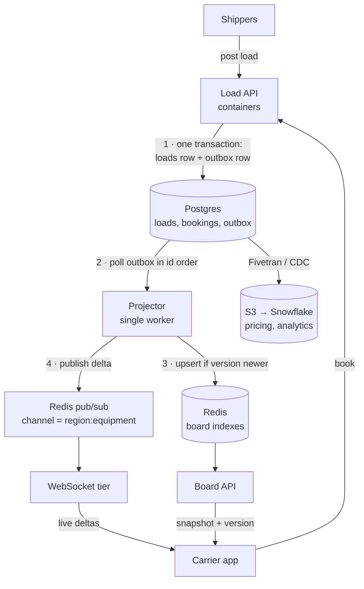

# Case: Live Load Board (In-Memory Matching)

> **At a glance** · **Level:** Intermediate · **Scale:** 50k open loads (~25 MB), 5k carriers online, ~2,000 reads/s, ~50 changes/s · **Core tools:** Postgres, Redis, S3 → Snowflake (plus a WebSocket tier) · **Key insight:** the database decides who books a load, and Redis only makes the board fast. Because Redis is a derived view, losing it costs speed, never correctness.

---

## 1. Prompt and clarifying questions

**Prompt.** A freight marketplace shows carriers a board of available loads. Carriers filter by origin radius, equipment type, pickup window and rate. The board updates **live** as loads are posted, booked or expire. A booked load must leave every other screen within a second and must **never be double-booked**.

| Ask | Assume | Why it changes the design |
| --- | --- | --- |
| How many open loads and carriers online? | 50k loads, 5k carriers | Sizes the hot set and the fan-out |
| Which filters? | Geo radius + equipment + pickup window + rate | Multi-dimensional filters no single B-tree serves well |
| How fresh? | Booked load off all screens in < 1 s | Push (WebSocket), not polling |
| Is booking money-moving? | Yes, it's a contract | Correctness lives in an ACID database |
| Mobile clients? | Yes, flaky networks | Reconnects are normal, so snapshots need versions |

---

## 2. Size it

| Quantity | Arithmetic | Result |
| --- | --- | --- |
| Hot set | 50,000 loads × ~500 B | **~25 MB**; under ~100 MB with indexes (approx.) |
| Board reads | 5,000 sessions × ~0.4 queries/s (filter change, page, refresh) | **~2,000 QPS**, a deliberately high bound |
| State changes | Post, book, expire | **~50/s**, trivial for Postgres |
| Naive fan-out | 50 changes/s × 5,000 clients | **250,000 msg/s**, almost all irrelevant |
| Bucketed fan-out | 250 buckets (50 regions × 5 equipment), ~2 buckets per carrier → ~40 subscribers per bucket; 50/s × 40 | **~2,000 msg/s**, 125× less |
| WebSocket churn | API Gateway WebSocket max connection 2 h → 5,000 ÷ 7,200 s | ~0.7 reconnects/s steady |
| Reconnect storm | 5,000 clients ÷ 500 new connections/s (default account quota) | **≥ 10 s** to reconnect everyone, and only if clients jitter |

*API Gateway WebSocket quotas checked 2026-09: 500 new connections/s per account per Region (adjustable), 2 h max connection, 10 min idle timeout.*

**What the numbers say.** The whole board fits in RAM on one small node. Writes are tiny, so Postgres stays the single source of truth. The real engineering is fan-out and reconnects, not storage.

---

## 3. The design: boring first, then the growth path

| Scale | Design | Move up when |
| --- | --- | --- |
| **10 trucks** (a small broker: ~100 loads, dozens of carriers) | Postgres with indexes (PostGIS for radius); clients poll every 30 s | Polling load or staleness complaints; filters get multi-dimensional |
| **10k trucks** (50k loads, 5k carriers): *this answer* | Postgres truth + outbox → one projector → Redis indexes + pub/sub → WebSocket tier; bookings are a conditional `UPDATE` in Postgres | Other systems want the same load events; one Redis node or one pub/sub channel set gets hot |
| **100k trucks** (~500k loads, ~50k carriers) | Redis Cluster sharded by region; a dedicated WebSocket fleet; CDC into Kinesis so pricing, search and analytics consume the same change events | Carriers type free-text lane searches → OpenSearch |

**Honest concession.** At 50k rows, Postgres + PostGIS can serve this board. The case for Redis is the *combination*: geo + range + set filters at 2,000 QPS, plus pub/sub from the same system. Redis buys headroom, not correctness. Say so before the interviewer does.

---

## 4. How it works

### 4.1 The write path and the read path



1. **Truth first.** Every change writes the `loads` row and an `outbox` row in one Postgres transaction, so there's no dual write. The outbox pattern is explained in [sql-vs-nosql.md](../99-reference/sql-vs-nosql.md).
2. **One projector.** It reads the outbox in `id` order, which is plenty at 50 changes/s, and applies each change to Redis only if `version` is newer. That makes replays harmless.
3. **Indexes updated, then deltas published** to the channel matching the load's region and equipment.
4. **Reads never touch Postgres.** The Board API answers from Redis; the WebSocket tier relays deltas.

The Load API runs on containers rather than Lambda because steady 2,000 QPS is where per-request pricing adds up. That's roughly $1.9k/month on Lambda at 20 ms and 512 MB (approx.), versus a couple of small containers.

### 4.2 Modelling the board in Redis

One board, several indexes over the same 50k loads:

| Structure | Key | Answers |
| --- | --- | --- |
| Hash | `load:{id}` | The load detail |
| Geo set | `loads:geo:origin` | "within 150 mi of Dallas" → `GEOSEARCH` |
| Sorted set | `loads:by_pickup` (score = epoch) | Pickup window → `ZRANGEBYSCORE` |
| Sorted set | `loads:by_rate` (score = $/mile) | Rate filter and sort |
| Set | `loads:equip:reefer` | Equipment filter |
| Sorted set | `loads:expiring` (score = expiry) | A sweeper finds expired loads without scanning |

A filtered query runs `GEOSEARCHSTORE` into a temp key, intersects it with the equipment set, filters the pickup window, sorts by rate, and fetches 25 hashes with `HMGET`. Everything stays in memory and no database is touched. Structure choices are detailed in [in-memory-databases.md](../99-reference/in-memory-databases.md).

```
GEOSEARCH loads:geo:origin FROMLONLAT -96.797 32.777 BYRADIUS 150 mi ASC COUNT 200
```

### 4.3 The booking race: the actual hard part

Two carriers tap **Book** on load 88213 within 40 ms. Exactly one must win.

```sql
UPDATE loads
   SET status = 'booked', carrier_id = :carrier, booked_at = now()
 WHERE id = :load_id AND status = 'open';
-- 1 row updated → this carrier won · 0 rows → someone else already did
```

A conditional update on the source of truth is atomic, needs no distributed lock and leaves no race window. **The row count is the answer.** The loser gets `409 LOAD_ALREADY_BOOKED`, and the removal delta is pushed immediately.

A Redis `SET lock:load:{id} NX PX 5000` is still useful to reject doomed second clicks before they reach Postgres, but it's an *optimization*. If Redis is down, bookings must still be correct. **Never use a Redis lock as the correctness mechanism for money-moving operations**: lock expiry during GC pauses or network delays can let two holders overlap.

### 4.4 Keeping 5,000 screens in sync

**Snapshot + stream**, the same pattern as the [truck console](../truck-stream-processor/README.md):

1. Carrier opens the board → Board API returns a filtered page **plus a `version`** (the last applied outbox id).
2. Client opens a WebSocket subscribed to its buckets (`board:dallas:reefer`).
3. Client applies deltas with `version` greater than its snapshot and discards the rest.
4. **On any reconnect, the client re-fetches a snapshot.** Redis pub/sub is fire-and-forget: a disconnected client or WebSocket node simply misses messages.

---

## 5. Justify each block

| Block | Job | What breaks if I delete it |
| --- | --- | --- |
| Postgres | ACID truth for loads and bookings; arbitrates the race | Double bookings; nothing to rebuild Redis from |
| Outbox table | Makes "row changed" and "event emitted" one transaction | Dual-write drift: Redis shows loads that were booked, forever |
| Projector | Turns ordered changes into indexes and deltas, idempotently | The API must write Redis directly, which is a dual write |
| Redis indexes | Multi-dimensional filters at 2,000 QPS | Postgres takes the read load; fine now, and that's the fallback |
| Redis pub/sub + buckets | Fan-out to the right screens | 250k msg/s broadcast, or polling |
| WebSocket tier | Holds 5,000 long-lived connections apart from the API | API deploys drop every carrier's live feed |
| S3 → Snowflake | Pricing models, market analytics | No history of what sold, and at what rate |

---

## 6. Failure modes

| Failure | How you notice | Mitigation |
| --- | --- | --- |
| **Redis dies** | Board API errors; Redis health alarms | Rebuild the 25 MB index from Postgres in seconds; meanwhile serve from Postgres (slower, still correct) |
| **Projector lag** | Outbox `max(id)` minus last applied id grows; booked loads linger and 409s rise | Alarm on lag; the booking response pushes its own removal delta as a fast lane |
| **Drift between Redis and Postgres** | Periodic reconciliation finds mismatches | Full diff every few minutes, which is cheap at 50k rows |
| **Poison outbox row** | Projector stuck on one id | Bounded retries → park the row in a dead-letter table → alarm, then continue |
| **Memory eviction** | `evicted_keys` > 0; loads vanish from the board | `maxmemory-policy noeviction`: this index is state, not a cache. Alarm on memory |
| **Hot bucket** (Chicago reefer) | One channel's message rate dominates | Split the bucket by sub-region |
| **Thundering herd on expiry** | Load spikes on the hour | Jitter expiry times |
| **Reconnect storm** after a deploy | New-connection throttling (500/s default quota); snapshot QPS spike | Client jittered backoff; drain WebSocket nodes gradually |

---

## 7. Common wrong answers

- **"Check Redis for availability, then book."** The check and the write aren't atomic, and Redis may be stale. The database decides.
- **"A Redlock makes booking safe."** It reduces contention; it doesn't guarantee mutual exclusion under pauses and clock problems.
- **"The API writes Postgres and Redis."** That's a dual write: a crash between the two leaves permanent drift. Use the outbox or CDC.
- **"Broadcast every change to every client."** 250k msg/s of noise. Bucket by region × equipment.
- **"Postgres can't handle this."** At 50k rows it can. Justify Redis by the filter combination and pub/sub, not by size.

---

## 8. What would make you change the design

- **Other consumers** (pricing, search, analytics) want load events → CDC into Kinesis instead of a single outbox poller.
- **Hot set outgrows one node** or one region dominates → Redis Cluster with region hash tags.
- **Free-text lane search** → project into OpenSearch.
- **Team doesn't want to run Redis** and QPS stays modest → Postgres + PostGIS with a short-TTL response cache.
- **Connections outgrow API Gateway quotas** or you need custom routing → a dedicated WebSocket fleet on containers.

---

## 9. Say it in two minutes

> "50k open loads at 500 bytes is 25 MB, so the whole board fits in memory. Writes are about 50 a second, so Postgres stays the source of truth. Every change writes the load row and an outbox row in one transaction; a projector applies them to Redis geo, sorted-set and set indexes and publishes deltas to channels bucketed by region and equipment. That cuts fan-out from 250k to about 2,000 messages a second. Carriers get a versioned snapshot from Redis, then deltas over a WebSocket, and re-snapshot on reconnect. Booking is a conditional `UPDATE ... WHERE status = 'open'` in Postgres, and the row count decides the winner; a Redis lock only filters double taps. If Redis dies, I rebuild it from Postgres and serve slower but correct. I'd honestly concede Postgres with PostGIS could serve this size; Redis buys headroom and pub/sub."

---

## 10. Self-check

<details><summary><b>Q1.</b> Why is the 25 MB number the one that justifies the whole design?</summary>

It proves the complete hot set fits in RAM on one node with room to spare. That makes Redis a cheap derived view you can rebuild in seconds, not a distributed database you must keep durable.

</details>

<details><summary><b>Q2.</b> Two carriers book the same load 40 ms apart. Walk through exactly what decides the winner.</summary>

`UPDATE loads SET status='booked' ... WHERE id=:id AND status='open'`. Postgres row locking serializes the two updates: the first changes 1 row and wins, and the second sees `status='booked'`, changes 0 rows, and gets a 409. No Redis lock is involved in correctness.

</details>

<details><summary><b>Q3.</b> Redis loses all data at 10:00. What do carriers experience, and how do you recover?</summary>

Board queries fail over to Postgres (slower). Bookings are unaffected because they never depended on Redis. The projector rebuilds the indexes from the `loads` table (~50k rows, seconds), and clients re-snapshot when their connections reset.

</details>

<details><summary><b>Q4.</b> Why `noeviction` instead of `allkeys-lru` for this Redis?</summary>

The index is state, not a cache. LRU eviction would silently remove open loads from the board, and nothing would reload them on a miss. With `noeviction`, writes fail loudly and memory alarms fire.

</details>

<details><summary><b>Q5.</b> Mini scenario: you deploy the WebSocket tier and all 5,000 clients drop at once. What happens with default API Gateway quotas, and what do you change?</summary>

The default is 500 new connections/s per account per Region, so reconnecting 5,000 takes at least 10 s, and that's only if clients spread out. Without jitter they retry together and get throttled repeatedly, and every reconnect also requests a snapshot. Fix it with jittered exponential backoff on clients, gradual draining of nodes on deploy, and a quota increase if the fleet grows.

</details>

<details><summary><b>Q6.</b> Why does every snapshot carry a version, and what does the client do with it?</summary>

Pub/sub doesn't store messages. A delta can arrive before, after or without the snapshot. The client ignores deltas at or below the snapshot version and applies newer ones, so ordering gaps can't resurrect a booked load.

</details>

---

## 11. Related

- [In-memory databases](../99-reference/in-memory-databases.md): Redis structures, eviction, stampedes
- [SQL vs NoSQL](../99-reference/sql-vs-nosql.md): outbox, CDC, dual-write anti-pattern
- [Truck stream processor](../truck-stream-processor/README.md): the same snapshot + stream console
- [CDC: Postgres → warehouse](../cdc-postgres-to-warehouse/README.md): the growth path for load events
