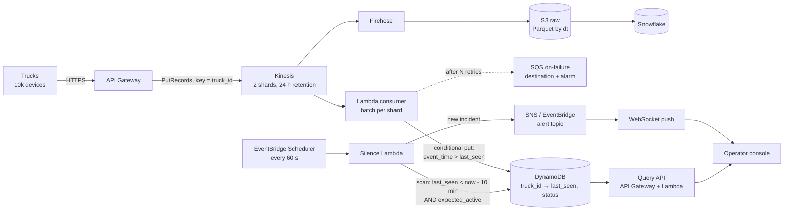
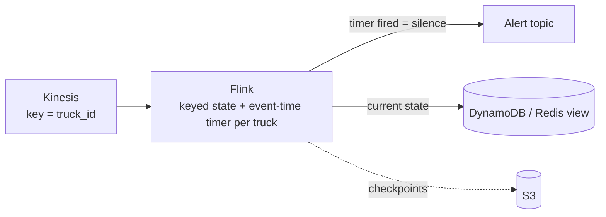

# Case: Truck Stream Processor (Silence Detection)

> **At a glance** · **Level:** Intermediate · **Scale:** 10k trucks, 333 events/s, 28.8 GB/day · **Core tools:** Kinesis, Lambda, DynamoDB, S3, Snowflake (Flink in the growth path) · **Key insight:** a missing event triggers nothing, so detecting silence needs a clock. At 10k trucks a scheduled scan is that clock; a per-truck timer in Flink replaces it when the scan stops being cheap or fast enough.

---

## 1. Prompt and clarifying questions

**Prompt.** Trucks send telemetry (GPS, engine state, temperature) every ~30 s. Alert operators when a truck goes **silent** for more than X minutes, in near real time. Keep the full history for analytics.

| Ask | Assume | Why it changes the design |
| --- | --- | --- |
| How many trucks, how often? | 10k, every 30 s, ~1 KB JSON | Sets events/s, shard count and cost |
| What is X, and how fast must the alert fire? | X = 10 min, alert within ~1 min after that | Decides scan (minutes) vs timer (seconds) |
| Do trucks buffer offline and replay? | Yes, hours of pings on reconnect | Forces event time and burst headroom |
| Is a parked truck "silent"? | No: depot, shift and geofence context apply | Separates real incidents from alert fatigue |
| Who else reads the events? | Analytics now, a live map later | Log (replay, many readers) vs queue |

---

## 2. Size it

| Quantity | Arithmetic | Result |
| --- | --- | --- |
| Events/s | 10,000 ÷ 30 s | **333/s** sustained |
| Volume | 333 × 86,400 s × ~1 KB | 28.8M events ≈ **28.8 GB/day** raw JSON |
| Kinesis shards | max(0.33 MB/s ÷ 1 MB/s, 333 ÷ 1,000 rec/s) | **1**; provision 2 for reconnect bursts |
| Hot state | 10k trucks × ~200 B | **~2 MB**, fits anywhere |
| Stream cost | 2 shards × $0.015/h × 730 h + 864M PUT units × $0.014/M | **~$34/month** |
| Hot-store writes | 864M writes/month × $0.625/M WRU (DynamoDB on-demand) | **~$540/month** |
| Silence scan | 2 MB scan ≈ 250 RRU, × 43,200 scans/month × $0.125/M | ~$1.35/month |

*Prices are US East list prices, approx. (checked 2026-09). Shard limit: 1 MB/s or 1,000 records/s written per shard.*

**What the numbers say.** 333 events/s is small: one shard, not a Kafka cluster. The surprising line is the database: one write per ping costs ~15× the stream. That's acceptable, but it's the first cost you'd optimize (see §8).

---

## 3. The design: boring first, then the growth path

| Scale | Design | Move up when |
| --- | --- | --- |
| **10 trucks** (0.3 events/s) | API Gateway + Lambda writes `last_seen` to Postgres; a cron query finds `last_seen < now() - 10 min` | A second consumer appears, or ping writes start hurting the app DB |
| **10k trucks** (333/s): *this answer* | Kinesis (key `truck_id`) → Lambda → DynamoDB `last_seen`; Firehose → S3 → Snowflake; a scheduled Lambda scans for silence every 60 s | SLO under ~1 min, per-truck logic (debounce, geofence sequences), or the scan stops being cheap |
| **100k trucks** (3,333/s, 3.3 MB/s → 4 shards min, 6–8 with headroom) | Kinesis → **Flink** with per-truck event-time timers → alert topic; DynamoDB/Redis becomes a view for the UI | Many teams read the stream, or retention > 365 days → **Kafka on MSK** |

The core-toolkit ladder lists Flink at 10k for "live map & alerts". Use that row when you need per-truck state or sub-minute alerts. For a 10-minute silence rule, Lambda plus a scan is enough, so say why you're deferring Flink.

**The trade-off to name.** In-stream detection has the best latency, but the state lives inside the job: you need checkpoints, and a bad deploy can lose or replay state. With polling, the state stays durable in DynamoDB and every component can restart freely. At 10k trucks, pick the polling design and say why.

---

## 4. How it works

### 4.1 The 10k design

1. **Partition key `truck_id`.** All pings from one truck land on one shard, in order, the same way `repartition("truck_id")` keeps a key's rows in one Spark partition.
2. **The consumer is stateless.** For each ping it writes `last_seen` with a condition `event_time > last_seen`, so duplicates and old replayed pings do nothing.
3. **The detector is the clock.** Every 60 s it finds trucks past the threshold that are expected to be active, records `alerted_at` so each incident alerts once, and publishes to the alert topic.
4. **Cold path.** Firehose buffers the same stream into S3; Snowpipe loads it into Snowflake. It is never on the alerting path.

**Latency:** X + up to 60 s scan interval + a few seconds of pipeline, which meets "within ~1 min".

### 4.2 Growth path: silence inside the stream

Flink keeps **one timer per `truck_id`**. Each event pushes that truck's timer forward to `event_time + X`, and a timer that fires *is* the silence signal. There's no scan and no database round trip, and alert latency ≈ watermark lag. Watermarks and event time are covered in [streaming-tools.md](../99-reference/streaming-tools.md).

### 4.3 Who feeds the operator console

**Not the stream processor.** Three paths feed it, and this *snapshot + stream* shape also appears in the [live load board](../live-load-board/README.md):

1. **Snapshot (pull).** On page load, the Query API reads the hot store and returns every truck with `last_seen` and `status`. Only a database can answer "all 10,000 trucks sorted by silence duration".
2. **Deltas (push).** A WebSocket subscribed to the alert topic sends only changes (truck 4471 went silent, 892 is back).
3. **History (pull, slow).** A separate endpoint over Snowflake for "incidents in the last 30 days", with its own latency budget.

The processor must not serve HTTP. You couldn't scale reads separately, deploys and checkpoint restores would drop connections, auth belongs in an API layer, and "sort, filter, paginate" is a database query, not a stream operation. **The processor writes state; an API serves it.**

---

## 5. Justify each block

| Block | Job | What breaks if I delete it |
| --- | --- | --- |
| API Gateway | TLS, auth and throttling in front of 10k devices | Devices need AWS credentials to write to Kinesis directly, and one misbehaving device can flood the stream |
| Kinesis (log) | Durable buffer, per-truck order, 24 h replay, two independent readers (Lambda, Firehose) | A consumer outage loses pings. A queue gives no replay and one reader per message ([queue vs log](../99-reference/streaming-tools.md)) |
| Lambda consumer | Turns events into current state, idempotently | Nothing knows each truck's `last_seen` |
| DynamoDB | Durable current state per truck | The detector has nothing to check; the console has no snapshot |
| Scheduler + silence Lambda | The clock, because absence produces no event | Silence is never detected |
| Alert topic | Decouples detection from delivery (console, pager, Slack) | The detector must know every channel and its failures |
| Firehose → S3 → Snowflake | History, analytics, reprocessing | No history; a hot-path bug destroys evidence |
| Query API | Auth, pagination and sorting for the console | The browser talks to the database directly |

---

## 6. Failure modes

| Failure | How you notice | Mitigation |
| --- | --- | --- |
| **Late / out-of-order replay** | Lag between `event_time` and arrival time spikes after reconnects | Event time everywhere; the conditional write ignores older pings |
| **Duplicates** (at-least-once) | Duplicate `(truck_id, event_id)` counts in Snowflake | Conditional put in the hot path; dedupe on `event_id` in dbt staging |
| **Backpressure** | `GetRecords.IteratorAge` climbing; this is the best single health metric here | More shards, a higher Lambda parallelization factor per shard, and larger batches |
| **Poison message** | IteratorAge climbs on *one* shard while others are fine | Bisect batch on error, bounded retries, on-failure destination to SQS, alarm on its depth |
| **Hot shard** | `WriteProvisionedThroughputExceeded` on one shard | Key by `truck_id`, never by region or depot |
| **Alert flapping** | Many alerts per truck per hour | Require N missed intervals; cooldown before re-alerting |
| **Alert storm** (cell tower down) | Hundreds of incidents in one region within a minute | Group correlated silences into one incident per region |
| **Silent ≠ broken** | Operators snooze most alerts | `expected_active` from shift schedule and depot geofence |
| **The detector dies** | Nothing alerts, which looks like good news | CloudWatch alarm on missing detector invocations (missing data = breaching) |
| **Flink restart** (growth path) | Duplicate alerts after checkpoint restore | Idempotent alert key `(truck_id, silence_started_at)` |

---

## 7. Common wrong answers

- **"Kafka and a Flink cluster."** At 333 events/s that's 1 shard. Oversizing reads as inexperience; propose it only with the growth trigger.
- **"DynamoDB TTL + Streams will emit the silence event."** TTL deletes expired items *within a few days*, not minutes. That can't meet a 10-minute rule.
- **"SQS FIFO with `truck_id` as the group gives per-truck order."** It does, but there's no replay and a message has one reader. Without high-throughput mode, FIFO also caps at 300 calls/s per API action (3,000 msg/s batched), which is too close to 333/s.
- **"Use arrival time."** A truck replaying 3 hours of pings would look alive for 3 hours of silence, or trigger false recoveries.
- **"The Flink job serves the dashboard."** See §4.3.

---

## 8. What would make you change the design

- **SLO under ~1 min, or per-truck logic** (debounce, route sequences) → move detection into Flink timers.
- **The write bill matters** (~$540/month at 10k, ~$5.4k at 100k on-demand) → put `last_seen` in a Redis sorted set (`ZADD` per ping). "Who is silent" then becomes one `ZRANGEBYSCORE` range query instead of a scan. Redis is rebuildable from the stream's 24 h replay ([in-memory-databases.md](../99-reference/in-memory-databases.md)).
- **A scan takes longer than its interval** (far beyond 100k trucks) → Redis sorted set or Flink.
- **Console needs rich filters** ("silent reefers in Texas") → a GSI per access pattern, or project state into OpenSearch.
- **Many teams read telemetry, > 365 d retention** → Kafka on MSK ([architecture-comparison.md](../../cloud/architecture-comparison.md)).
- **Devices speak MQTT with per-device certificates** → AWS IoT Core in front of Kinesis instead of API Gateway.

---

## 9. Say it in two minutes

> "10k trucks every 30 seconds is 333 events a second and about 29 GB a day, so one Kinesis shard with a second for reconnect bursts. I'd key by `truck_id`, have a Lambda consumer write `last_seen` to DynamoDB with a condition so duplicates and replays are no-ops, and send the same stream through Firehose to S3 and Snowflake for history. Silence produces no event, so I need a clock: a scheduled Lambda scans every minute for active trucks past the threshold and publishes to an alert topic. The console loads a snapshot from an API over DynamoDB and gets deltas over a WebSocket. I'd alarm on IteratorAge and on the detector itself going quiet. If the SLO drops below a minute or we need per-truck logic, I'd move detection into Flink with per-key event-time timers. If the write bill matters, I'd use a Redis sorted set."

---

## 10. Self-check

<b>Q1.</b> 10k trucks ping every 30 s with 1 KB events. Give events/s, GB/day and Kinesis shards, out loud.

10,000 ÷ 30 = **333 events/s**. × 86,400 s × 1 KB ≈ **28.8 GB/day**. Shards = max(0.33 MB/s ÷ 1, 333 ÷ 1,000) = **1**, and I'd provision 2 for reconnect bursts. At 100k trucks it's 3,333/s and 3.3 MB/s, so 4 shards minimum.

<b>Q2.</b> Why is detecting the absence of an event harder than detecting an event, and what provides the "clock" at 10k vs 100k trucks?

Nothing arrives to trigger computation. At 10k, a scheduled Lambda scanning `last_seen` every 60 s is the clock: cheap, durable and easy to debug. At 100k, or with a sub-minute SLO, Flink's per-key event-time timer is the clock: each event resets the truck's timer, and a fired timer is the silence signal.

<b>Q3.</b> What breaks if you use arrival time instead of event time when a truck replays 3 hours of buffered pings?

The truck looks alive the moment the replay starts, so a 3-hour silence is never reported. The `last_seen` state can also be overwritten with old values if writes aren't conditional. Use device `event_time`, and write only when `event_time > last_seen`.

<b>Q4.</b> Why not use DynamoDB TTL + Streams to detect silence?

TTL deletion is best-effort, typically within a few days of expiry. It's built for cleanup, not timing, so it can't meet a 10-minute rule.

<b>Q5.</b> Mini scenario: a cell tower outage silences 400 trucks in one region at once. What happens in your design and what do you add?

The detector would open 400 incidents and page someone 400 times. Add correlation: if more than N trucks in one region go silent within a minute, open one regional incident and suppress the individual ones. Also check `expected_active` so parked trucks aren't counted. When the tower returns, replayed pings close incidents through the normal conditional writes.

<b>Q6.</b> Why should the operator console not read directly from the stream processor?

Reads couldn't scale separately from the streaming job, and restarts would drop connections. Auth and rate limiting belong in an API layer, and "sort by silence, filter, paginate" is a database query. The processor writes state; a Query API serves it, and a WebSocket carries deltas.

---

## 11. Related

- [Streaming tools](../99-reference/streaming-tools.md): queue vs log, event time, watermarks, delivery semantics
- [In-memory databases](../99-reference/in-memory-databases.md): Redis sorted sets for "who is silent"
- [Cloud architecture comparison](../../cloud/architecture-comparison.md): core toolkit and the 10 / 10k / 100k ladder
- [AWS services map](../99-reference/aws-services-map.md)
- Next case: [Live load board](../live-load-board/README.md) reuses the snapshot + stream console
