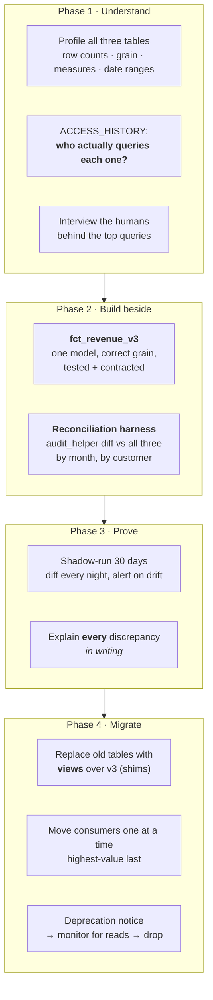

# Inheriting a Production Warehouse — Dedup, Consolidation & Safe Refactor

**Problem.** You join a company and inherit a Snowflake warehouse that grew organically for four years across three teams. The symptoms:

- **Nobody trusts the numbers.** Three tables claim to hold revenue — `fct_revenue`, `revenue_final`, `revenue_v2_new` — and they disagree by 4%. Finance keeps a parallel spreadsheet.
- **Duplicates in core facts.** `fct_shipments` has 1.03 rows per real shipment. Some dashboards double-count, some don't, depending on whether the author knew to add `distinct`.
- **The bill is $85k/month**, growing 12% quarter over quarter, and nobody can attribute it.
- **400 dbt models**, no tests, no docs, and a dependency graph nobody can read.
- **One 6-hour nightly DAG** that fails twice a week and is restarted by hand from the top.
- **BI dashboards query RAW tables directly**, so every source schema change is an outage.

**Mandate:** cut cost, restore trust, don't break anything, and keep the lights on while you do it.

This is the brownfield version of [freight-billing-warehouse](../freight-billing-warehouse/README.md). Greenfield design asks *what would you build*; this asks *how do you change a system while it's running and being trusted*. Most senior data-engineering jobs are this one, and the discipline it tests — measure, prove equivalence, migrate incrementally, keep a rollback — is what separates a senior engineer from someone who rewrites things and hopes.

---

## 1. Measure before you touch anything

The instinct is to start fixing. Resist it for two weeks. You cannot prove you improved anything without a baseline, and you will be asked to prove it.

Everything you need is already in `SNOWFLAKE.ACCOUNT_USAGE` (365-day retention; note the ~45-minute latency — use `INFORMATION_SCHEMA` when you need real-time).

**Where is the money going?**
```sql
-- credits by warehouse, last 30 days
select warehouse_name,
       sum(credits_used)                      as credits,
       sum(credits_used) * 3.00               as approx_usd   -- your $/credit rate
from snowflake.account_usage.warehouse_metering_history
where start_time >= dateadd(day, -30, current_date)
group by 1 order by credits desc;
```

**Which queries are expensive?** Cost ≈ warehouse size × execution time, so rank by credit-seconds, not by count:
```sql
select query_tag,
       left(query_text, 120)                                   as sample,
       count(*)                                                as runs,
       sum(total_elapsed_time)/1000/3600 * wh_credits_per_hour  as credit_hours,
       avg(bytes_spilled_to_remote_storage)                     as avg_remote_spill,
       avg(partitions_scanned / nullif(partitions_total,0))     as avg_scan_ratio
from snowflake.account_usage.query_history q
join warehouse_credit_rates r on r.warehouse_size = q.warehouse_size
where start_time >= dateadd(day, -7, current_date)
group by 1,2
order by credit_hours desc
limit 50;
```

**What is nobody using?** The single highest-leverage query of the whole engagement:
```sql
-- tables with no reads in 90 days
select t.table_catalog, t.table_schema, t.table_name,
       t.bytes/pow(1024,3) as gb,
       max(a.query_start_time) as last_read
from snowflake.account_usage.tables t
left join snowflake.account_usage.access_history a
       on a.objects_accessed[0]:objectName::string
        = t.table_catalog||'.'||t.table_schema||'.'||t.table_name
      and a.query_start_time >= dateadd(day, -90, current_date)
where t.deleted is null
group by 1,2,3,4
having max(a.query_start_time) is null
order by gb desc;
```

**Deliverable at the end of week two:** a one-page baseline — spend by warehouse and by team, the top 20 queries by cost, the list of unread tables and unused models, current DAG runtime and failure rate, and the duplicate rate in each core fact. That page is how you get permission to do the rest, and how you prove impact in your review.

> **The interview point:** lead with measurement, not with a rewrite plan. "I'd spend the first two weeks instrumenting before changing anything" is a senior answer. "I'd migrate everything to a medallion architecture" is not.

---

## 2. Triage — sequence the work

Three problems compete. Sequence them by *risk of doing nothing* against *effort*:

| Priority | Problem | Why this order |
| --- | --- | --- |
| **1** | **Stop the bleeding on cost** | Warehouse right-sizing and auto-suspend are config changes, reversible in seconds, no logic risk. Typically 20–35% off the bill in week one. It buys you political capital for the slow work |
| **2** | **Reliability of the nightly DAG** | Every day it fails, you lose a day of trust and a day of your own time restarting it. Fix idempotency and decomposition before touching any modelling |
| **3** | **Deduplication** | Wrong numbers are worse than slow numbers. But dedup needs the DAG to be re-runnable first, or you can't safely rebuild |
| **4** | **Consolidation of the three revenue tables** | The highest-value and highest-risk item. Needs the trust and tooling built in 1–3 |
| **5** | **Deprecate unused models, add tests and docs** | Continuous, not a project. Fold into every PR |

Cost first is deliberate and worth saying out loud: it is the lowest-risk change with the most visible result, and shipping a win in week one is how you get the runway to spend three months on consolidation.

---

## 3. Deduplication

"There are duplicates" is four different problems with four different fixes. Diagnosing which one you have is the whole skill.

### The four kinds

| Kind | Cause | Fix |
| --- | --- | --- |
| **Exact duplicates** | Pipeline re-ran without idempotency; a source file loaded twice | Dedup on the natural key at staging; fix the loader to be idempotent so it stops recurring |
| **Versioned duplicates** | CDC or a `updated_at` feed appends every version of a row; downstream treats it as current-state | `QUALIFY ROW_NUMBER()` to latest-per-key in staging. **This is the common one** |
| **Fan-out duplicates** | A join to a table that isn't unique on the join key — the classic 1:many that the author believed was 1:1 | Fix the join, not the symptom. `distinct` here silently hides a modelling bug |
| **Semantic duplicates** | The same real entity arriving as two rows with different keys — the same carrier as `ACME LOGISTICS` and `Acme Logistics Inc` | Entity resolution: a mapping table, fuzzy matching, and a human decision. Never solvable in pure SQL |

### Diagnose first

```sql
-- 1 · how bad, and which kind?
select count(*)                                     as rows,
       count(distinct shipment_id)                  as entities,
       count(*) / nullif(count(distinct shipment_id),0) as rows_per_entity
from analytics.fct_shipments;

-- 2 · exact vs versioned: do the duplicate rows differ in any column?
select shipment_id, count(*) as n,
       count(distinct hash(*)) as distinct_row_versions   -- 1 → exact dupes, >1 → versioned
from analytics.fct_shipments
group by 1 having count(*) > 1
order by n desc limit 20;

-- 3 · fan-out: does the duplication appear only after a specific join?
--     count rows at each CTE boundary in the offending model and find where it jumps
```

`count(distinct hash(*))` is the fast tell: if it's 1, the rows are byte-identical and you have a re-run problem. If it's greater than 1, you have version history being read as current state — a modelling problem, not a loader problem.

### Fix at the right layer

Dedup belongs in **staging**, once, so every downstream model inherits it. Deduping in each mart is how you end up with three revenue tables that disagree.

```sql
-- models/staging/stg_postgres__shipments.sql
select
    shipment_id,
    customer_id,
    delivered_at,
    revenue_usd,
    updated_at,
    _loaded_at
from {{ source('raw', 'shipments') }}
qualify row_number() over (
    partition by shipment_id
    order by updated_at desc, _loaded_at desc, _file_row_number desc   -- deterministic tiebreak
) = 1
```

**The tiebreaker must be total.** `order by updated_at desc` alone is non-deterministic when two rows share a timestamp — the model returns different results on different runs, and you get a "flaky" pipeline nobody can reproduce. Chain enough columns to guarantee a unique ordering: an LSN, a load sequence, a file row number, ultimately the primary key.

Then lock it in so it cannot regress:
```yaml
  - name: stg_postgres__shipments
    columns:
      - name: shipment_id
        tests: [unique, not_null]     # severity: error — this must break the build
```

### Backfilling the fix
The historical table still contains the duplicates. Don't `DELETE` in place:

1. Build the corrected table alongside: `create table fct_shipments__dedup as select ... qualify ...`
2. Reconcile: row counts, sums of every measure, and a per-month diff against the original.
3. Take a zero-copy clone of the original as a rollback point: `create table fct_shipments__pre_dedup clone fct_shipments;` (costs nothing until data diverges).
4. `alter table ... swap with ...` — an atomic metadata operation, effectively instant.
5. Keep the clone for a deprecation window, then drop.

`SWAP WITH` is the move to know. It exchanges two tables atomically, so readers never see a half-migrated state and rollback is a second swap.

---

## 4. Consolidating three revenue tables into one

The highest-risk work in the engagement. Someone's board deck depends on each of these tables, and you don't yet know who.

**Never rewrite-and-cut-over.** Use the **strangler pattern**: build the replacement beside the originals, prove equivalence with real traffic, migrate consumers one at a time, and only then delete.



### Phase 3 is the one people skip, and it's the one that matters

```sql
-- nightly reconciliation, alert on any row returned
with old as (select date_trunc(month, revenue_date) m, sum(amount) amt from fct_revenue      group by 1),
     new as (select date_trunc(month, revenue_date) m, sum(amount) amt from fct_revenue_v3   group by 1)
select coalesce(old.m, new.m) as month, old.amt, new.amt,
       new.amt - old.amt      as diff,
       div0(new.amt - old.amt, nullif(old.amt,0)) as pct
from old full outer join new using (m)
where abs(coalesce(new.amt,0) - coalesce(old.amt,0)) > 0.001 * coalesce(old.amt,1);
```

dbt's **`audit_helper`** package does the heavy version of this — `compare_relations` for row-level diffs, `compare_column_values` to find which column drifts, `compare_queries` for arbitrary logic.

> **Expect the new number to differ, and treat that as the deliverable.** You will find that the old table was wrong — it double-counted refunds, or dropped a currency. The migration then stops being technical and becomes a conversation with finance about a restatement. **Write down the explanation for every discrepancy before you migrate.** An unexplained 0.3% difference will surface six months later in an audit and it will be your name on it.

### The view shim
Once v3 is proven, the old names become views. Consumers keep working untouched:
```sql
create or replace view analytics.fct_revenue as
select shipment_id, revenue_date, amount, currency   -- exact original column list & order
from analytics.fct_revenue_v3;
```
Now you have one source of truth with three aliases, zero consumer changes, and `ACCESS_HISTORY` telling you exactly who still reads each shim so you know when it's safe to drop. Announce a deprecation date, monitor reads to zero, then drop.

---

## 5. Safe refactoring mechanics

The toolkit, independent of which refactor you're doing:

| Technique | What it gives you |
| --- | --- |
| **Zero-copy clone** | `create database analytics_test clone analytics_prod;` — full-size, production-shaped test environment in seconds, storage billed only on divergence. The single most useful Snowflake feature for this work |
| **Time Travel** | `select * from t at (offset => -3600)` and `undrop table t`. Your undo button. Default 1 day; raise `DATA_RETENTION_TIME_IN_DAYS` on critical tables before a risky migration |
| **`SWAP WITH`** | Atomic table exchange. Cutover and rollback are both instant and invisible to readers |
| **dbt contracts** | `contract: {enforced: true}` — a column type or name change fails at build time instead of in someone's dashboard |
| **`dbt build --select state:modified+`** | Build only what changed plus its children. Makes CI fast enough that people actually wait for it |
| **audit_helper** | Prove old and new produce identical output before cutover |
| **Expand / contract** | Add the new column → dual-write both → migrate readers → drop the old. Never rename in place |
| **`--empty` / dry runs** | `dbt run --empty` compiles and validates against a zero-row build — catches SQL and ref errors without paying for compute |

### The rule that prevents most disasters
**Every refactor is additive first, subtractive last, with a monitored gap in between.** Add the new thing, run both, prove equivalence, move readers, wait, *then* delete. The gap is where you find out who was depending on the thing you were about to drop.

---

## 6. Cost optimisation

Compute dominates the bill — storage is roughly $23/TB/month compressed and rarely the problem. Attack it in this order:

| Lever | Typical saving | Effort |
| --- | --- | --- |
| **`AUTO_SUSPEND = 60`** on every warehouse | 10–25% | Minutes. Idle warehouses are the most common single waste |
| **Split warehouses by workload** (`LOADING` / `TRANSFORM` / `BI` / `ADHOC`) | Attribution, then savings | Hours. You can't optimise what you can't attribute |
| **Right-size down** and measure | 10–20% | Days. Most warehouses are oversized because someone bumped it once during an incident |
| **`QUERY_TAG` per dbt model** | Attribution | An hour: `query-comment` in `dbt_project.yml` |
| **Delete unused models & tables** | 5–15% | Days. Use the unread-tables query from §1 |
| **Fix the top 10 queries** | 15–30% | Weeks. See [snowflake-performance.md](../../data-engineering/snowflake-performance.md) |
| **Resource monitors** on `ADHOC` | Caps the tail risk | Minutes. Prevents the accidental cross join that costs $4k overnight |
| **Drop unnecessary clustering** | Variable, sometimes large | Automatic clustering bills continuously; on a table that isn't filtered by the cluster key it is pure waste |

**Right-sizing intuition:** each size up doubles credits/hour *and* compute. If moving M → L halves the runtime, cost is identical and you finished sooner. If it improves runtime by 20%, you just made it 60% more expensive. Test, measure, keep the smaller one unless the profile shows remote spilling.

> **The counterintuitive one worth saying in an interview:** sizing *up* can be cheaper. A query spilling to remote storage on a Small may run 5× faster on a Large with no spill — same credits, one fifth the wall time. Cost is size × time, and people forget the second term.

---

## 7. Refactoring the Airflow monolith

The 6-hour DAG that fails twice a week and gets restarted from the top.

| Symptom | Root cause | Fix |
| --- | --- | --- |
| Restart re-runs everything | Not idempotent — tasks use `datetime.now()` and append | Key everything on `data_interval_start`; make writes `MERGE` not `INSERT` |
| One failure blocks all sources | Single monolithic DAG | Split: one DAG per source domain, one transform DAG triggered by **Datasets** |
| `dbt run` fails at model 300/400 | One opaque BashOperator | **Cosmos** — renders each dbt model as an Airflow task, so you retry the one that failed |
| Worker OOM | `PythonOperator` pulling GB through the worker | Push work down to Snowflake. Airflow orchestrates, it doesn't compute |
| Nothing is alerted, someone notices at 10am | No SLA monitoring | Failure callbacks *and* SLA-miss callbacks to Slack |
| Sensors burn worker slots for hours | Classic poke-mode sensors | **Deferrable operators** — release the slot while waiting |
| Backfills take down the warehouse | No concurrency control | `max_active_runs=1`, Airflow pools, a dedicated backfill warehouse with a resource monitor |

**Refactor it the same way as the warehouse: strangler, not big-bang.** Stand up the new decomposed DAGs beside the monolith writing to a `_v2` schema. Run both for two weeks. Diff the outputs nightly. Cut consumers over. Delete the monolith. Rewriting a production DAG in place over a weekend is how you spend the following month firefighting.

---

## 8. Failure modes

| Scenario | Handling |
| --- | --- |
| **You "fix" a number and finance's reported revenue moves** | The real risk of this whole project. Never ship a correction silently — socialise the diff, get finance to sign off, and time the change to a period boundary |
| **Dedup drops legitimate rows** | Your "duplicate" was a genuine second shipment on the same day. Validate the grain with a domain expert *before* deduping. Row counts don't tell you which is which |
| **Non-deterministic tiebreak** | `ROW_NUMBER` over a non-unique ordering returns different rows per run. Chain the ordering to uniqueness, always |
| **You drop a table someone needed** | `ACCESS_HISTORY` only shows queries — it misses external tools reading via a share or a stale service account. Deprecation window + monitored shim, never a straight drop. (`UNDROP TABLE` inside Time Travel if you get it wrong) |
| **A cost cut breaks an SLA** | Downsizing a warehouse slows the DAG past its 06:00 deadline. Change one variable at a time and watch the next full cycle before the next change |
| **CI passes, prod breaks** | CI ran on stale or sampled data. Zero-copy clone of prod is the fix — same volume, same skew, same edge cases |
| **The refactor never finishes** | The genuine failure mode of brownfield work: shims and v2 tables accumulate forever. Put deprecation dates in the ticket, monitor shim reads to zero, and treat deletion as part of the work, not cleanup |
| **Schema change upstream during migration** | Contracts fail the build loudly. Better than the alternative, which is silent nulls in a mart |

---

## 9. A 90-day plan

| Weeks | Focus | Deliverable |
| --- | --- | --- |
| **1–2** | Measure | Baseline one-pager: spend attribution, top-20 queries, unused assets, dupe rates, DAG reliability |
| **3–4** | Cheap cost wins | Auto-suspend, warehouse split, query tags, resource monitors, unused tables dropped. **Report the saving** |
| **5–7** | Reliability | Decompose the DAG, idempotency, Cosmos, alerting. Failure rate to near zero |
| **8–10** | Dedup | Staging-layer dedup + `unique` tests on every core fact. Backfill via clone→build→reconcile→swap |
| **11–14** | Consolidation | v3 revenue model, 30-day shadow run, reconciliation signed off by finance, shims in place |
| **Ongoing** | Hygiene | Tests and docs required in every PR; monthly cost review; monitor shims to zero and delete |

Sequencing matters as much as the technical content: **visible win → stability → correctness → consolidation.** Attempting consolidation in week two, before you have reliable pipelines or anyone's trust, is how these projects die.

---

## 10. What to say in the last two minutes

> "I'd spend the first two weeks measuring rather than changing — ACCOUNT_USAGE gives me spend by warehouse, the top queries by credit-seconds, and which tables haven't been read in 90 days. That baseline is how I prove impact later. Then cost first, because auto-suspend and warehouse splits are reversible config changes that free up 20–30% and buy credibility for the slower work. Reliability second: decompose the monolith DAG, make every task idempotent on the run window, and use Cosmos so a failure at model 300 retries one model instead of 400. Dedup third — but I'd diagnose which kind of duplicate it is first, because versioned CDC rows need a `QUALIFY ROW_NUMBER` in staging while fan-out duplicates mean a broken join that `distinct` would only hide. Consolidation last, with a strangler: build v3 beside the old tables, shadow-run and diff for 30 days, explain every discrepancy in writing to finance, then turn the old names into views over v3 so no consumer changes. Rollback is a zero-copy clone and a `SWAP WITH` at every step."

---

## 11. Likely follow-up questions

| Question | Short answer |
| --- | --- |
| *"How do you know it's safe to drop a table?"* | `ACCESS_HISTORY` for 90 days, then a monitored view shim, then a deprecation window. Never a straight drop — and `UNDROP` inside Time Travel if I'm wrong |
| *"The new revenue number is 4% lower. Now what?"* | That's a business conversation, not a technical one. Explain the discrepancy in writing, get finance sign-off, and land it on a period boundary. I don't ship a silent restatement |
| *"How do you dedup 800M rows without downtime?"* | Clone → build the corrected table beside it → reconcile → `SWAP WITH`. The swap is metadata-only, so cutover is instant and rollback is a second swap |
| *"How do you stop it regressing?"* | `unique`/`not_null` tests at `error` severity in staging, contracts on marts, and a CI that runs on a clone of prod |
| *"Where would you cut cost first?"* | Auto-suspend at 60s and splitting warehouses by workload — reversible, no logic risk, visible in a week. Query tuning is higher value but slower, so it comes after |
| *"A query got slower after your change. How do you debug it?"* | Query Profile: check partition pruning ratio first, then spilling, then the join explosion. See [snowflake-performance.md](../../data-engineering/snowflake-performance.md) |
| *"How do you refactor a DAG people depend on?"* | Same strangler pattern — new DAGs beside the old writing to a `_v2` schema, diff nightly, cut over, delete |

---

## Related
- [Snowflake performance & cost](../../data-engineering/snowflake-performance.md) — query profiling, pruning, spilling, clustering, warehouse sizing
- [Freight billing warehouse](../freight-billing-warehouse/README.md) — the greenfield version of this stack
- [CDC: Postgres → warehouse](../cdc-postgres-to-warehouse/README.md) — where versioned duplicates come from in the first place
